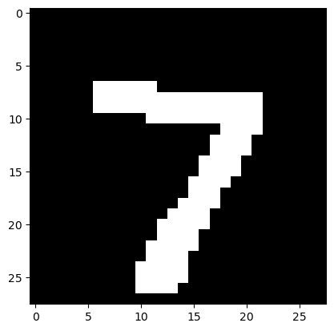
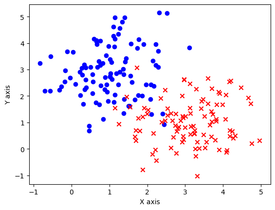
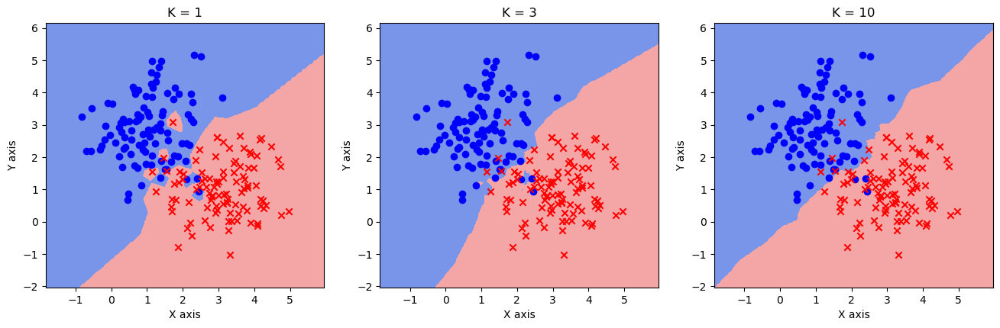
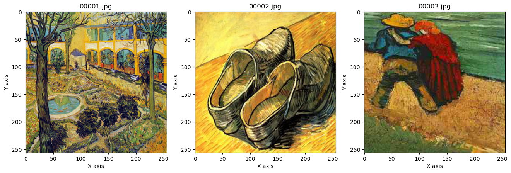
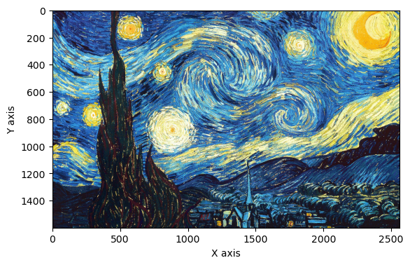
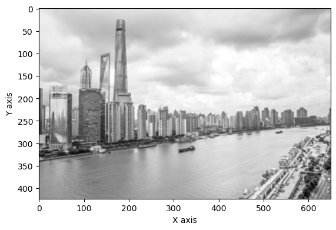
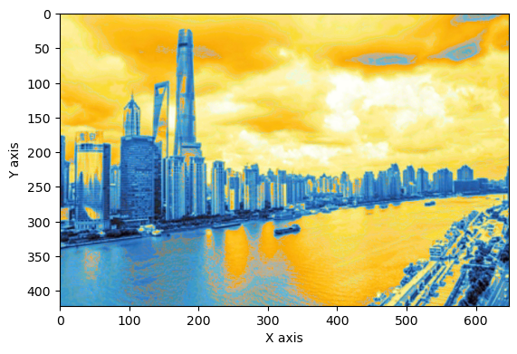

# 一 K近邻KNN

## 1 自定义实现

```python
import matplotlib.pyplot as plt
import numpy as np
import os

# 读入mnist数据集
m_x = np.loadtxt('./data/ch01/mnist_x', delimiter=' ')
m_y = np.loadtxt('./data/ch01/mnist_y')

# 数据集可视化
data = np.reshape(np.array(m_x[0], dtype=int), [28, 28])
plt.figure()
plt.imshow(data, cmap='gray')

# 将数据集分为训练集和测试集
ratio = 0.8
split = int(len(m_x) * ratio)
# 打乱数据
np.random.seed(0)
idx = np.random.permutation(np.arange(len(m_x)))
m_x = m_x[idx]
m_y = m_y[idx]
x_train, x_test = m_x[:split], m_x[split:]
y_train, y_test = m_y[:split], m_y[split:]
```



```python
class KNN:
    def __init__(self, k, label_num):
        self.k = k
        self.label_num = label_num # 类别的数量

    def fit(self, x_train, y_train):
        # 在类中保存训练数据
        self.x_train = x_train
        self.y_train = y_train

    def distance(self, a, b):
        return np.sqrt(np.sum(np.square(a - b)))

    def get_knn_indices(self, x):
        # 获取距离目标样本点最近的K个样本点的标签
        # 计算已知样本的距离
        dis = list(map(lambda a: self.distance(a, x), self.x_train)) 
        # 按距离从小到大排序，并得到对应的下标
        knn_indices = np.argsort(dis) 
        # 取最近的K个
        knn_indices = knn_indices[:self.k] 
        return knn_indices

    def get_label(self, x):
        # 对KNN方法的具体实现，观察K个近邻并使用np.argmax获取其中数量最多的类别
        knn_indices = self.get_knn_indices(x)
        # 类别计数
        label_statistic = np.zeros(shape=[self.label_num]) 
        for index in knn_indices:
            label = int(self.y_train[index])
            label_statistic[label] += 1
        # 返回数量最多的类别
        return np.argmax(label_statistic) 

    def predict(self, x_test): 
        # 预测样本 test_x 的类别
        predicted_test_labels = np.zeros(shape=[len(x_test)], dtype=int)
        for i, x in enumerate(x_test):
            predicted_test_labels[i] = self.get_label(x)
        return predicted_test_labels
```

```python
for k in range(1, 10):
    knn = KNN(k, label_num=10)
    knn.fit(x_train, y_train)
    predicted_labels = knn.predict(x_test)

    accuracy = np.mean(predicted_labels == y_test)
    print(f'K的取值为 {k}, 预测准确率为 {accuracy * 100:.1f}%')
```

    K的取值为 1, 预测准确率为 88.5%
    K的取值为 2, 预测准确率为 88.0%
    K的取值为 3, 预测准确率为 87.5%
    K的取值为 4, 预测准确率为 87.5%
    K的取值为 5, 预测准确率为 88.5%
    K的取值为 6, 预测准确率为 88.5%
    K的取值为 7, 预测准确率为 88.0%
    K的取值为 8, 预测准确率为 87.0%
    K的取值为 9, 预测准确率为 87.0%

## 2 sklearn实现

```python
from sklearn.neighbors import KNeighborsClassifier # sklearn中的KNN分类器
from matplotlib.colors import ListedColormap

# 读入高斯数据集
data = np.loadtxt('./data/ch01/gauss.csv', delimiter=',')
x_train = data[:, :2]
y_train = data[:, 2]
print('数据集大小：', len(x_train))

# 可视化
plt.figure()
plt.scatter(x_train[y_train == 0, 0], x_train[y_train == 0, 1], c='blue', marker='o')
plt.scatter(x_train[y_train == 1, 0], x_train[y_train == 1, 1], c='red', marker='x')
plt.xlabel('X axis')
plt.ylabel('Y axis')
plt.show()
```

    数据集大小： 200



```python
# 设置步长
step = 0.02 
# 设置网格边界
x_min, x_max = np.min(x_train[:, 0]) - 1, np.max(x_train[:, 0]) + 1 
y_min, y_max = np.min(x_train[:, 1]) - 1, np.max(x_train[:, 1]) + 1
# 构造网格
xx, yy = np.meshgrid(np.arange(x_min, x_max, step), np.arange(y_min, y_max, step))
grid_data = np.concatenate([xx.reshape(-1, 1), yy.reshape(-1, 1)], axis=1)
```

```python
fig = plt.figure(figsize=(16,4.5))
# K值，读者可以自行调整，观察分类结果的变化
ks = [1, 3, 10] 
cmap_light = ListedColormap(['royalblue', 'lightcoral'])

for i, k in enumerate(ks):
    # 定义KNN分类器
    knn = KNeighborsClassifier(n_neighbors=k) 
    knn.fit(x_train, y_train)
    z = knn.predict(grid_data)

    # 画出分类结果
    ax = fig.add_subplot(1, 3, i + 1)
    ax.pcolormesh(xx, yy, z.reshape(xx.shape), cmap=cmap_light, alpha=0.7)
    ax.scatter(x_train[y_train == 0, 0], x_train[y_train == 0, 1], c='blue', marker='o')
    ax.scatter(x_train[y_train == 1, 0], x_train[y_train == 1, 1], c='red', marker='x')

    ax.set_xlabel('X axis')
    ax.set_ylabel('Y axis')
    ax.set_title(f'K = {k}')
plt.show()
```



## 3 用 KNN 算法完成回归任务——色彩风格迁移

```python
!pip install scikit-image
from skimage import io # 图像输入输出
from skimage.color import rgb2lab, lab2rgb # 图像通道转换
from sklearn.neighbors import KNeighborsRegressor # KNN 回归器
import os

path = './data/ch01/style_transfer'
```

    Requirement already satisfied: scikit-image in /Users/xtq/anaconda3/envs/uni/lib/python3.11/site-packages (0.22.0)
    Requirement already satisfied: numpy>=1.22 in /Users/xtq/anaconda3/envs/uni/lib/python3.11/site-packages (from scikit-image) (1.23.5)
    Requirement already satisfied: scipy>=1.8 in /Users/xtq/anaconda3/envs/uni/lib/python3.11/site-packages (from scikit-image) (1.11.3)
    Requirement already satisfied: networkx>=2.8 in /Users/xtq/anaconda3/envs/uni/lib/python3.11/site-packages (from scikit-image) (3.1)
    Requirement already satisfied: pillow>=9.0.1 in /Users/xtq/anaconda3/envs/uni/lib/python3.11/site-packages (from scikit-image) (9.4.0)
    Requirement already satisfied: imageio>=2.27 in /Users/xtq/anaconda3/envs/uni/lib/python3.11/site-packages (from scikit-image) (2.31.6)
    Requirement already satisfied: tifffile>=2022.8.12 in /Users/xtq/anaconda3/envs/uni/lib/python3.11/site-packages (from scikit-image) (2023.9.26)
    Requirement already satisfied: packaging>=21 in /Users/xtq/anaconda3/envs/uni/lib/python3.11/site-packages (from scikit-image) (23.1)
    Requirement already satisfied: lazy_loader>=0.3 in /Users/xtq/anaconda3/envs/uni/lib/python3.11/site-packages (from scikit-image) (0.3)

```python
data_dir = os.path.join(path, 'vangogh')
fig = plt.figure(figsize=(16, 5))
for i, file in enumerate(np.sort(os.listdir(data_dir))[:3]):
    img = io.imread(os.path.join(data_dir, file))
    ax = fig.add_subplot(1, 3, i + 1)
    ax.imshow(img)
    ax.set_xlabel('X axis')
    ax.set_ylabel('Y axis')
    ax.set_title(file)
plt.show()
```



```python
# block_size表示向外扩展的层数，扩展1层即3*3
block_size = 1 

def read_style_image(file_name, size=block_size):
    # 读入风格图像, 得到映射 X->Y
    # 其中X储存3*3像素格的灰度值，Y储存中心像素格的色彩值
    # 读取图像文件，设图像宽为W，高为H，得到W*H*3的RGB矩阵
    img = io.imread(file_name) 
    fig = plt.figure()
    plt.imshow(img)
    plt.xlabel('X axis')
    plt.ylabel('Y axis')
    plt.show()

    # 将RGB矩阵转换成LAB表示法的矩阵，大小仍然是W*H*3，三维分别是L、A、B
    img = rgb2lab(img) 
    # 取出图像的宽度和高度
    w, h = img.shape[:2] 
  
    X = []
    Y = []
    # 枚举全部可能的中心点
    for x in range(size, w - size): 
        for y in range(size, h - size):
            # 保存所有窗口
            X.append(img[x - size: x + size + 1, \
                y - size: y + size + 1, 0].flatten())
            # 保存窗口对应的色彩值a和b
            Y.append(img[x, y, 1:])
    return X, Y
```

```python
X, Y = read_style_image(os.path.join(path, 'style.jpg')) # 建立映射

# weights='distance'表示邻居的权重与其到样本的距离成反比
knn = KNeighborsRegressor(n_neighbors=4, weights='distance')
knn.fit(X, Y)
```



<style>#sk-container-id-1 {color: black;}#sk-container-id-1 pre{padding: 0;}#sk-container-id-1 div.sk-toggleable {background-color: white;}#sk-container-id-1 label.sk-toggleable__label {cursor: pointer;display: block;width: 100%;margin-bottom: 0;padding: 0.3em;box-sizing: border-box;text-align: center;}#sk-container-id-1 label.sk-toggleable__label-arrow:before {content: "▸";float: left;margin-right: 0.25em;color: #696969;}#sk-container-id-1 label.sk-toggleable__label-arrow:hover:before {color: black;}#sk-container-id-1 div.sk-estimator:hover label.sk-toggleable__label-arrow:before {color: black;}#sk-container-id-1 div.sk-toggleable__content {max-height: 0;max-width: 0;overflow: hidden;text-align: left;background-color: #f0f8ff;}#sk-container-id-1 div.sk-toggleable__content pre {margin: 0.2em;color: black;border-radius: 0.25em;background-color: #f0f8ff;}#sk-container-id-1 input.sk-toggleable__control:checked~div.sk-toggleable__content {max-height: 200px;max-width: 100%;overflow: auto;}#sk-container-id-1 input.sk-toggleable__control:checked~label.sk-toggleable__label-arrow:before {content: "▾";}#sk-container-id-1 div.sk-estimator input.sk-toggleable__control:checked~label.sk-toggleable__label {background-color: #d4ebff;}#sk-container-id-1 div.sk-label input.sk-toggleable__control:checked~label.sk-toggleable__label {background-color: #d4ebff;}#sk-container-id-1 input.sk-hidden--visually {border: 0;clip: rect(1px 1px 1px 1px);clip: rect(1px, 1px, 1px, 1px);height: 1px;margin: -1px;overflow: hidden;padding: 0;position: absolute;width: 1px;}#sk-container-id-1 div.sk-estimator {font-family: monospace;background-color: #f0f8ff;border: 1px dotted black;border-radius: 0.25em;box-sizing: border-box;margin-bottom: 0.5em;}#sk-container-id-1 div.sk-estimator:hover {background-color: #d4ebff;}#sk-container-id-1 div.sk-parallel-item::after {content: "";width: 100%;border-bottom: 1px solid gray;flex-grow: 1;}#sk-container-id-1 div.sk-label:hover label.sk-toggleable__label {background-color: #d4ebff;}#sk-container-id-1 div.sk-serial::before {content: "";position: absolute;border-left: 1px solid gray;box-sizing: border-box;top: 0;bottom: 0;left: 50%;z-index: 0;}#sk-container-id-1 div.sk-serial {display: flex;flex-direction: column;align-items: center;background-color: white;padding-right: 0.2em;padding-left: 0.2em;position: relative;}#sk-container-id-1 div.sk-item {position: relative;z-index: 1;}#sk-container-id-1 div.sk-parallel {display: flex;align-items: stretch;justify-content: center;background-color: white;position: relative;}#sk-container-id-1 div.sk-item::before, #sk-container-id-1 div.sk-parallel-item::before {content: "";position: absolute;border-left: 1px solid gray;box-sizing: border-box;top: 0;bottom: 0;left: 50%;z-index: -1;}#sk-container-id-1 div.sk-parallel-item {display: flex;flex-direction: column;z-index: 1;position: relative;background-color: white;}#sk-container-id-1 div.sk-parallel-item:first-child::after {align-self: flex-end;width: 50%;}#sk-container-id-1 div.sk-parallel-item:last-child::after {align-self: flex-start;width: 50%;}#sk-container-id-1 div.sk-parallel-item:only-child::after {width: 0;}#sk-container-id-1 div.sk-dashed-wrapped {border: 1px dashed gray;margin: 0 0.4em 0.5em 0.4em;box-sizing: border-box;padding-bottom: 0.4em;background-color: white;}#sk-container-id-1 div.sk-label label {font-family: monospace;font-weight: bold;display: inline-block;line-height: 1.2em;}#sk-container-id-1 div.sk-label-container {text-align: center;}#sk-container-id-1 div.sk-container {/* jupyter's `normalize.less` sets `[hidden] { display: none; }` but bootstrap.min.css set `[hidden] { display: none !important; }` so we also need the `!important` here to be able to override the default hidden behavior on the sphinx rendered scikit-learn.org. See: https://github.com/scikit-learn/scikit-learn/issues/21755 */display: inline-block !important;position: relative;}#sk-container-id-1 div.sk-text-repr-fallback {display: none;}</style><div id="sk-container-id-1" class="sk-top-container"><div class="sk-text-repr-fallback"><pre>KNeighborsRegressor(n_neighbors=4, weights='distance')</pre><b>In a Jupyter environment, please rerun this cell to show the HTML representation or trust the notebook. <br />On GitHub, the HTML representation is unable to render, please try loading this page with nbviewer.org.</b></div><div class="sk-container" hidden><div class="sk-item"><div class="sk-estimator sk-toggleable"><input class="sk-toggleable__control sk-hidden--visually" id="sk-estimator-id-1" type="checkbox" checked><label for="sk-estimator-id-1" class="sk-toggleable__label sk-toggleable__label-arrow">KNeighborsRegressor</label><div class="sk-toggleable__content"><pre>KNeighborsRegressor(n_neighbors=4, weights='distance')</pre></div></div></div></div></div>

```python
def rebuild(img, size=block_size):
    # 打印内容图像
    fig = plt.figure()
    plt.imshow(img)
    plt.xlabel('X axis')
    plt.ylabel('Y axis')
    plt.show()
  
    # 将内容图像转为LAB表示
    img = rgb2lab(img) 
    w, h = img.shape[:2]
  
    # 初始化输出图像对应的矩阵
    photo = np.zeros([w, h, 3])
    # 枚举内容图像的中心点，保存所有窗口
    print('Constructing window...')
    X = []
    for x in range(size, w - size):
        for y in range(size, h - size):
            # 得到中心点对应的窗口
            window = img[x - size: x + size + 1, \
                y - size: y + size + 1, 0].flatten()
            X.append(window)
    X = np.array(X)

    # 用KNN回归器预测颜色
    print('Predicting...')
    pred_ab = knn.predict(X).reshape(w - 2 * size, h - 2 * size, -1)
    # 设置输出图像
    photo[:, :, 0] = img[:, :, 0]
    photo[size: w - size, size: h - size, 1:] = pred_ab
  
    # 由于最外面size层无法构造窗口，简单起见，我们直接把这些像素裁剪掉
    photo = photo[size: w - size, size: h - size, :]
    return photo
```

```python
content = io.imread(os.path.join(path, 'input.jpg'))
new_photo = rebuild(content)
# 为了展示图像，我们将其再转换为RGB表示
new_photo = lab2rgb(new_photo)

fig = plt.figure()
plt.imshow(new_photo)
plt.xlabel('X axis')
plt.ylabel('Y axis')
plt.show()
```



    Constructing window...
    Predicting...


