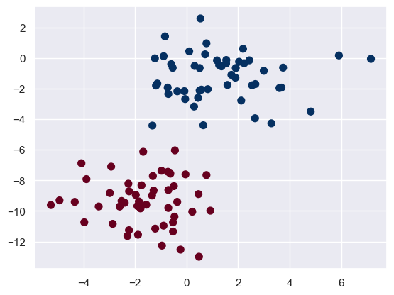

# 六 Bayes 贝叶斯

## 1.贝叶斯

- 贝叶斯定理：基于先验概率和样本信息来估计后验概率

$$
P(A|B)=\frac{P(A)P(B|A)}{P(B)}
$$

- 朴素贝叶斯:基于贝叶斯定理的简单概率分类器，它在分类决策中假设各个特征之间相互独立，用于计算给定特征 X 下某个类别 C 的概率

$$
P(c|x)=\frac{P(c)P(x|c)}{P(x)}=\frac{P(c)}{P(x)}\displaystyle\prod_{i=1}^dP(x_i|c)
$$

由于对于所有类别来说P(x)相同，贝叶斯判定准则有

$$
h_{nb}(x)=argmax_{c∈Y}P(c)\displaystyle\prod_{i=1}^dP(c|x)
$$

- sklearn


```python
import numpy as np
import matplotlib.pyplot as plt
import seaborn as sns; sns.set()
from sklearn.datasets import make_blobs
#生成随机数据
# make_blobs：为聚类产生数据集
# n_samples：样本点数，n_features：数据的维度，centers:产生数据的中心点，默认值3
# cluster_std：数据集的标准差，浮点数或者浮点数序列，默认值1.0，random_state：随机种子
X, y = make_blobs(n_samples = 100, n_features=2, centers=2, random_state=2, cluster_std=1.5)
plt.scatter(X[:, 0], X[:, 1], c=y, s=50, cmap='RdBu')
plt.show()

from sklearn.naive_bayes import GaussianNB
model = GaussianNB()#朴素贝叶斯
model.fit(X, y)# 训练模型
rng = np.random.RandomState(0)
X_test = [-6, -14] + [14, 18] * rng.rand(2000, 2)#生成训练集
y_pred = model.predict(X_test)
# 将训练集和测试集的数据用图像表示出来，颜色深直径大的为训练集，颜色浅直径小的为测试集
plt.scatter(X[:, 0], X[:, 1], c=y, s=50, cmap='RdBu')
lim = plt.axis()
plt.scatter(X_test[:, 0], X_test[:, 1], c=y_pred, s=20, cmap='RdBu', alpha=0.1)
plt.axis(lim)
plt.show()

yprob = model.predict_proba(X_test)#返回的预测值为，每条数据对每个分类的概率
print(yprob[-8:].round(2))
```


    

    


    

    


    [[0.89 0.11]
     [1.   0.  ]
     [1.   0.  ]
     [1.   0.  ]
     [1.   0.  ]
     [1.   0.  ]
     [0.   1.  ]
     [0.15 0.85]]

