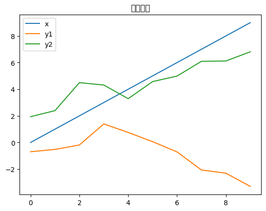
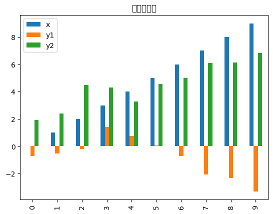
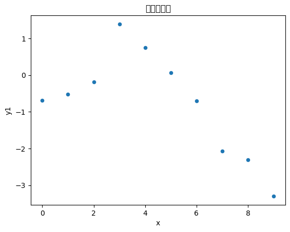
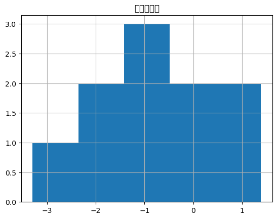

# Pandas 从基础到进阶的详细使用案例

```python
import pandas as pd
import numpy as np
from datetime import datetime, timedelta
import matplotlib.pyplot as plt
```

## 1. Pandas基础操作

```python
# Series创建和基本操作
s = pd.Series([1, 3, 5, np.nan, 6, 8])
print("Series:")
print(s)
print("Series类型:", type(s))
print("Series索引:", s.index)
print("Series值:", s.values)
print("Series描述统计:", s.describe())
```

    Series:
    0    1.0
    1    3.0
    2    5.0
    3    NaN
    4    6.0
    5    8.0
    dtype: float64
    Series类型: <class 'pandas.core.series.Series'>
    Series索引: RangeIndex(start=0, stop=6, step=1)
    Series值: [ 1.  3.  5. nan  6.  8.]
    Series描述统计: count    5.000000
    mean     4.600000
    std      2.701851
    min      1.000000
    25%      3.000000
    50%      5.000000
    75%      6.000000
    max      8.000000
    dtype: float64

```python
# DataFrame创建
df = pd.DataFrame({
    'A': [1, 2, 3, 4],
    'B': pd.Timestamp('20230101'),
    'C': pd.Series(1, index=list(range(4)), dtype='float32'),
    'D': np.array([3] * 4, dtype='int32'),
    'E': pd.Categorical(["test", "train", "test", "train"]),
    'F': 'foo'
})
print("\nDataFrame:")
print(df)
print("DataFrame数据类型:")
print(df.dtypes)
print("DataFrame形状:", df.shape)
print("DataFrame信息:")
print(df.info())
```

    DataFrame:
       A          B    C  D      E    F
    0  1 2023-01-01  1.0  3   test  foo
    1  2 2023-01-01  1.0  3  train  foo
    2  3 2023-01-01  1.0  3   test  foo
    3  4 2023-01-01  1.0  3  train  foo
    DataFrame数据类型:
    A            int64
    B    datetime64[s]
    C          float32
    D            int32
    E         category
    F           object
    dtype: object
    DataFrame形状: (4, 6)
    DataFrame信息:
    <class 'pandas.core.frame.DataFrame'>
    Index: 4 entries, 0 to 3
    Data columns (total 6 columns):
     #   Column  Non-Null Count  Dtype
    ---  ------  --------------  -----
    0   A       4 non-null      int64
    1   B       4 non-null      datetime64[s]
     2   C       4 non-null      float32
    3   D       4 non-null      int32
    4   E       4 non-null      category
    5   F       4 non-null      object
    dtypes: category(1), datetime64[s](1), float32(1), int32(1), int64(1), object(1)
    memory usage: 288.0+ bytes
    None

## 2. 数据读取和写入

```python
# 创建示例数据
data = {
    'Name': ['Alice', 'Bob', 'Charlie', 'David', 'Eve'],
    'Age': [25, 30, 35, 28, 32],
    'City': ['New York', 'London', 'Tokyo', 'Paris', 'Sydney'],
    'Salary': [50000, 60000, 70000, 55000, 65000]
}
df_sample = pd.DataFrame(data)
print("示例数据:")
print(df_sample)

# 保存为CSV
df_sample.to_csv('/tmp/sample_data.csv', index=False)
print("数据已保存为CSV文件")

# 从CSV读取
df_read = pd.read_csv('/tmp/sample_data.csv')
print("从CSV读取的数据:")
print(df_read.head())
```

    示例数据:
          Name  Age      City  Salary
    0    Alice   25  New York   50000
    1      Bob   30    London   60000
    2  Charlie   35     Tokyo   70000
    3    David   28     Paris   55000
    4      Eve   32    Sydney   65000
    数据已保存为CSV文件
    从CSV读取的数据:
          Name  Age      City  Salary
    0    Alice   25  New York   50000
    1      Bob   30    London   60000
    2  Charlie   35     Tokyo   70000
    3    David   28     Paris   55000
    4      Eve   32    Sydney   65000

## 3. 数据选择和索引

```python
df = pd.DataFrame(np.random.randn(6, 4), 
                  index=pd.date_range('20230101', periods=6),
                  columns=list('ABCD'))
print("原始数据:")
print(df)

# 选择列
print("\n选择列A:")
print(df['A'])
print("\n选择多列:")
print(df[['A', 'C']])

# 选择行
print("\n选择前3行:")
print(df[0:3])
print("\n按标签选择:")
print(df.loc['2023-01-02':'2023-01-04', ['A', 'B']])
print("\n按位置选择:")
print(df.iloc[3:5, 0:2])

# 布尔索引
print("\n布尔索引(A列大于0):")
print(df[df.A > 0])
print("\n多条件筛选:")
print(df[(df.A > 0) & (df.B < 0)])
```

    原始数据:
                       A         B         C         D
    2023-01-01  0.811937  1.382129 -0.458692  0.250370
    2023-01-02 -0.124542 -1.532981 -0.471101 -1.797905
    2023-01-03  0.342414  0.744138 -1.674813  0.015059
    2023-01-04  0.655752  0.825130  0.072174  0.414027
    2023-01-05 -0.759593 -0.808303 -0.432388 -1.041269
    2023-01-06 -0.226249  0.414288  0.362685 -0.703399

    选择列A:
    2023-01-01    0.811937
    2023-01-02   -0.124542
    2023-01-03    0.342414
    2023-01-04    0.655752
    2023-01-05   -0.759593
    2023-01-06   -0.226249
    Freq: D, Name: A, dtype: float64

    选择多列:
                       A         C
    2023-01-01  0.811937 -0.458692
    2023-01-02 -0.124542 -0.471101
    2023-01-03  0.342414 -1.674813
    2023-01-04  0.655752  0.072174
    2023-01-05 -0.759593 -0.432388
    2023-01-06 -0.226249  0.362685

    选择前3行:
                       A         B         C         D
    2023-01-01  0.811937  1.382129 -0.458692  0.250370
    2023-01-02 -0.124542 -1.532981 -0.471101 -1.797905
    2023-01-03  0.342414  0.744138 -1.674813  0.015059

    按标签选择:
                       A         B
    2023-01-02 -0.124542 -1.532981
    2023-01-03  0.342414  0.744138
    2023-01-04  0.655752  0.825130

    按位置选择:
                       A         B
    2023-01-04  0.655752  0.825130
    2023-01-05 -0.759593 -0.808303

    布尔索引(A列大于0):
                       A         B         C         D
    2023-01-01  0.811937  1.382129 -0.458692  0.250370
    2023-01-03  0.342414  0.744138 -1.674813  0.015059
    2023-01-04  0.655752  0.825130  0.072174  0.414027

    多条件筛选:
    Empty DataFrame
    Columns: [A, B, C, D]
    Index: []

## 4. 数据清洗

```python
# 创建包含缺失值的数据
df_dirty = pd.DataFrame({
    'A': [1, 2, np.nan, 4, 5],
    'B': [np.nan, 2, 3, 4, 5],
    'C': [1, 2, 3, np.nan, 5],
    'D': ['a', 'b', 'c', 'd', 'e']
})
print("包含缺失值的数据:")
print(df_dirty)
print("\n缺失值统计:")
print(df_dirty.isnull().sum())

# 删除缺失值
print("\n删除包含缺失值的行:")
print(df_dirty.dropna())
print("\n删除包含缺失值的列:")
print(df_dirty.dropna(axis=1))

# 填充缺失值
print("\n用0填充缺失值:")
print(df_dirty.fillna(0))
print("\n用前一个值填充:")
print(df_dirty.fillna(method='ffill'))
print("\n用均值填充数值列:")
df_filled = df_dirty.copy()
for col in df_filled.select_dtypes(include=[np.number]).columns:
    df_filled[col].fillna(df_filled[col].mean(), inplace=True)
print(df_filled)

# 重复值处理
df_dup = pd.DataFrame({
    'A': [1, 2, 2, 3, 3],
    'B': [1, 2, 2, 3, 4]
})
print("\n包含重复值的数据:")
print(df_dup)
print("\n检查重复值:")
print(df_dup.duplicated())
print("\n删除重复值:")
print(df_dup.drop_duplicates())
```

    包含缺失值的数据:
         A    B    C  D
    0  1.0  NaN  1.0  a
    1  2.0  2.0  2.0  b
    2  NaN  3.0  3.0  c
    3  4.0  4.0  NaN  d
    4  5.0  5.0  5.0  e

    缺失值统计:
    A    1
    B    1
    C    1
    D    0
    dtype: int64

    删除包含缺失值的行:
         A    B    C  D
    1  2.0  2.0  2.0  b
    4  5.0  5.0  5.0  e

    删除包含缺失值的列:
       D
    0  a
    1  b
    2  c
    3  d
    4  e

    用0填充缺失值:
         A    B    C  D
    0  1.0  0.0  1.0  a
    1  2.0  2.0  2.0  b
    2  0.0  3.0  3.0  c
    3  4.0  4.0  0.0  d
    4  5.0  5.0  5.0  e

    用前一个值填充:
         A    B    C  D
    0  1.0  NaN  1.0  a
    1  2.0  2.0  2.0  b
    2  2.0  3.0  3.0  c
    3  4.0  4.0  3.0  d
    4  5.0  5.0  5.0  e

    用均值填充数值列:
         A    B     C  D
    0  1.0  3.5  1.00  a
    1  2.0  2.0  2.00  b
    2  3.0  3.0  3.00  c
    3  4.0  4.0  2.75  d
    4  5.0  5.0  5.00  e

    包含重复值的数据:
       A  B
    0  1  1
    1  2  2
    2  2  2
    3  3  3
    4  3  4

    检查重复值:
    0    False
    1    False
    2     True
    3    False
    4    False
    dtype: bool

    删除重复值:
       A  B
    0  1  1
    1  2  2
    3  3  3
    4  3  4

    /var/folders/cc/_fp3lvjs5yj560jjt4vv9v9w0000gn/T/ipykernel_49679/28308970.py:23: FutureWarning: DataFrame.fillna with 'method' is deprecated and will raise in a future version. Use obj.ffill() or obj.bfill() instead.
      print(df_dirty.fillna(method='ffill'))

## 5. 数据变换

```python
df = pd.DataFrame({
    'A': [1, 2, 3, 4, 5],
    'B': [10, 20, 30, 40, 50],
    'C': ['a', 'b', 'c', 'd', 'e']
})
print("原始数据:")
print(df)

# 应用函数
print("\n对A列应用平方函数:")
print(df['A'].apply(lambda x: x**2))
print("\n对数值列应用函数:")
print(df[['A', 'B']].apply(np.sqrt))

# 字符串操作
df_str = pd.DataFrame({
    'names': ['Alice Smith', 'Bob Johnson', 'Charlie Brown'],
    'emails': ['alice@email.com', 'bob@email.com', 'charlie@email.com']
})
print("\n字符串数据:")
print(df_str)
print("\n提取姓氏:")
print(df_str['names'].str.split().str[1])
print("\n转换为大写:")
print(df_str['names'].str.upper())
print("\n检查是否包含特定字符:")
print(df_str['emails'].str.contains('alice'))
```

    原始数据:
       A   B  C
    0  1  10  a
    1  2  20  b
    2  3  30  c
    3  4  40  d
    4  5  50  e

    对A列应用平方函数:
    0     1
    1     4
    2     9
    3    16
    4    25
    Name: A, dtype: int64

    对数值列应用函数:
              A         B
    0  1.000000  3.162278
    1  1.414214  4.472136
    2  1.732051  5.477226
    3  2.000000  6.324555
    4  2.236068  7.071068

    字符串数据:
               names             emails
    0    Alice Smith    alice@email.com
    1    Bob Johnson      bob@email.com
    2  Charlie Brown  charlie@email.com

    提取姓氏:
    0      Smith
    1    Johnson
    2      Brown
    Name: names, dtype: object

    转换为大写:
    0      ALICE SMITH
    1      BOB JOHNSON
    2    CHARLIE BROWN
    Name: names, dtype: object

    检查是否包含特定字符:
    0     True
    1    False
    2    False
    Name: emails, dtype: bool

## 6. 分组操作

```python
df_group = pd.DataFrame({
    'Department': ['Sales', 'Sales', 'Marketing', 'Marketing', 'IT', 'IT'],
    'Employee': ['Alice', 'Bob', 'Charlie', 'David', 'Eve', 'Frank'],
    'Salary': [50000, 55000, 60000, 58000, 70000, 72000],
    'Experience': [2, 3, 5, 4, 6, 7]
})
print("员工数据:")
print(df_group)

# 按部门分组
print("\n按部门分组统计:")
print(df_group.groupby('Department').agg({
    'Salary': ['mean', 'sum', 'count'],
    'Experience': 'mean'
}))

# 多重分组
df_multi = pd.DataFrame({
    'Department': ['Sales', 'Sales', 'Marketing', 'Marketing', 'IT', 'IT'],
    'Level': ['Junior', 'Senior', 'Junior', 'Senior', 'Junior', 'Senior'],
    'Salary': [45000, 65000, 50000, 70000, 60000, 80000]
})
print("\n多重分组:")
print(df_multi.groupby(['Department', 'Level'])['Salary'].mean())
```

    员工数据:
      Department Employee  Salary  Experience
    0      Sales    Alice   50000           2
    1      Sales      Bob   55000           3
    2  Marketing  Charlie   60000           5
    3  Marketing    David   58000           4
    4         IT      Eve   70000           6
    5         IT    Frank   72000           7

    按部门分组统计:
                 Salary               Experience
                   mean     sum count       mean
    Department
    IT          71000.0  142000     2        6.5
    Marketing   59000.0  118000     2        4.5
    Sales       52500.0  105000     2        2.5

    多重分组:
    Department  Level
    IT          Junior    60000.0
                Senior    80000.0
    Marketing   Junior    50000.0
                Senior    70000.0
    Sales       Junior    45000.0
                Senior    65000.0
    Name: Salary, dtype: float64

## 7. 数据合并

```python
# 创建示例数据
df1 = pd.DataFrame({
    'ID': [1, 2, 3, 4],
    'Name': ['Alice', 'Bob', 'Charlie', 'David'],
    'Age': [25, 30, 35, 28]
})
df2 = pd.DataFrame({
    'ID': [1, 2, 3, 5],
    'Department': ['Sales', 'Marketing', 'IT', 'HR'],
    'Salary': [50000, 60000, 70000, 55000]
})
print("数据表1:")
print(df1)
print("\n数据表2:")
print(df2)

# 内连接
print("\n内连接:")
print(pd.merge(df1, df2, on='ID', how='inner'))

# 左连接
print("\n左连接:")
print(pd.merge(df1, df2, on='ID', how='left'))

# 外连接
print("\n外连接:")
print(pd.merge(df1, df2, on='ID', how='outer'))

# 拼接
df3 = pd.DataFrame({
    'ID': [6, 7],
    'Name': ['Eve', 'Frank'],
    'Age': [32, 29]
})
print("\n垂直拼接:")
print(pd.concat([df1, df3], ignore_index=True))
```

    数据表1:
       ID     Name  Age
    0   1    Alice   25
    1   2      Bob   30
    2   3  Charlie   35
    3   4    David   28

    数据表2:
       ID Department  Salary
    0   1      Sales   50000
    1   2  Marketing   60000
    2   3         IT   70000
    3   5         HR   55000

    内连接:
       ID     Name  Age Department  Salary
    0   1    Alice   25      Sales   50000
    1   2      Bob   30  Marketing   60000
    2   3  Charlie   35         IT   70000

    左连接:
       ID     Name  Age Department   Salary
    0   1    Alice   25      Sales  50000.0
    1   2      Bob   30  Marketing  60000.0
    2   3  Charlie   35         IT  70000.0
    3   4    David   28        NaN      NaN

    外连接:
       ID     Name   Age Department   Salary
    0   1    Alice  25.0      Sales  50000.0
    1   2      Bob  30.0  Marketing  60000.0
    2   3  Charlie  35.0         IT  70000.0
    3   4    David  28.0        NaN      NaN
    4   5      NaN   NaN         HR  55000.0

    垂直拼接:
       ID     Name  Age
    0   1    Alice   25
    1   2      Bob   30
    2   3  Charlie   35
    3   4    David   28
    4   6      Eve   32
    5   7    Frank   29

## 8. 透视表

```python
df_pivot = pd.DataFrame({
    'Date': pd.date_range('2023-01-01', periods=12, freq='M'),
    'Product': ['A', 'B', 'A', 'B'] * 3,
    'Region': ['North', 'North', 'South', 'South'] * 3,
    'Sales': [100, 150, 120, 180, 110, 160, 130, 190, 105, 155, 125, 185]
})
print("销售数据:")
print(df_pivot)

# 创建透视表
print("\n透视表:")
pivot_table = df_pivot.pivot_table(
    values='Sales',
    index='Product',
    columns='Region',
    aggfunc='mean'
)
print(pivot_table)

# 交叉表
print("\n交叉表:")
print(pd.crosstab(df_pivot['Product'], df_pivot['Region'], values=df_pivot['Sales'], aggfunc='sum'))
```

    销售数据:
             Date Product Region  Sales
    0  2023-01-31       A  North    100
    1  2023-02-28       B  North    150
    2  2023-03-31       A  South    120
    3  2023-04-30       B  South    180
    4  2023-05-31       A  North    110
    5  2023-06-30       B  North    160
    6  2023-07-31       A  South    130
    7  2023-08-31       B  South    190
    8  2023-09-30       A  North    105
    9  2023-10-31       B  North    155
    10 2023-11-30       A  South    125
    11 2023-12-31       B  South    185

    透视表:
    Region   North  South
    Product
    A        105.0  125.0
    B        155.0  185.0

    交叉表:
    Region   North  South
    Product
    A          315    375
    B          465    555

## 9. 时间序列

```python
# 创建时间序列数据
dates = pd.date_range('2023-01-01', periods=100, freq='D')
ts = pd.Series(np.random.randn(100), index=dates)
print("时间序列数据(前10个):")
print(ts.head(10))

# 时间索引操作
print("\n2023年1月的数据:")
print(ts['2023-01'].head())
print("\n按月重采样(求均值):")
print(ts.resample('M').mean())

# 滚动窗口
print("\n7天滚动平均:")
print(ts.rolling(window=7).mean().head(10))

# 时间偏移
print("\n向前偏移3天:")
print(ts.shift(3).head(10))
```

    时间序列数据(前10个):
    2023-01-01    0.633043
    2023-01-02   -1.205793
    2023-01-03   -0.186307
    2023-01-04   -0.925950
    2023-01-05   -0.296575
    2023-01-06    0.765089
    2023-01-07    0.537569
    2023-01-08    1.922644
    2023-01-09   -0.092435
    2023-01-10    0.125457
    Freq: D, dtype: float64

    2023年1月的数据:
    2023-01-01    0.633043
    2023-01-02   -1.205793
    2023-01-03   -0.186307
    2023-01-04   -0.925950
    2023-01-05   -0.296575
    Freq: D, dtype: float64

    按月重采样(求均值):
    2023-01-31    0.132853
    2023-02-28    0.178117
    2023-03-31   -0.363340
    2023-04-30   -0.755475
    Freq: M, dtype: float64

    7天滚动平均:
    2023-01-01         NaN
    2023-01-02         NaN
    2023-01-03         NaN
    2023-01-04         NaN
    2023-01-05         NaN
    2023-01-06         NaN
    2023-01-07   -0.096989
    2023-01-08    0.087240
    2023-01-09    0.246291
    2023-01-10    0.290828
    Freq: D, dtype: float64

    向前偏移3天:
    2023-01-01         NaN
    2023-01-02         NaN
    2023-01-03         NaN
    2023-01-04    0.633043
    2023-01-05   -1.205793
    2023-01-06   -0.186307
    2023-01-07   -0.925950
    2023-01-08   -0.296575
    2023-01-09    0.765089
    2023-01-10    0.537569
    Freq: D, dtype: float64

## 10. 数据可视化基础

```python
# 创建示例数据
df_plot = pd.DataFrame({
    'x': range(10),
    'y1': np.random.randn(10).cumsum(),
    'y2': np.random.randn(10).cumsum()
})
print("绘图数据:")
print(df_plot)

# 注意：实际绘图需要在支持图形显示的环境中运行
# df_plot.plot()  # 线图
# df_plot.plot(kind='bar')  # 柱状图
# df_plot.plot(kind='scatter', x='x', y='y1')  # 散点图
# df_plot['y1'].hist()  # 直方图

# 为了在notebook中显示，我们添加一个简单的绘图示例
df_plot.plot(title='示例线图')
plt.show()

df_plot.plot(kind='bar', title='示例柱状图')
plt.show()

df_plot.plot(kind='scatter', x='x', y='y1', title='示例散点图')
plt.show()

df_plot['y1'].hist(bins=5)
plt.title('示例直方图')
plt.show()
```

    绘图数据:
       x        y1        y2
    0  0 -0.696051  1.936907
    1  1 -0.521892  2.390199
    2  2 -0.189325  4.493946
    3  3  1.391588  4.314372
    4  4  0.752769  3.290980
    5  5  0.060365  4.573363
    6  6 -0.709191  4.987634
    7  7 -2.065804  6.094666
    8  8 -2.307299  6.119528
    9  9 -3.298396  6.807911

    /Users/xtq/anaconda3/envs/uni/lib/python3.11/site-packages/IPython/core/pylabtools.py:152: UserWarning: Glyph 31034 (\N{CJK UNIFIED IDEOGRAPH-793A}) missing from current font.
      fig.canvas.print_figure(bytes_io, **kw)
    /Users/xtq/anaconda3/envs/uni/lib/python3.11/site-packages/IPython/core/pylabtools.py:152: UserWarning: Glyph 20363 (\N{CJK UNIFIED IDEOGRAPH-4F8B}) missing from current font.
      fig.canvas.print_figure(bytes_io, **kw)
    /Users/xtq/anaconda3/envs/uni/lib/python3.11/site-packages/IPython/core/pylabtools.py:152: UserWarning: Glyph 32447 (\N{CJK UNIFIED IDEOGRAPH-7EBF}) missing from current font.
      fig.canvas.print_figure(bytes_io, **kw)
    /Users/xtq/anaconda3/envs/uni/lib/python3.11/site-packages/IPython/core/pylabtools.py:152: UserWarning: Glyph 22270 (\N{CJK UNIFIED IDEOGRAPH-56FE}) missing from current font.
      fig.canvas.print_figure(bytes_io, **kw)



    /Users/xtq/anaconda3/envs/uni/lib/python3.11/site-packages/IPython/core/pylabtools.py:152: UserWarning: Glyph 31034 (\N{CJK UNIFIED IDEOGRAPH-793A}) missing from current font.
      fig.canvas.print_figure(bytes_io, **kw)
    /Users/xtq/anaconda3/envs/uni/lib/python3.11/site-packages/IPython/core/pylabtools.py:152: UserWarning: Glyph 20363 (\N{CJK UNIFIED IDEOGRAPH-4F8B}) missing from current font.
      fig.canvas.print_figure(bytes_io, **kw)
    /Users/xtq/anaconda3/envs/uni/lib/python3.11/site-packages/IPython/core/pylabtools.py:152: UserWarning: Glyph 26609 (\N{CJK UNIFIED IDEOGRAPH-67F1}) missing from current font.
      fig.canvas.print_figure(bytes_io, **kw)
    /Users/xtq/anaconda3/envs/uni/lib/python3.11/site-packages/IPython/core/pylabtools.py:152: UserWarning: Glyph 29366 (\N{CJK UNIFIED IDEOGRAPH-72B6}) missing from current font.
      fig.canvas.print_figure(bytes_io, **kw)
    /Users/xtq/anaconda3/envs/uni/lib/python3.11/site-packages/IPython/core/pylabtools.py:152: UserWarning: Glyph 22270 (\N{CJK UNIFIED IDEOGRAPH-56FE}) missing from current font.
      fig.canvas.print_figure(bytes_io, **kw)



    /Users/xtq/anaconda3/envs/uni/lib/python3.11/site-packages/IPython/core/pylabtools.py:152: UserWarning: Glyph 31034 (\N{CJK UNIFIED IDEOGRAPH-793A}) missing from current font.
      fig.canvas.print_figure(bytes_io, **kw)
    /Users/xtq/anaconda3/envs/uni/lib/python3.11/site-packages/IPython/core/pylabtools.py:152: UserWarning: Glyph 20363 (\N{CJK UNIFIED IDEOGRAPH-4F8B}) missing from current font.
      fig.canvas.print_figure(bytes_io, **kw)
    /Users/xtq/anaconda3/envs/uni/lib/python3.11/site-packages/IPython/core/pylabtools.py:152: UserWarning: Glyph 25955 (\N{CJK UNIFIED IDEOGRAPH-6563}) missing from current font.
      fig.canvas.print_figure(bytes_io, **kw)
    /Users/xtq/anaconda3/envs/uni/lib/python3.11/site-packages/IPython/core/pylabtools.py:152: UserWarning: Glyph 28857 (\N{CJK UNIFIED IDEOGRAPH-70B9}) missing from current font.
      fig.canvas.print_figure(bytes_io, **kw)
    /Users/xtq/anaconda3/envs/uni/lib/python3.11/site-packages/IPython/core/pylabtools.py:152: UserWarning: Glyph 22270 (\N{CJK UNIFIED IDEOGRAPH-56FE}) missing from current font.
      fig.canvas.print_figure(bytes_io, **kw)



    /Users/xtq/anaconda3/envs/uni/lib/python3.11/site-packages/IPython/core/pylabtools.py:152: UserWarning: Glyph 30452 (\N{CJK UNIFIED IDEOGRAPH-76F4}) missing from current font.
      fig.canvas.print_figure(bytes_io, **kw)
    /Users/xtq/anaconda3/envs/uni/lib/python3.11/site-packages/IPython/core/pylabtools.py:152: UserWarning: Glyph 26041 (\N{CJK UNIFIED IDEOGRAPH-65B9}) missing from current font.
      fig.canvas.print_figure(bytes_io, **kw)



## 11. 高级索引

```python
# 多级索引
arrays = [['A', 'A', 'B', 'B'], ['one', 'two', 'one', 'two']]
tuples = list(zip(*arrays))
index = pd.MultiIndex.from_tuples(tuples, names=['first', 'second'])
df_multi_index = pd.DataFrame(np.random.randn(4, 2), index=index, columns=['X', 'Y'])
print("多级索引DataFrame:")
print(df_multi_index)

# 多级索引操作
print("\n选择A级别的数据:")
print(df_multi_index.loc['A'])
print("\n交换索引级别:")
print(df_multi_index.swaplevel(0, 1))
print("\n按级别排序:")
print(df_multi_index.sort_index(level=1))
```

    多级索引DataFrame:
                         X         Y
    first second
    A     one    -0.113121  0.491103
          two     0.740081 -1.017043
    B     one     2.647916 -1.670777
          two    -0.540132 -0.293017

    选择A级别的数据:
                   X         Y
    second
    one    -0.113121  0.491103
    two     0.740081 -1.017043

    交换索引级别:
                         X         Y
    second first
    one    A     -0.113121  0.491103
    two    A      0.740081 -1.017043
    one    B      2.647916 -1.670777
    two    B     -0.540132 -0.293017

    按级别排序:
                         X         Y
    first second
    A     one    -0.113121  0.491103
    B     one     2.647916 -1.670777
    A     two     0.740081 -1.017043
    B     two    -0.540132 -0.293017

## 12. 性能优化

```python
# 数据类型优化
df_optimize = pd.DataFrame({
    'int_col': [1, 2, 3, 4, 5],
    'float_col': [1.1, 2.2, 3.3, 4.4, 5.5],
    'str_col': ['a', 'b', 'c', 'd', 'e']
})
print("原始数据类型:")
print(df_optimize.dtypes)
print("内存使用:")
print(df_optimize.memory_usage(deep=True))

# 优化数据类型
df_optimize['int_col'] = df_optimize['int_col'].astype('int8')
df_optimize['str_col'] = df_optimize['str_col'].astype('category')
print("\n优化后数据类型:")
print(df_optimize.dtypes)
print("优化后内存使用:")
print(df_optimize.memory_usage(deep=True))

# 使用query方法
df_query = pd.DataFrame({
    'A': range(100),
    'B': np.random.randn(100),
    'C': np.random.choice(['X', 'Y', 'Z'], 100)
})
print("\n使用query方法筛选:")
result = df_query.query('A > 50 and B > 0 and C == "X"')
print(f"筛选结果数量: {len(result)}")
```

    原始数据类型:
    int_col        int64
    float_col    float64
    str_col       object
    dtype: object
    内存使用:
    Index        132
    int_col       40
    float_col     40
    str_col      290
    dtype: int64

    优化后数据类型:
    int_col          int8
    float_col     float64
    str_col      category
    dtype: object
    优化后内存使用:
    Index        132
    int_col        5
    float_col     40
    str_col      467
    dtype: int64

    使用query方法筛选:
    筛选结果数量: 9

## 13. 数据导入导出进阶

```python
# 创建复杂数据
complex_data = pd.DataFrame({
    'date': pd.date_range('2023-01-01', periods=5),
    'category': pd.Categorical(['A', 'B', 'A', 'C', 'B']),
    'value': [1.1, 2.2, 3.3, 4.4, 5.5],
    'description': ['First', 'Second', 'Third', 'Fourth', 'Fifth']
})
print("复杂数据:")
print(complex_data)
print("数据类型:")
print(complex_data.dtypes)

# 保存为不同格式
complex_data.to_json('/tmp/complex_data.json', orient='records', date_format='iso')
complex_data.to_pickle('/tmp/complex_data.pkl')
print("数据已保存为JSON和Pickle格式")

# 从不同格式读取
df_from_json = pd.read_json('/tmp/complex_data.json')
df_from_pickle = pd.read_pickle('/tmp/complex_data.pkl')
print("\n从JSON读取的数据类型:")
print(df_from_json.dtypes)
print("\n从Pickle读取的数据类型:")
print(df_from_pickle.dtypes)
```

    复杂数据:
            date category  value description
    0 2023-01-01        A    1.1       First
    1 2023-01-02        B    2.2      Second
    2 2023-01-03        A    3.3       Third
    3 2023-01-04        C    4.4      Fourth
    4 2023-01-05        B    5.5       Fifth
    数据类型:
    date           datetime64[ns]
    category             category
    value                 float64
    description            object
    dtype: object
    数据已保存为JSON和Pickle格式

    从JSON读取的数据类型:
    date           datetime64[ns]
    category               object
    value                 float64
    description            object
    dtype: object

    从Pickle读取的数据类型:
    date           datetime64[ns]
    category             category
    value                 float64
    description            object
    dtype: object

## 14. 数据验证和质量检查

```python
validation_data = pd.DataFrame({
    'age': [25, 30, -5, 150, 35],
    'salary': [50000, 60000, 70000, -10000, 80000],
    'email': ['valid@email.com', 'invalid-email', 'another@valid.com', '', 'test@test.com']
})
print("待验证数据:")
print(validation_data)

# 数据范围检查
print("\n年龄异常值检查:")
age_outliers = validation_data[(validation_data['age'] < 0) | (validation_data['age'] > 120)]
print(age_outliers)

# 数据格式检查
print("\n邮箱格式检查:")
email_pattern = r'^[\w\.-]+@[\w\.-]+\.w+$'
valid_emails = validation_data['email'].str.match(email_pattern, na=False)
print("有效邮箱:", validation_data[valid_emails]['email'].tolist())
print("无效邮箱:", validation_data[~valid_emails]['email'].tolist())
```

    待验证数据:
       age  salary              email
    0   25   50000    valid@email.com
    1   30   60000      invalid-email
    2   -5   70000  another@valid.com
    3  150  -10000
    4   35   80000      test@test.com

    年龄异常值检查:
       age  salary              email
    2   -5   70000  another@valid.com
    3  150  -10000

    邮箱格式检查:
    有效邮箱: []
    无效邮箱: ['valid@email.com', 'invalid-email', 'another@valid.com', '', 'test@test.com']

## 15. 高级数据操作

```python
# 数据透视和逆透视
wide_data = pd.DataFrame({
    'ID': [1, 2, 3],
    'Name': ['Alice', 'Bob', 'Charlie'],
    'Math': [90, 85, 92],
    'Science': [88, 90, 87],
    'English': [85, 88, 90]
})
print("宽格式数据:")
print(wide_data)

# 宽格式转长格式
long_data = pd.melt(wide_data, 
                   id_vars=['ID', 'Name'], 
                   value_vars=['Math', 'Science', 'English'],
                   var_name='Subject', 
                   value_name='Score')
print("\n长格式数据:")
print(long_data)

# 长格式转宽格式
wide_again = long_data.pivot(index=['ID', 'Name'], columns='Subject', values='Score')
print("\n重新转换为宽格式:")
print(wide_again)

# 数据分箱
scores = pd.Series([45, 67, 89, 92, 78, 56, 34, 88, 91, 76])
print("\n原始分数:")
print(scores)

# 等宽分箱
bins_equal = pd.cut(scores, bins=3, labels=['低', '中', '高'])
print("\n等宽分箱:")
print(bins_equal)

# 等频分箱
bins_quantile = pd.qcut(scores, q=3, labels=['下', '中', '上'])
print("\n等频分箱:")
print(bins_quantile)
```

    宽格式数据:
       ID     Name  Math  Science  English
    0   1    Alice    90       88       85
    1   2      Bob    85       90       88
    2   3  Charlie    92       87       90

    长格式数据:
       ID     Name  Subject  Score
    0   1    Alice     Math     90
    1   2      Bob     Math     85
    2   3  Charlie     Math     92
    3   1    Alice  Science     88
    4   2      Bob  Science     90
    5   3  Charlie  Science     87
    6   1    Alice  English     85
    7   2      Bob  English     88
    8   3  Charlie  English     90

    重新转换为宽格式:
    Subject     English  Math  Science
    ID Name
    1  Alice         85    90       88
    2  Bob           88    85       90
    3  Charlie       90    92       87

    原始分数:
    0    45
    1    67
    2    89
    3    92
    4    78
    5    56
    6    34
    7    88
    8    91
    9    76
    dtype: int64

    等宽分箱:
    0    低
    1    中
    2    高
    3    高
    4    高
    5    中
    6    低
    7    高
    8    高
    9    高
    dtype: category
    Categories (3, object): ['低' < '中' < '高']

    等频分箱:
    0    下
    1    下
    2    上
    3    上
    4    中
    5    下
    6    下
    7    中
    8    上
    9    中
    dtype: category
    Categories (3, object): ['下' < '中' < '上']

## Pandas学习示例完成

```python
print("\n=== Pandas学习示例完成 ===")
print("本文件包含了Pandas从基础到进阶的15个主要模块:")
print("1. 基础操作 - Series和DataFrame创建")
print("2. 数据读写 - CSV等格式的导入导出")
print("3. 数据选择 - 各种索引和筛选方法")
print("4. 数据清洗 - 缺失值和重复值处理")
print("5. 数据变换 - 函数应用和字符串操作")
print("6. 分组操作 - groupby和聚合函数")
print("7. 数据合并 - merge和concat操作")
print("8. 透视表 - pivot_table和交叉表")
print("9. 时间序列 - 时间索引和重采样")
print("10. 数据可视化 - 基础绘图方法")
print("11. 高级索引 - 多级索引操作")
print("12. 性能优化 - 数据类型和查询优化")
print("13. 导入导出进阶 - 多种格式处理")
print("14. 数据验证 - 质量检查和异常检测")
print("15. 高级操作 - 数据透视和分箱")
```

    === Pandas学习示例完成 ===
    本文件包含了Pandas从基础到进阶的15个主要模块:
    1. 基础操作 - Series和DataFrame创建
    2. 数据读写 - CSV等格式的导入导出
    3. 数据选择 - 各种索引和筛选方法
    4. 数据清洗 - 缺失值和重复值处理
    5. 数据变换 - 函数应用和字符串操作
    6. 分组操作 - groupby和聚合函数
    7. 数据合并 - merge和concat操作
    8. 透视表 - pivot_table和交叉表
    9. 时间序列 - 时间索引和重采样
    10. 数据可视化 - 基础绘图方法
    11. 高级索引 - 多级索引操作
    12. 性能优化 - 数据类型和查询优化
    13. 导入导出进阶 - 多种格式处理
    14. 数据验证 - 质量检查和异常检测
    15. 高级操作 - 数据透视和分箱
