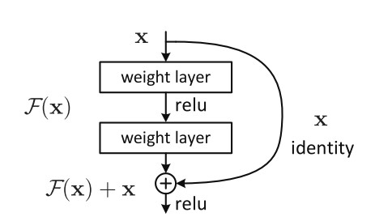

# 四 PyTorch基础实战

## 1 ResNet

### 1.1 基本介绍
**残差神经网络（ResNet）**针对网络层数增加出现的训练精度退化现象发明了 “快捷连接（Shortcut connection）”，将输入直接连接到后面的层，极大的消除了深度过大的梯度消失和梯度爆炸问题，深度首次突破100层。
网络层之间的梯度（值大于 1.0）重复相乘导致的指数级增长会产生**梯度爆炸**。
网络层之间的梯度（值小于 1.0）重复相乘导致的指数级变小会产生**梯度消失**。

### 1.2 源码解读

[torchvision的ResNet源码](https://github.com/pytorch/vision/blob/master/torchvision/models/resnet.py)

#### 1.2.1 卷积核的封装

首先封装了3x3和1x1的卷积核，这样可以增加代码的可读性

```python
def conv3x3(in_planes: int, out_planes: int, stride: int = 1, groups: int = 1, dilation: int = 1) -> nn.Conv2d:
    """3x3 convolution with padding"""
    return nn.Conv2d(
        in_planes,
        out_planes,
        kernel_size=3,
        stride=stride,
        padding=dilation,
        groups=groups,
        bias=False,
        dilation=dilation,
    )


def conv1x1(in_planes: int, out_planes: int, stride: int = 1) -> nn.Conv2d:
    """1x1 convolution"""
    return nn.Conv2d(in_planes, out_planes, kernel_size=1, stride=stride, bias=False)

```

#### 1.2.2 基本模块的设计 

ResNet在设计时采用了模块化设计，是由很多相同的模块堆叠起来的。针对不同大小的ResNet，书写了BasicBlock（左）和BottleNeck（右）两个基本模块。


ResNet常见的大小有下图的ResNet-18，ResNet-34，ResNet-50、ResNet-101和ResNet-152，其中网络后面的数字代表的是网络的层数。


以ResNet101为例：

| layer_name | 次数                            |
| ---------- | ------------------------------- |
| conv1      | 卷积1次                         |
| conv2_x    | 卷积3 x 3 = 9次                 |
| conv3_x    | 卷积4 x 3 = 12次                |
| conv4_x    | 卷积23 x 3 = 69次               |
| conv5_x    | 卷积3 x 3 = 9次                 |
| fc         | average pool 1次                |
| 合计       | 1 + 9 + 12 + 69 + 9 + 1 = 101次 |

##### 1.2.2.1 Shortcut Connection



shortcut connection也就是所谓的“抄近道”，它有两种方式，其一为同等维度的映射，即输入输出直接相加（即上图中的F(x) + x），另一种为不同维度的映射，这时候就需要给x补充一个线性映射来匹配维度。


左：VGG-19模型，作为参考。 中：一个有34个参数层的普通网络。 右：一个有34个参数层的残差网络（即resnet34）

在上图最右侧的路径中，我们可以很明显的看到shortcut connection加入了网络之中，同时，图中也很明显的可以看到，实线部分就是进行了单纯的F(x)+x操作，而虚线部分，第一个卷积层的stride是2（那个/2的意思就是stride是2）；同时注意到深度也发生了变换，channel数目增加一倍（扩大两倍），这样F(x)的分辨率比x小一半，厚度比x大一倍。在这样的shortcut connection中，就需要补充线性映射来增加维度。在ResNet中，作者使用了1 x 1的卷积核来达到这个目的。

##### 1.2.2.2 BasicBlock

BasicBlock模块用来构建resnet18和resnet34

```python
class BasicBlock(nn.Module):
    expansion: int = 1

    def __init__(
        self,
        inplanes: int,
        planes: int,
        stride: int = 1,
        downsample: Optional[nn.Module] = None,
        groups: int = 1,
        base_width: int = 64,
        dilation: int = 1,
        norm_layer: Optional[Callable[..., nn.Module]] = None,
    ) -> None:
        super().__init__()
        if norm_layer is None:
            norm_layer = nn.BatchNorm2d
        if groups != 1 or base_width != 64:
            raise ValueError("BasicBlock only supports groups=1 and base_width=64")
        if dilation > 1:
            raise NotImplementedError("Dilation > 1 not supported in BasicBlock")
        # Both self.conv1 and self.downsample layers downsample the input when stride != 1
        self.conv1 = conv3x3(inplanes, planes, stride)
        self.bn1 = norm_layer(planes)
        self.relu = nn.ReLU(inplace=True)
        self.conv2 = conv3x3(planes, planes)
        self.bn2 = norm_layer(planes)
        self.downsample = downsample
        self.stride = stride

    def forward(self, x: Tensor) -> Tensor:
        identity = x  # x  给自己先备份一份

        out = self.conv1(x)  # 对x做卷积 
        out = self.bn1(out)  # 对x归一化 
        out = self.relu(out)  # 对x用激活函数

        out = self.conv2(out)  # 对x做卷积
        out = self.bn2(out)  # 归一化

        if self.downsample is not None:
            identity = self.downsample(x)

        out += identity  # 进行downsample
        out = self.relu(out)

        return out

```

##### 1.2.2.3 BottleNeck

BottleNeck模块用来构建resnet50，resnet101和resnet152

```python
class Bottleneck(nn.Module):
    # Bottleneck in torchvision places the stride for downsampling at 3x3 convolution(self.conv2)
    # while original implementation places the stride at the first 1x1 convolution(self.conv1)
    # according to "Deep residual learning for image recognition"https://arxiv.org/abs/1512.03385.
    # This variant is also known as ResNet V1.5 and improves accuracy according to
    # https://ngc.nvidia.com/catalog/model-scripts/nvidia:resnet_50_v1_5_for_pytorch.

    expansion: int = 4  # 对输出通道进行倍增

    def __init__(
        self,
        inplanes: int,
        planes: int,
        stride: int = 1,
        downsample: Optional[nn.Module] = None,
        groups: int = 1,
        base_width: int = 64,
        dilation: int = 1,
        norm_layer: Optional[Callable[..., nn.Module]] = None,
    ) -> None:
        super().__init__()
        if norm_layer is None:
            norm_layer = nn.BatchNorm2d
        width = int(planes * (base_width / 64.0)) * groups
        # Both self.conv2 and self.downsample layers downsample the input when stride != 1
        self.conv1 = conv1x1(inplanes, width)
        self.bn1 = norm_layer(width)
        self.conv2 = conv3x3(width, width, stride, groups, dilation)
        self.bn2 = norm_layer(width)
        self.conv3 = conv1x1(width, planes * self.expansion)
        self.bn3 = norm_layer(planes * self.expansion)
        self.relu = nn.ReLU(inplace=True)
        self.downsample = downsample
        self.stride = stride

        # Bottleneckd forward函数和BasicBlock类似，不再额外注释
    def forward(self, x: Tensor) -> Tensor:
        identity = x

        out = self.conv1(x)
        out = self.bn1(out)
        out = self.relu(out)

        out = self.conv2(out)
        out = self.bn2(out)
        out = self.relu(out)

        out = self.conv3(out)
        out = self.bn3(out)

        if self.downsample is not None:
            identity = self.downsample(x)

        out += identity
        out = self.relu(out)

        return out

```

#### 1.2.3 网络整体结构

```python
class ResNet(nn.Module):
    def __init__(
        self,
        block: Type[Union[BasicBlock, Bottleneck]], # 选择基本模块
        layers: List[int], # 每一层block的数目构成 -> [3,4,6,3]
        num_classes: int = 1000, # 分类数目
        zero_init_residual: bool = False, # 初始化
        
        #######其他卷积构成，与本文ResNet无关######
        groups: int = 1,
        width_per_group: int = 64,
        replace_stride_with_dilation: Optional[List[bool]] = None,
        #########################################
        
        norm_layer: Optional[Callable[..., nn.Module]] = None, # norm层
    ) -> None:
        super().__init__()
        _log_api_usage_once(self)
        if norm_layer is None:
            norm_layer = nn.BatchNorm2d
        self._norm_layer = norm_layer
		
        self.inplanes = 64 # 输入通道
        
        #######其他卷积构成，与本文ResNet无关######
        self.dilation = 1 # 空洞卷积
        if replace_stride_with_dilation is None:
            # each element in the tuple indicates if we should replace
            # the 2x2 stride with a dilated convolution instead
            replace_stride_with_dilation = [False, False, False]
        if len(replace_stride_with_dilation) != 3:
            raise ValueError(
                "replace_stride_with_dilation should be None "
                f"or a 3-element tuple, got {replace_stride_with_dilation}"
            )
        self.groups = groups
        self.base_width = width_per_group
        #########################################
        
        self.conv1 = nn.Conv2d(3, self.inplanes, kernel_size=7, stride=2, padding=3, bias=False)
        self.bn1 = norm_layer(self.inplanes)
        self.relu = nn.ReLU(inplace=True)
        self.maxpool = nn.MaxPool2d(kernel_size=3, stride=2, padding=1)
        # 通过_make_layer带到层次化设计的效果
        self.layer1 = self._make_layer(block, 64, layers[0])  # 对应着conv2_x
        self.layer2 = self._make_layer(block, 128, layers[1], stride=2, dilate=replace_stride_with_dilation[0])  # 对应着conv3_x
        self.layer3 = self._make_layer(block, 256, layers[2], stride=2, dilate=replace_stride_with_dilation[1])  # 对应着conv4_x
        self.layer4 = self._make_layer(block, 512, layers[3], stride=2, dilate=replace_stride_with_dilation[2])  # 对应着conv5_x
        # 分类头
        self.avgpool = nn.AdaptiveAvgPool2d((1, 1))
        self.fc = nn.Linear(512 * block.expansion, num_classes)
		
        # 模型初始化
        for m in self.modules():
            if isinstance(m, nn.Conv2d):
                nn.init.kaiming_normal_(m.weight, mode="fan_out", nonlinearity="relu")
            elif isinstance(m, (nn.BatchNorm2d, nn.GroupNorm)):
                nn.init.constant_(m.weight, 1)
                nn.init.constant_(m.bias, 0)

        # Zero-initialize the last BN in each residual branch,
        # so that the residual branch starts with zeros, and each residual block behaves like an identity.
        # This improves the model by 0.2~0.3% according to https://arxiv.org/abs/1706.02677
        if zero_init_residual:
            for m in self.modules():
                if isinstance(m, Bottleneck) and m.bn3.weight is not None:
                    nn.init.constant_(m.bn3.weight, 0)  # type: ignore[arg-type]
                elif isinstance(m, BasicBlock) and m.bn2.weight is not None:
                    nn.init.constant_(m.bn2.weight, 0)  # type: ignore[arg-type]
	# 层次化设计
    def _make_layer(
        self,
        block: Type[Union[BasicBlock, Bottleneck]], # 基本构成模块选择
        planes: int,  # 输入的通道
        blocks: int, # 模块数目
        stride: int = 1, # 步长
        dilate: bool = False, # 空洞卷积，与本文无关
    ) -> nn.Sequential:
        norm_layer = self._norm_layer
        downsample = None # 是否采用下采样
        ####################无关#####################
        previous_dilation = self.dilation 
        if dilate:
            self.dilation *= stride
            stride = 1
        #############################################
        if stride != 1 or self.inplanes != planes * block.expansion:
            downsample = nn.Sequential(
                conv1x1(self.inplanes, planes * block.expansion, stride),
                norm_layer(planes * block.expansion),
            )
		
        # 使用layers存储每个layer
        layers = []
        layers.append(
            block(
                self.inplanes, planes, stride, downsample, self.groups, self.base_width, previous_dilation, norm_layer
            )
        )
        self.inplanes = planes * block.expansion
        for _ in range(1, blocks):
            layers.append(
                block(
                    self.inplanes,
                    planes,
                    groups=self.groups,
                    base_width=self.base_width,
                    dilation=self.dilation,
                    norm_layer=norm_layer,
                )
            )
		# 将layers通过nn.Sequential转化为网络
        return nn.Sequential(*layers)

    def _forward_impl(self, x: Tensor) -> Tensor:
        # See note [TorchScript super()]
        x = self.conv1(x)  # conv1   x shape [1 64 112 112]
        x = self.bn1(x)   # 归一化处理   
        x = self.relu(x)  # 激活函数
        x = self.maxpool(x)  # conv2_x的3x3 maxpool        x shape [1 64 56 56]

        x = self.layer1(x) # layer 1
        x = self.layer2(x) # layer 2
        x = self.layer3(x) # layer 3
        x = self.layer4(x) # layer 4

        x = self.avgpool(x) # 自适应池化
        x = torch.flatten(x, 1) 
        x = self.fc(x) # 分类

        return x

    def forward(self, x: Tensor) -> Tensor:
        return self._forward_impl(x) 

```

首先是一个7 x 7的卷积作用在输入的3维图片上，并输入一个64维的特征图（即self.inplanes的初始值），通过BatchNorm层，ReLU层，MaxPool层；然后经过_make_layer()函数构建的4层layer，最后经过一个AveragePooling层，再经过一个fc层得到分类输出。在网络搭建起来后，还对模型的参数(Conv2d、BatchNorm2d、last BN)进行了初始化。

而对于\_make_layer函数，一个_make_layer()构建一个layer层，每一个layer层是上述两种基本模块的堆叠。输入参数中block代表该layer堆叠模块的类型，可选BasicBlock或者BottleNeck；blocks代表该layer中堆叠的block的数目；planes与该layer最终输出的维度数有关，注意最终输出的维度数为planes * block.expansion。除此之外， _make\_layer()是用来生成残差块的，这就牵扯到它的第四个参数：stride，即卷积步幅。该函数中首先定义了如果stride不等于1或者维度不匹配（即输入通道不满足对应关系）的时候的downsample，然后对其进行一次BN操作。接着对inplanes和planes不一致的情况进行了一次downsample ，即将带downsample的block添加至layers。这样保证了x和out的维度一致，接下来通过一个循环添加了指定个数的Block，由于x已经维度一致了，这样添加的其他的Block就可以不用降维了，所以循环添加不含Downsample的Block。

当一个layer包含多个block时，是通过向layers列表中依次加入每个block，来实现block的堆叠的。第一个block需要特殊处理，该block依据传入的self.inplanes, planes以及stride判断，可能含有downsample支路；这个block的输出维度是planes\*block.expansion。紧接着便把self.inplanes更新为此值作为后续block的输入维度。后面的block的stride为默认值1，同时，由于输入为self.inplanes，输出为planes*block.expansion，而self.inplanes = planes * block.expansion，因此不会出现特征图大小或者尺寸不一致的情况，不可能出现downsample操作。

### 1.3 总结

与普通的网络相比，ResNet最大的优势就是引入了Shortcut这个支路，让某一层可以直接连接到后面的层，使得后面的层可以直接学习残差。
通过直接将输入信息绕道传到输出，保护信息的完整性，整个网络则只需要学习输入、输出差别的那一部分，简化学习目标和难度。
在一定程度上解决了卷积神经网络随深度的增加，但是模型效果却变差的问题。

## 2 基础实战——FashionMNIST时装分类

这里的任务是对10个类别的“时装”图像进行分类，使用[FashionMNIST数据集](https://github.com/zalandoresearch/fashion-mnist/tree/master/data/fashion)。


上图给出了FashionMNIST中数据的若干样例图，其中每个小图对应一个样本。
FashionMNIST数据集中包含已经预先划分好的训练集和测试集，其中训练集共60,000张图像，测试集共10,000张图像。每张图像均为单通道黑白图像，大小为28\*28pixel，分属10个类别。

### 2.1 导入包


```python
import os
import numpy as np
import pandas as pd
import torch
import torch.nn as nn
import torch.optim as optim
from torch.utils.data import Dataset, DataLoader
```

### 2.2 配置训练环境和超参数


```python
# 配置GPU，这里有两种方式
## 方案一：使用os.environ
# os.environ['CUDA_VISIBLE_DEVICES'] = '0'
# 方案二：使用“device”，后续对要使用GPU的变量用.to(device)即可
device = torch.device("cuda:1" if torch.cuda.is_available() else "cpu")

## 配置其他超参数，如batch_size, num_workers, learning rate, 以及总的epochs
batch_size = 256
num_workers = 4   # 对于Windows用户，这里应设置为0，否则会出现多线程错误
lr = 1e-4
epochs = 20
```

### 2.3 数据读入和加载


```python
# 首先设置数据变换
from torchvision import transforms

image_size = 28
data_transform = transforms.Compose([
    transforms.ToPILImage(),  
     # 这一步取决于后续的数据读取方式，如果使用内置数据集读取方式则不需要
    transforms.Resize(image_size),
    transforms.ToTensor()
])
```


```python
# ## 读取方式一：使用torchvision自带数据集，下载可能需要一段时间
# from torchvision import datasets

# train_data = datasets.FashionMNIST(root='./', train=True, download=True, transform=data_transform)
# test_data = datasets.FashionMNIST(root='./', train=False, download=True, transform=data_transform)
```


```python
## 读取方式二：读入csv格式的数据，自行构建Dataset类
# csv数据下载链接：https://www.kaggle.com/zalando-research/fashionmnist
class FMDataset(Dataset):
    def __init__(self, df, transform=None):
        self.df = df
        self.transform = transform
        self.images = df.iloc[:,1:].values.astype(np.uint8)
        self.labels = df.iloc[:, 0].values
        
    def __len__(self):
        return len(self.images)
    
    def __getitem__(self, idx):
        image = self.images[idx].reshape(28,28,1)
        label = int(self.labels[idx])
        if self.transform is not None:
            image = self.transform(image)
        else:
            image = torch.tensor(image/255., dtype=torch.float)
        label = torch.tensor(label, dtype=torch.long)
        return image, label
    
import sys
current_dir = sys.path[0]  # 当前脚本目录
parent_dir = os.path.dirname(current_dir)  # 上层目录
data_dir = os.path.join(current_dir, 'datasets/ch04') # data目录

train_csv_file = os.path.join(data_dir, 'fashion_mnist_train.csv')
test_csv_file = os.path.join(data_dir, 'fashion_mnist_test.csv')

train_df = pd.read_csv(train_csv_file)
test_df = pd.read_csv(test_csv_file)

train_data = FMDataset(train_df, data_transform)
test_data = FMDataset(test_df, data_transform)
```


```python
# 在构建训练和测试数据集完成后，需要定义DataLoader类，以便在训练和测试时加载数据
train_loader = DataLoader(train_data, batch_size=batch_size, shuffle=True, num_workers=num_workers, drop_last=True)
test_loader = DataLoader(test_data, batch_size=batch_size, shuffle=False, num_workers=num_workers)
```


```python
# 读入后，我们可以做一些数据可视化操作，主要是验证我们读入的数据是否正确
# import matplotlib.pyplot as plt
# image, label = next(iter(train_loader))
# print(image.shape, label.shape)
# plt.imshow(image[0][0], cmap="gray")
# plt.show()
```

```python
torch.Size([256, 1, 28, 28])
torch.Size([256])
<matplotlib.image.AxesImage at 0x7f19a043cc10>
```


### 2.4 模型设计


```python
# 使用CNN
class Net(nn.Module):
    def __init__(self):
        super(Net, self).__init__()
        self.conv = nn.Sequential(
            nn.Conv2d(1, 32, 5),
            nn.ReLU(),
            nn.MaxPool2d(2, stride=2),
            nn.Dropout(0.3),
            nn.Conv2d(32, 64, 5),
            nn.ReLU(),
            nn.MaxPool2d(2, stride=2),
            nn.Dropout(0.3)
        )
        self.fc = nn.Sequential(
            nn.Linear(64*4*4, 512),
            nn.ReLU(),
            nn.Linear(512, 10)
        )
        
    def forward(self, x):
        x = self.conv(x)
        x = x.view(-1, 64*4*4)
        x = self.fc(x)
        # x = nn.functional.normalize(x)
        return x

model = Net()
# model = model.cuda()  #将模型放于GPU上
# model = nn.DataParallel(model).cuda()   # 或使用多卡训练时的写法
```

### 2.5 设定损失函数和优化器


```python
# 使用交叉熵损失函数
criterion = nn.CrossEntropyLoss()
# criterion = nn.CrossEntropyLoss(weight=[1,1,1,1,3,1,1,1,1,1])
```


```python
# 使用Adam优化器
optimizer = optim.Adam(model.parameters(), lr=0.001)
```

### 2.6 训练和验证


各自封装成函数，方便后续调用
关注两者的主要区别：  
- 模型状态设置  
- 是否需要初始化优化器
- 是否需要将loss传回到网络
- 是否需要每步更新optimizer  
  
此外，对于测试或验证过程，可以计算分类准确率


```python
def train(epoch):
    model.train()
    train_loss = 0
    for data, label in train_loader:
        data, label = data.cuda(), label.cuda()
        optimizer.zero_grad()
        output = model(data)
        loss = criterion(output, label)
        loss.backward()
        optimizer.step()
        train_loss += loss.item()*data.size(0)
    train_loss = train_loss/len(train_loader.dataset)
    print('Epoch: {} \tTraining Loss: {:.6f}'.format(epoch, train_loss))
```


```python
def val(epoch):       
    model.eval()
    val_loss = 0
    gt_labels = []
    pred_labels = []
    with torch.no_grad():
        for data, label in test_loader:
            data, label = data.cuda(), label.cuda()
            output = model(data)
            preds = torch.argmax(output, 1)
            gt_labels.append(label.cpu().data.numpy())
            pred_labels.append(preds.cpu().data.numpy())
            loss = criterion(output, label)
            val_loss += loss.item()*data.size(0)
    val_loss = val_loss/len(test_loader.dataset)
    gt_labels, pred_labels = np.concatenate(gt_labels), np.concatenate(pred_labels)
    acc = np.sum(gt_labels==pred_labels)/len(pred_labels)
    print('Epoch: {} \tValidation Loss: {:.6f}, Accuracy: {:6f}'.format(epoch, val_loss, acc))
```


```python
# # 训练及验证
# for epoch in range(1, epochs+1):
#     train(epoch)
#     val(epoch)
```

### 2.7 模型保存


训练完成后，可以使用torch.save保存模型参数或者整个模型，也可以在训练过程中保存模型


```python
# save_path = "./FahionModel.pkl"
# torch.save(model, save_path)
```

### 2.8 完整示例

```python
import os
import numpy as np
import pandas as pd
import torch
import torch.nn as nn
import torch.optim as optim
from torch.utils.data import Dataset, DataLoader
import matplotlib.pyplot as plt
import sys
from torchvision import transforms

# ## 读取方式一：使用torchvision自带数据集，下载可能需要一段时间
# from torchvision import datasets

# train_data = datasets.FashionMNIST(root='./', train=True, download=True, transform=data_transform)
# test_data = datasets.FashionMNIST(root='./', train=False, download=True, transform=data_transform)

## 读取方式二：读入csv格式的数据，自行构建Dataset类
# csv数据下载链接：https://www.kaggle.com/zalando-research/fashionmnist
class FMDataset(Dataset):
    def __init__(self, df, transform=None):
        self.df = df
        self.transform = transform
        self.images = df.iloc[:,1:].values.astype(np.uint8)
        self.labels = df.iloc[:, 0].values
        
    def __len__(self):
        return len(self.images)
    
    def __getitem__(self, idx):
        image = self.images[idx].reshape(28,28,1)
        label = int(self.labels[idx])
        if self.transform is not None:
            image = self.transform(image)
        else:
            image = torch.tensor(image/255., dtype=torch.float)
        label = torch.tensor(label, dtype=torch.long)
        return image, label

# 加载数据
def load_fm_data(data_transform, batch_size, num_workers):
    current_dir = sys.path[0]  # 当前脚本目录
    parent_dir = os.path.dirname(current_dir)  # 上层目录
    parent_dir = os.path.dirname(parent_dir)  # 上层目录
    data_dir = os.path.join(parent_dir, 'datasets/ch04') # data目录

    train_csv_file = os.path.join(data_dir, 'fashion_mnist_train.csv')
    test_csv_file = os.path.join(data_dir, 'fashion_mnist_test.csv')
    # train_csv_file = "../datasets/fashion_mnist_train.csv"
    # test_csv_file = "../datasets/fashion_mnist_test.csv"

    train_df = pd.read_csv(train_csv_file)
    test_df = pd.read_csv(test_csv_file)
    train_data = FMDataset(train_df, data_transform)
    test_data = FMDataset(test_df, data_transform)

    # 在构建训练和测试数据集完成后，需要定义DataLoader类，以便在训练和测试时加载数据
    train_loader = DataLoader(train_data, batch_size=batch_size, shuffle=True, num_workers=num_workers, drop_last=True)
    test_loader = DataLoader(test_data, batch_size=batch_size, shuffle=False, num_workers=num_workers)

    # 读入后，我们可以做一些数据可视化操作，主要是验证我们读入的数据是否正确
    image, label = next(iter(train_loader))
    print(image.shape, label.shape)
    plt.imshow(image[0][0], cmap="gray")
    plt.show()

    return train_loader, test_loader

# 使用CNN
class Net(nn.Module):
    def __init__(self):
        super(Net, self).__init__()
        self.conv = nn.Sequential(
            nn.Conv2d(1, 32, 5),
            nn.ReLU(),
            nn.MaxPool2d(2, stride=2),
            nn.Dropout(0.3),
            nn.Conv2d(32, 64, 5),
            nn.ReLU(),
            nn.MaxPool2d(2, stride=2),
            nn.Dropout(0.3)
        )
        self.fc = nn.Sequential(
            nn.Linear(64*4*4, 512),
            nn.ReLU(),
            nn.Linear(512, 10)
        )
        
    def forward(self, x):
        x = self.conv(x)
        x = x.view(-1, 64*4*4)
        x = self.fc(x)
        # x = nn.functional.normalize(x)
        return x

def train(epoch, model, device, train_loader, optimizer, criterion):
    model.train()
    train_loss = 0
    for i, (data, label) in enumerate(train_loader):
        device = torch.device("cuda:0" if torch.cuda.is_available() else "cpu")
        data, label = data.to(device), label.to(device)
        optimizer.zero_grad()
        output = model(data)
        loss = criterion(output, label)
        loss.backward()
        optimizer.step()
        train_loss += loss.item()*data.size(0)
        if i % 100 == 0:
            print('--Epoch: {} \tTraining Loss: {:.6f} [{}/{} ({:.0f}%)]'.format(epoch, loss.item(), i * len(data), len(train_loader.dataset),
              100. * i / len(train_loader)))
    train_loss = train_loss/len(train_loader.dataset)
    print('Epoch: {} \tTraining Loss: {:.6f}'.format(epoch, train_loss))

def val(epoch, model, device, test_loader, criterion):       
    model.eval()
    val_loss = 0
    gt_labels = []
    pred_labels = []
    with torch.no_grad():
        for data, label in test_loader:
            # data, label = data.cuda(), label.cuda()
            device = torch.device("cuda:0" if torch.cuda.is_available() else "cpu")
            data, label = data.to(device), label.to(device)
            output = model(data)
            preds = torch.argmax(output, 1)
            gt_labels.append(label.cpu().data.numpy())
            pred_labels.append(preds.cpu().data.numpy())
            loss = criterion(output, label)
            val_loss += loss.item()*data.size(0)
    val_loss = val_loss/len(test_loader.dataset)
    gt_labels, pred_labels = np.concatenate(gt_labels), np.concatenate(pred_labels)
    acc = np.sum(gt_labels==pred_labels)/len(pred_labels)
    print('Epoch: {} \tValidation Loss: {:.6f}, Accuracy: {:6f}'.format(epoch, val_loss, acc))


if __name__ == '__main__':
    # 配置GPU，这里有两种方式
    ## 方案一：使用os.environ
    # os.environ['CUDA_VISIBLE_DEVICES'] = '0'
    # 方案二：使用“device”，后续对要使用GPU的变量用.to(device)即可
    device = torch.device("cuda:1" if torch.cuda.is_available() else "cpu")

    ## 配置其他超参数，如batch_size, num_workers, learning rate, 以及总的epochs
    batch_size = 256
    num_workers = 4   # 对于Windows用户，这里应设置为0，否则会出现多线程错误
    lr = 1e-4
    epochs = 20

    # 首先设置数据变换
    image_size = 28
    data_transform = transforms.Compose([
        transforms.ToPILImage(),  
        # 这一步取决于后续的数据读取方式，如果使用内置数据集读取方式则不需要
        transforms.Resize(image_size),
        transforms.ToTensor()
    ])

    train_loader, test_loader = load_fm_data(data_transform, batch_size, num_workers)

    model = Net()
    # model = model.cuda()  #将模型放于GPU上
    # model = nn.DataParallel(model).cuda()   # 多卡训练时的写法

    # 使用交叉熵损失函数
    criterion = nn.CrossEntropyLoss()
    # criterion = nn.CrossEntropyLoss(weight=[1,1,1,1,3,1,1,1,1,1])

    # 使用Adam优化器
    optimizer = optim.Adam(model.parameters(), lr=0.001)


    # 训练及验证
    for epoch in range(1, epochs+1):
        train(epoch, model, device, train_loader, optimizer, criterion)
        val(epoch, model, device, test_loader, criterion)
    
    # save_path = "./FahionModel.pkl"
    # torch.save(model, save_path)
```
