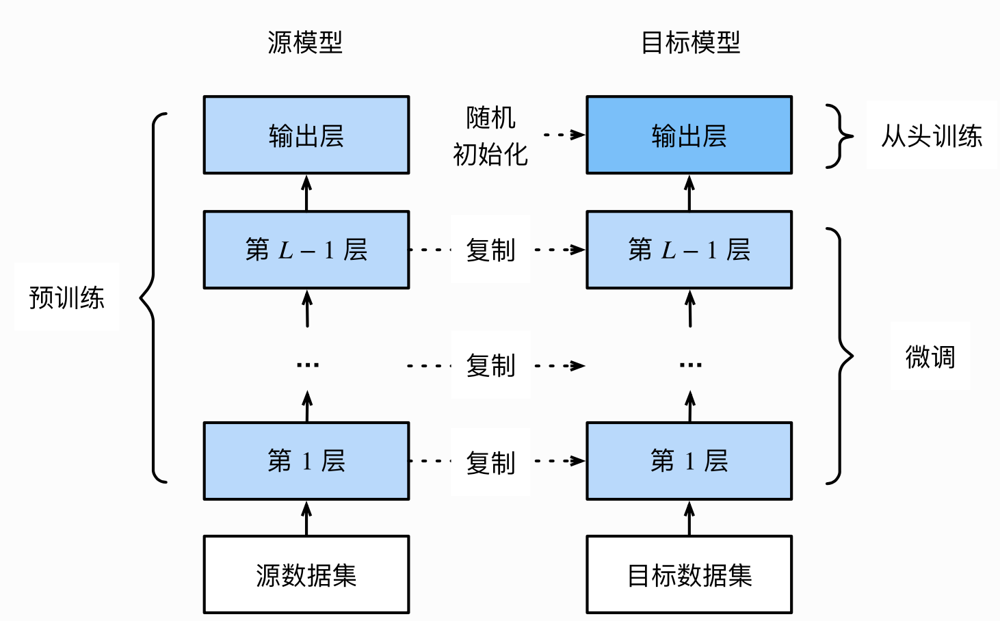

# 六 PyTorch进阶训练技巧

## 1 自定义损失函数

### 1.1 以函数方式定义

```python
def my_loss(output, target):
    loss = torch.mean((output - target)**2)
    return loss

```

### 1.2 以类方式定义

通过继承`nn.Module`，将其当做神经网络的一层来看待

以DiceLoss损失函数为例，定义如下：
$$
DSC = \frac{2|X∩Y|}{|X|+|Y|}
$$

```python
class DiceLoss(nn.Module):
    def __init__(self,weight=None,size_average=True):
        super(DiceLoss,self).__init__()
        
    def forward(self,inputs,targets,smooth=1):
        inputs = F.sigmoid(inputs)       
        inputs = inputs.view(-1)
        targets = targets.view(-1)
        intersection = (inputs * targets).sum()                   
        dice = (2.*intersection + smooth)/(inputs.sum() + targets.sum() + smooth)  
        return 1 - dice

# 使用方法    
criterion = DiceLoss()
loss = criterion(input,targets)

```

```python
class DiceBCELoss(nn.Module):
    def __init__(self, weight=None, size_average=True):
        super(DiceBCELoss, self).__init__()

    def forward(self, inputs, targets, smooth=1):
        inputs = F.sigmoid(inputs)       
        inputs = inputs.view(-1)
        targets = targets.view(-1)
        intersection = (inputs * targets).sum()                     
        dice_loss = 1 - (2.*intersection + smooth)/(inputs.sum() + targets.sum() + smooth)  
        BCE = F.binary_cross_entropy(inputs, targets, reduction='mean')
        Dice_BCE = BCE + dice_loss
        
        return Dice_BCE

```

```python
class IoULoss(nn.Module):
    def __init__(self, weight=None, size_average=True):
        super(IoULoss, self).__init__()

    def forward(self, inputs, targets, smooth=1):
        inputs = F.sigmoid(inputs)       
        inputs = inputs.view(-1)
        targets = targets.view(-1)
        intersection = (inputs * targets).sum()
        total = (inputs + targets).sum()
        union = total - intersection 
        
        IoU = (intersection + smooth)/(union + smooth)
                
        return 1 - IoU

```

```python
ALPHA = 0.8
GAMMA = 2

class FocalLoss(nn.Module):
    def __init__(self, weight=None, size_average=True):
        super(FocalLoss, self).__init__()

    def forward(self, inputs, targets, alpha=ALPHA, gamma=GAMMA, smooth=1):
        inputs = F.sigmoid(inputs)       
        inputs = inputs.view(-1)
        targets = targets.view(-1)
        BCE = F.binary_cross_entropy(inputs, targets, reduction='mean')
        BCE_EXP = torch.exp(-BCE)
        focal_loss = alpha * (1-BCE_EXP)**gamma * BCE
                       
        return focal_loss
```

## 2 动态调整学习率

- Scheduler：学习率衰减策略，解决学习率选择的问题，用于提高精度

### 2.1 使用官方scheduler

- `torch.optim.lr_scheduler`:
  + [`lr_scheduler.LambdaLR`](https://pytorch.org/docs/stable/generated/torch.optim.lr_scheduler.LambdaLR.html#torch.optim.lr_scheduler.LambdaLR)
  + [`lr_scheduler.MultiplicativeLR`](https://pytorch.org/docs/stable/generated/torch.optim.lr_scheduler.MultiplicativeLR.html#torch.optim.lr_scheduler.MultiplicativeLR)
  + [`lr_scheduler.StepLR`](https://pytorch.org/docs/stable/generated/torch.optim.lr_scheduler.StepLR.html#torch.optim.lr_scheduler.StepLR)
  + [`lr_scheduler.MultiStepLR`](https://pytorch.org/docs/stable/generated/torch.optim.lr_scheduler.MultiStepLR.html#torch.optim.lr_scheduler.MultiStepLR)
  + [`lr_scheduler.ExponentialLR`](https://pytorch.org/docs/stable/generated/torch.optim.lr_scheduler.ExponentialLR.html#torch.optim.lr_scheduler.ExponentialLR)
  + [`lr_scheduler.CosineAnnealingLR`](https://pytorch.org/docs/stable/generated/torch.optim.lr_scheduler.CosineAnnealingLR.html#torch.optim.lr_scheduler.CosineAnnealingLR)
  + [`lr_scheduler.ReduceLROnPlateau`](https://pytorch.org/docs/stable/generated/torch.optim.lr_scheduler.ReduceLROnPlateau.html#torch.optim.lr_scheduler.ReduceLROnPlateau)
  + [`lr_scheduler.CyclicLR`](https://pytorch.org/docs/stable/generated/torch.optim.lr_scheduler.CyclicLR.html#torch.optim.lr_scheduler.CyclicLR)
  + [`lr_scheduler.OneCycleLR`](https://pytorch.org/docs/stable/generated/torch.optim.lr_scheduler.OneCycleLR.html#torch.optim.lr_scheduler.OneCycleLR)
  + [`lr_scheduler.CosineAnnealingWarmRestarts`](https://pytorch.org/docs/stable/generated/torch.optim.lr_scheduler.CosineAnnealingWarmRestarts.html#torch.optim.lr_scheduler.CosineAnnealingWarmRestarts)
  + [`lr_scheduler.ConstantLR`](https://pytorch.org/docs/stable/generated/torch.optim.lr_scheduler.ConstantLR.html#torch.optim.lr_scheduler.ConstantLR)
  + [`lr_scheduler.LinearLR`](https://pytorch.org/docs/stable/generated/torch.optim.lr_scheduler.LinearLR.html#torch.optim.lr_scheduler.LinearLR)
  + [`lr_scheduler.PolynomialLR`](https://pytorch.org/docs/stable/generated/torch.optim.lr_scheduler.PolynomialLR.html#torch.optim.lr_scheduler.PolynomialLR)
  + [`lr_scheduler.ChainedScheduler`](https://pytorch.org/docs/stable/generated/torch.optim.lr_scheduler.ChainedScheduler.html#torch.optim.lr_scheduler.ChainedScheduler)
  + [`lr_scheduler.SequentialLR`](https://pytorch.org/docs/stable/generated/torch.optim.lr_scheduler.SequentialLR.html#torch.optim.lr_scheduler.SequentialLR)

这些scheduler都是继承自 `_LRScheduler`类，我们可以通过 `help(torch.optim.lr_scheduler)`来查看这些类的具体使用方法，也可以通过 `help(torch.optim.lr_scheduler._LRScheduler)`来查看 `_LRScheduler`类的具体使用方法。

- 使用官方API示例

```python
# 选择一种优化器
optimizer = torch.optim.Adam(...) 
# 选择上面提到的一种或多种动态调整学习率的方法
scheduler1 = torch.optim.lr_scheduler.... 
scheduler2 = torch.optim.lr_scheduler....
...
schedulern = torch.optim.lr_scheduler....
# 进行训练
for epoch in range(100):
    train(...)
    validate(...)
    optimizer.step()
    # 需要在优化器参数更新之后再动态调整学习率
    # scheduler的优化是在每一轮后面进行的
    scheduler1.step() 
    ...
    schedulern.step()

```

我们在使用官方给出的 `torch.optim.lr_scheduler`时，需要将 `scheduler.step()`放在 `optimizer.step()`后面进行使用。

### 2.2 自定义scheduler

```python
def adjust_learning_rate(optimizer, epoch):
    lr = args.lr * (0.1 ** (epoch // 30))
    for param_group in optimizer.param_groups:
        param_group['lr'] = lr

```

```python
optimizer = torch.optim.SGD(model.parameters(),lr = args.lr,momentum = 0.9)
for epoch in range(10):
    train(...)
    validate(...)
    adjust_learning_rate(optimizer,epoch)

```

## 3 模型微调 - timm

除了使用 `torchvision.models`进行预训练以外，还有一个常见的预训练模型库，叫做 `timm`。PyTorch 图像模型 （ timm ） 是图像模型、层、实用程序、优化器、调度程序、数据加载器/增强器和参考训练/验证脚本的集合，旨在将各种 SOTA 模型与重现 ImageNet 训练结果的能力结合在一起。是用于训练、推理和验证的最先进的 PyTorch 图像模型、预训练权重和实用程序脚本的开源集合。

- Github链接：https://github.com/rwightman/pytorch-image-models
- 官网链接：https://fastai.github.io/timmdocs/
  https://rwightman.github.io/pytorch-image-models/

### 3.1 timm的安装

1. 通过pip安装

```shell
pip install timm
```

2. 通过源码编译安装

```shell
git clone https://github.com/rwightman/pytorch-image-models
cd pytorch-image-models && pip install -e .
```

### 3.2 查看预训练模型种类

1. 查看timm提供的预训练模型


```python
import timm
avail_pretrained_models = timm.list_models(pretrained=True)
len(avail_pretrained_models)
```


    1260


2. 查看特定模型的所有种类

我们可以在 `timm.list_models()`传入想查询的模型名称（模糊查询），比如我们想查询densenet系列的所有模型。


```python
all_densnet_models = timm.list_models("*densenet*")
all_densnet_models
```


    ['densenet121',
     'densenet161',
     'densenet169',
     'densenet201',
     'densenet264d',
     'densenetblur121d']


3. 查看模型的具体参数


```python
model = timm.create_model('resnet34',num_classes=10,pretrained=True)
model.default_cfg
```

    '(ReadTimeoutError("HTTPSConnectionPool(host='huggingface.co', port=443): Read timed out. (read timeout=10)"), '(Request ID: 9edccc4c-ecc5-4136-bec7-adb8fb8181b3)')' thrown while requesting HEAD https://huggingface.co/timm/resnet34.a1_in1k/resolve/main/model.safetensors


    {'url': 'https://github.com/huggingface/pytorch-image-models/releases/download/v0.1-rsb-weights/resnet34_a1_0-46f8f793.pth',
     'hf_hub_id': 'timm/resnet34.a1_in1k',
     'architecture': 'resnet34',
     'tag': 'a1_in1k',
     'custom_load': False,
     'input_size': (3, 224, 224),
     'test_input_size': (3, 288, 288),
     'fixed_input_size': False,
     'interpolation': 'bicubic',
     'crop_pct': 0.95,
     'test_crop_pct': 1.0,
     'crop_mode': 'center',
     'mean': (0.485, 0.456, 0.406),
     'std': (0.229, 0.224, 0.225),
     'num_classes': 1000,
     'pool_size': (7, 7),
     'first_conv': 'conv1',
     'classifier': 'fc',
     'origin_url': 'https://github.com/huggingface/pytorch-image-models',
     'paper_ids': 'arXiv:2110.00476'}


可以通过访问这个[链接](https://rwightman.github.io/pytorch-image-models/results/) 查看提供的预训练模型的准确度等信息

### 3.3 使用和修改预训练模型

- 通过 `timm.create_model()`的方法创建模型，参数 `pretrained=True`表示使用预训练模型


```python
import timm
import torch

model = timm.create_model('resnet34',pretrained=True)
x = torch.randn(1,3,224,224)
output = model(x)
output.shape
```


    torch.Size([1, 1000])


- 查看某一层模型参数（以第一层卷积为例）


```python
list(dict(model.named_children())['conv1'].parameters())
```


    [Parameter containing:
     tensor([[[[ 1.3241e-02,  6.6559e-03,  5.7815e-02,  ..., -3.8790e-02,
                 1.9017e-02,  9.5395e-03],
               [-7.0519e-03, -7.8363e-03,  3.4842e-02,  ..., -1.0224e-01,
                -1.2634e-02,  1.5481e-02],
               [ 1.1300e-03, -5.1502e-02,  9.0429e-02,  ..., -1.8404e-01,
                 5.5529e-02,  2.2725e-02],
               ...,
               [ 9.9761e-03, -8.1292e-03,  6.7813e-02,  ..., -1.6383e-02,
                 8.5947e-02, -5.2195e-03],
               [-3.1304e-05, -5.6708e-03,  3.1476e-02,  ...,  2.3568e-02,
                 3.3940e-02,  1.1443e-02],
               [-1.6616e-02, -1.9411e-02,  1.8363e-02,  ..., -3.4171e-02,
                 4.5334e-02,  6.7183e-03]],
     
              [[-1.1590e-02, -4.6420e-03,  1.9632e-01,  ..., -1.5805e-01,
                -1.5498e-01,  5.5492e-02],
               [-4.1337e-02,  8.6030e-03,  2.5071e-01,  ..., -4.4611e-01,
                -1.4408e-01,  1.6274e-01],
               [-2.3485e-02, -1.4609e-03,  3.6883e-01,  ..., -7.4886e-01,
                 1.2964e-01,  2.4389e-01],
               ...,
               [ 1.8104e-02,  5.9922e-02,  1.6394e-01,  ..., -1.2101e-01,
                 3.0192e-01,  8.4386e-02],
               [ 2.1925e-02,  2.6516e-02,  1.3733e-02,  ...,  5.2955e-02,
                 1.5561e-01,  3.1387e-02],
               [ 4.6675e-03, -3.7291e-02, -2.3643e-03,  ...,  2.3555e-02,
                 1.2043e-01,  3.4407e-02]],
     
              [[-1.4739e-02, -5.8642e-02,  1.7216e-01,  ..., -1.1750e-01,
                -2.1472e-01,  2.3416e-02],
               [-2.5352e-02, -7.0249e-02,  2.8296e-01,  ..., -4.2906e-01,
                -1.8982e-01,  1.8421e-01],
               [-4.2610e-02, -3.1400e-02,  4.1770e-01,  ..., -7.3294e-01,
                 1.0219e-01,  2.8515e-01],
               ...,
               [ 1.8093e-02,  1.0949e-01,  1.3435e-01,  ..., -8.6010e-02,
                 3.8485e-01,  1.9760e-02],
               [ 4.5487e-02,  1.1258e-02, -4.4662e-02,  ...,  1.1688e-01,
                 1.7451e-01, -4.5457e-02],
               [ 4.5555e-02, -4.9004e-02, -4.4223e-02,  ...,  1.2554e-01,
                 1.1863e-01, -5.2878e-02]]],
     
     
             [[[-1.4286e-02, -5.7435e-02, -5.0481e-02,  ...,  2.3353e-01,
                 9.3413e-03, -1.3056e-01],
               [ 6.9023e-02,  1.2293e-01,  3.4628e-01,  ..., -3.4137e-01,
                -4.3753e-01, -7.2841e-03],
               [ 6.9188e-02,  7.4427e-02, -1.5753e-01,  ..., -5.0551e-01,
                 2.5123e-01,  3.0250e-01],
               ...,
               [-8.8818e-02, -3.5606e-02,  1.8457e-01,  ...,  4.9473e-04,
                -1.9765e-01, -1.4096e-01],
               [ 2.5310e-02,  7.2172e-02,  9.2005e-02,  ..., -8.8405e-02,
                -3.7373e-02,  3.0886e-02],
               [ 2.8831e-03,  2.0433e-02, -2.4169e-02,  ..., -2.9244e-03,
                -5.9756e-04,  1.3455e-02]],
     
              [[ 6.1489e-04, -4.9930e-02, -7.9242e-02,  ...,  2.5175e-01,
                 9.3875e-03, -1.1223e-01],
               [ 2.5510e-02,  8.6683e-02,  3.7108e-01,  ..., -3.9404e-01,
                -4.7669e-01,  1.6728e-02],
               [ 2.1567e-02,  1.0391e-01, -1.3022e-01,  ..., -5.6372e-01,
                 3.1695e-01,  2.8162e-01],
               ...,
               [-2.7600e-02, -2.8208e-03,  1.7733e-01,  ..., -4.2006e-02,
                -2.2525e-01, -1.1917e-01],
               [ 3.6358e-02,  3.5118e-02,  6.7940e-02,  ..., -6.3574e-02,
                -3.4339e-02,  3.4484e-02],
               [ 3.3697e-03,  2.2288e-03, -5.9547e-03,  ..., -5.2432e-03,
                -8.9137e-03, -7.8769e-03]],
     
              [[ 3.6170e-02, -2.1226e-02, -9.5854e-02,  ...,  6.7977e-02,
                 1.9102e-02,  5.3759e-04],
               [-1.2038e-02, -6.3962e-02,  1.3238e-01,  ..., -8.4713e-02,
                -1.3318e-01,  2.9261e-02],
               [-4.7583e-02,  5.0337e-02,  3.5472e-02,  ..., -1.7995e-01,
                 1.3148e-01,  4.6766e-03],
               ...,
               [ 3.6997e-02,  1.7687e-02,  2.1564e-02,  ..., -1.0761e-01,
                -8.0010e-02,  9.8908e-03],
               [-1.3485e-03, -5.2196e-02, -1.7048e-02,  ...,  1.9133e-02,
                 5.0341e-02,  3.8563e-02],
               [-6.2974e-03,  1.6892e-02,  1.2362e-02,  ...,  8.7610e-03,
                -9.0904e-03, -2.9497e-02]]],
     
     
             [[[ 1.7855e-02, -3.5589e-02, -3.0748e-02,  ..., -4.0728e-02,
                 2.0649e-02,  1.2108e-02],
               [ 2.5726e-02, -6.1673e-02, -2.8369e-02,  ..., -2.9064e-02,
                 6.1145e-05,  1.3813e-04],
               [ 2.1786e-02, -1.8098e-01,  3.4700e-02,  ...,  3.4765e-03,
                -9.7975e-03,  3.7564e-03],
               ...,
               [-1.6468e-02, -7.2676e-01,  3.1810e-02,  ...,  9.5118e-02,
                -4.0116e-02, -2.6844e-02],
               [-2.3499e-02, -6.8231e-01, -5.7596e-02,  ...,  1.4643e-01,
                -1.2075e-02, -3.3952e-02],
               [ 5.4030e-03, -4.1767e-01, -8.1749e-02,  ...,  7.2265e-02,
                 1.1518e-02,  3.0781e-02]],
     
              [[ 1.1709e-02, -4.7288e-02, -5.7795e-03,  ..., -3.1544e-02,
                 1.3032e-02,  5.4662e-03],
               [ 3.2407e-02, -3.5795e-02,  3.0350e-03,  ..., -2.0654e-02,
                 3.6605e-03, -1.1423e-02],
               [ 1.7763e-02, -1.3680e-01,  2.7630e-02,  ...,  1.5636e-02,
                -3.1981e-02,  8.4630e-03],
               ...,
               [-7.3526e-03, -6.7698e-01,  3.1936e-02,  ...,  1.3407e-01,
                -1.7916e-03, -1.2497e-02],
               [-1.7930e-02, -6.4497e-01, -6.4267e-02,  ...,  1.7841e-01,
                 4.2890e-02, -2.4835e-03],
               [ 1.0293e-02, -4.1721e-01, -1.1511e-01,  ...,  4.9444e-02,
                 3.3947e-02,  2.4359e-02]],
     
              [[-2.6378e-02,  5.2438e-03,  1.9837e-02,  ..., -1.0643e-02,
                 6.0600e-03,  1.3987e-02],
               [-1.2431e-02,  9.2507e-03,  3.8218e-03,  ..., -5.1784e-03,
                -1.2076e-03, -1.0555e-02],
               [-3.0464e-02, -2.8299e-02,  4.2893e-02,  ..., -1.7603e-02,
                -2.0343e-02, -7.8467e-03],
               ...,
               [ 1.6213e-02, -2.7667e-01,  7.0711e-02,  ...,  1.3919e-02,
                 2.2801e-02, -3.1549e-03],
               [-1.6207e-03, -2.5565e-01, -1.9946e-02,  ...,  5.3616e-02,
                 1.4953e-02, -9.0670e-03],
               [ 3.0156e-02, -1.7439e-01, -4.1103e-02,  ..., -3.1542e-02,
                 2.4011e-03, -9.4365e-03]]],
     
     
             ...,
     
     
             [[[ 5.8947e-03, -2.7493e-02, -3.0449e-02,  ..., -6.9770e-02,
                 1.6368e-01,  1.2380e-01],
               [ 1.1019e-01,  5.5498e-02, -4.0677e-02,  ..., -4.1906e-01,
                 1.5541e-02,  2.0763e-01],
               [ 1.3086e-01,  2.7921e-01,  3.2870e-01,  ..., -6.6961e-01,
                -4.7537e-01, -2.3455e-02],
               ...,
               [-1.5914e-01, -1.6557e-01, -1.6625e-02,  ...,  6.2807e-01,
                 3.0720e-02, -2.0916e-01],
               [-9.0365e-02, -2.2828e-01, -3.5199e-01,  ...,  4.1845e-01,
                 3.1820e-01,  3.5371e-02],
               [ 2.3924e-02, -2.2370e-02, -3.1909e-01,  ...,  3.9743e-02,
                 1.9867e-01,  1.2677e-01]],
     
              [[-7.1503e-03, -1.9327e-02,  8.2112e-03,  ..., -4.8980e-02,
                 1.0190e-01,  5.2047e-02],
               [ 4.7220e-02, -1.3147e-04, -3.8134e-02,  ..., -2.6850e-01,
                 5.8958e-02,  1.6542e-01],
               [ 5.1625e-02,  1.6315e-01,  2.6927e-01,  ..., -5.8208e-01,
                -2.9708e-01,  2.1708e-02],
               ...,
               [-1.2651e-01, -2.1064e-01, -8.8513e-02,  ...,  5.1764e-01,
                -1.2078e-02, -1.1731e-01],
               [-1.2137e-04, -1.6347e-01, -3.2100e-01,  ...,  2.9400e-01,
                 1.8603e-01,  1.2233e-02],
               [ 7.0618e-02,  6.1514e-02, -1.7610e-01,  ...,  5.3494e-02,
                 1.3066e-01,  7.3699e-02]],
     
              [[ 2.5782e-02,  1.1023e-02,  1.6451e-02,  ..., -1.1678e-02,
                 1.3607e-02, -2.6681e-02],
               [ 1.6801e-02, -1.5870e-02, -1.1689e-02,  ..., -3.2389e-02,
                 5.0521e-02,  2.7317e-02],
               [ 1.0790e-02,  3.8570e-02,  5.3604e-02,  ..., -1.9055e-01,
                -4.1125e-02,  2.7854e-02],
               ...,
               [-4.8699e-02, -8.5574e-02, -7.3246e-02,  ...,  1.4008e-01,
                -5.4957e-03,  2.0663e-02],
               [-3.1447e-04, -4.9698e-02, -1.1207e-01,  ...,  6.3284e-02,
                 5.5323e-03, -2.0749e-02],
               [ 1.6497e-02,  4.1875e-02, -2.9682e-02,  ...,  3.9186e-02,
                 5.3620e-02,  5.0269e-03]]],
     
     
             [[[-2.8548e-02, -2.6543e-02,  6.7921e-02,  ...,  1.2728e-01,
                -6.9825e-03, -5.9453e-02],
               [-7.1546e-03,  1.4437e-01, -1.8212e-01,  ..., -2.0689e-01,
                -5.2888e-03,  3.5883e-02],
               [ 7.3313e-02, -8.3201e-02, -9.5630e-02,  ...,  1.5879e-01,
                -2.5985e-01,  1.9782e-01],
               ...,
               [-1.0720e-01,  8.2556e-02, -1.8204e-01,  ..., -1.1637e-01,
                -1.5587e-02, -1.2281e-01],
               [ 3.6179e-03,  1.5731e-01, -2.8542e-01,  ...,  6.1562e-02,
                -2.4722e-01,  2.6920e-01],
               [-1.8427e-02,  1.4430e-01, -2.7984e-01,  ..., -1.4372e-01,
                -7.3867e-02,  4.0152e-02]],
     
              [[ 3.8070e-02,  1.9433e-02, -1.1266e-01,  ..., -3.9471e-02,
                -1.1299e-02,  1.0684e-01],
               [-3.8311e-02, -2.5227e-02,  8.7646e-03,  ...,  5.6639e-02,
                -4.9940e-02, -1.6739e-01],
               [ 3.0385e-02, -1.0573e-01,  3.0423e-01,  ..., -2.9630e-01,
                 5.7277e-01, -1.5735e-01],
               ...,
               [-8.4368e-02,  7.0955e-02, -7.6949e-02,  ..., -4.1375e-02,
                -2.9747e-01,  1.3582e-01],
               [-3.2340e-02,  2.8470e-01, -1.3323e-01,  ...,  2.0059e-01,
                 2.6076e-01, -2.5807e-02],
               [-1.9552e-02, -2.1651e-01,  3.1641e-01,  ...,  4.2781e-02,
                -4.7551e-02, -1.1276e-01]],
     
              [[ 1.2550e-02, -2.7163e-02,  6.5782e-02,  ..., -1.1360e-01,
                 3.6653e-02, -5.4121e-02],
               [-4.6508e-03, -4.1934e-02,  1.3767e-01,  ...,  2.0854e-01,
                -1.0368e-03,  1.5212e-01],
               [-5.6300e-02,  1.3897e-01, -2.2924e-01,  ..., -1.0420e-02,
                -1.8810e-01, -8.8822e-02],
               ...,
               [ 2.1298e-01, -1.6483e-01,  1.8837e-01,  ..., -6.5574e-02,
                 5.0852e-01, -1.1179e-01],
               [-1.5652e-02, -3.7864e-01,  4.0806e-01,  ..., -1.3842e-01,
                -1.3881e-01, -1.7664e-01],
               [ 6.5026e-02,  3.9605e-02, -2.9637e-02,  ...,  4.8323e-02,
                 1.6893e-01,  5.0818e-02]]],
     
     
             [[[ 1.4048e-01, -3.6534e-02, -1.0400e-01,  ..., -1.3452e-01,
                -9.3455e-02, -1.3049e-02],
               [-1.4503e-01, -3.0569e-01, -3.8185e-01,  ..., -3.4403e-01,
                -2.3987e-01, -1.7264e-01],
               [-1.6567e-01, -2.8784e-01, -3.0000e-01,  ..., -2.1768e-01,
                -1.4775e-01, -3.9372e-02],
               ...,
               [ 1.3176e-02,  5.8095e-02,  1.8447e-01,  ...,  3.8632e-01,
                 3.5278e-01,  2.7609e-01],
               [ 3.6373e-02,  1.0737e-01,  2.1756e-01,  ...,  3.3167e-01,
                 2.3077e-01,  1.4995e-01],
               [ 8.9822e-02,  1.6576e-01,  2.1574e-01,  ...,  1.8515e-01,
                 6.5659e-02,  1.2438e-02]],
     
              [[ 1.6540e-01, -8.2899e-03, -1.5084e-01,  ..., -1.8677e-01,
                -1.2802e-01, -1.6653e-02],
               [-1.9052e-01, -4.0643e-01, -5.2828e-01,  ..., -4.6475e-01,
                -3.2534e-01, -2.0600e-01],
               [-2.8335e-01, -4.4007e-01, -4.8985e-01,  ..., -3.1629e-01,
                -2.2295e-01, -9.3976e-02],
               ...,
               [ 2.5611e-02,  6.3411e-02,  2.0961e-01,  ...,  4.6038e-01,
                 4.0952e-01,  3.4953e-01],
               [ 1.0977e-01,  1.8378e-01,  3.2035e-01,  ...,  4.7985e-01,
                 3.8312e-01,  3.1068e-01],
               [ 1.7699e-01,  2.6005e-01,  3.0907e-01,  ...,  3.2934e-01,
                 1.8473e-01,  1.0355e-01]],
     
              [[ 1.5434e-01,  5.3328e-02,  6.5378e-03,  ..., -5.3431e-02,
                -3.3524e-02,  7.3244e-03],
               [-4.7930e-02, -1.4941e-01, -2.4998e-01,  ..., -2.2902e-01,
                -1.7905e-01, -1.3108e-01],
               [-1.0564e-01, -2.1076e-01, -2.6875e-01,  ..., -1.5942e-01,
                -1.0332e-01, -5.7918e-02],
               ...,
               [ 1.6620e-03, -7.3453e-03,  6.5151e-02,  ...,  2.4352e-01,
                 1.9470e-01,  1.5235e-01],
               [ 4.2911e-02,  5.8226e-02,  1.0825e-01,  ...,  2.3578e-01,
                 1.7880e-01,  1.3307e-01],
               [ 1.1795e-01,  1.4593e-01,  1.3136e-01,  ...,  1.7697e-01,
                 1.2030e-01,  8.8541e-02]]]], requires_grad=True)]


- 修改模型（将1000类改为10类输出）


```python
model = timm.create_model('resnet34',num_classes=10,pretrained=True)
x = torch.randn(1,3,224,224)
output = model(x)
output.shape
```


    torch.Size([1, 10])


通过添加 `in_chans=1`来改变输入通道数（比如单通道改成三通道图片）


```python
model = timm.create_model('resnet34',num_classes=10,pretrained=True,in_chans=1)
x = torch.randn(1,1,224,224)
output = model(x)
output
```


    tensor([[-0.1057, -0.0467, -0.0258,  0.0343,  0.1512,  0.1545, -0.1026, -0.1659,
             -0.0996, -0.1807]], grad_fn=<AddmmBackward0>)


### 3.4 模型的保存

```python
torch.save(model.state_dict(),'./checkpoint/timm_model.pth')
model.load_state_dict(torch.load('./checkpoint/timm_model.pth'))
```

## 4 模型微调-torchvision

- 概念：找到一个同类已训练好的模型，调整模型参数，使用数据进行训练。

### 4.1 模型微调流程

* 在源数据集(如ImageNet数据集)上预训练一个神经网络模型，即源模型。
* 创建一个新的神经网络模型，即目标模型。它复制了源模型上除了输出层外的所有模型设计及其参数。我们假设这些模型参数包含了源数据集上学习到的知识，且这些知识同样适用于目标数据集。
* 为目标模型添加一个输出⼤小为⽬标数据集类别个数的输出层，并随机初始化该层的模型参数。
* 在目标数据集上训练目标模型。我们将从头训练输出层，而其余层的参数都是基于源模型的参数微调得到的。



### 4.2 使用已有模型结构

- 通过传递pretrained参数为 `True`或者 `False`来决定是否使用预训练好的权重

```py
import torchvision.models as models
resnet18 = models.resnet18(pretrained=True)
alexnet = models.alexnet(pretrained=True)
squeezenet = models.squeezenet1_0(pretrained=True)
vgg16 = models.vgg16(pretrained=True)
densenet = models.densenet161(pretrained=True)
inception = models.inception_v3(pretrained=True)
googlenet = models.googlenet(pretrained=True)
shufflenet = models.shufflenet_v2_x1_0(pretrained=True)
mobilenet_v2 = models.mobilenet_v2(pretrained=True)
mobilenet_v3_large = models.mobilenet_v3_large(pretrained=True)
mobilenet_v3_small = models.mobilenet_v3_small(pretrained=True)
resnext50_32x4d = models.resnext50_32x4d(pretrained=True)
wide_resnet50_2 = models.wide_resnet50_2(pretrained=True)
mnasnet = models.mnasnet1_0(pretrained=True)
```

- 可以将模型的权重下载下来，然后再将参数加载到模型中。可以通过使用 [`torch.utils.model_zoo.load_url()`](https://pytorch.org/docs/stable/model_zoo.html#torch.utils.model_zoo.load_url)设置权重的下载地址

```py
self.model = models.resnet50(pretrained=False)
self.model.load_state_dict(torch.load('./model/resnet50-19c8e357.pth'))

```

### 4.3 训练特定层

- 设置 `requires_grad = False`来冻结部分层（默认为True）

```py
# 如果需要特征提取，即feature_extracting为True，则冻结所有参数的梯度
def set_parameter_requires_grad(model, feature_extracting):
    if feature_extracting:
        for param in model.parameters():
            param.requires_grad = False

```

- 将1000类改为4类，仅改变最后一层的模型参数，不改变特征提取的模型参数；先冻结模型参数的梯度，再对模型输出部分的全连接层fc进行修改，参数更新则只会发生在fc层。

```python
import torchvision.models as models
# 需要特征提取，冻结参数的梯度
feature_extract = True
model = models.resnet18(pretrained=True)
set_parameter_requires_grad(model, feature_extract)
# 修改模型
num_ftrs = model.fc.in_features
model.fc = nn.Linear(in_features=num_ftrs, out_features=4, bias=True)
```

## 5 半精度训练

- 半精度：`torch.float32`改为`torch.float16`，减少显存占用，使得显卡可以同时加载更多数据进行计算

- 半精度训练的设置过程:使用autocast配置
  1. **import autocast**

  ```python
  from torch.cuda.amp import autocast
  ```

  2. **模型设置**

  在模型定义中，使用python的装饰器方法，用autocast装饰模型中的forward函数。关于装饰器的使用，可以参考[这里](https://www.cnblogs.com/jfdwd/p/11253925.html)：

  ```python
  @autocast()   
  def forward(self, x):
      ...
      return x
  ```

  3. **训练过程**

  在训练过程中，只需在将数据输入模型及其之后的部分放入“with autocast():“即可：

  ```python
   for x in train_loader:
  	x = x.cuda()
  	with autocast():
              output = model(x)
          ...
  ```

## 6 使用argparse进行调参

### 6.1 argparse简介

argsparse是python的命令行解析的标准模块，内置于python，不需要安装。这个库可以让我们直接在命令行中就可以向程序中传入参数。

argparse的作用就是将命令行传入的其他参数进行解析、保存和使用。在使用argparse后，我们在命令行输入的参数就可以以这种形式 `python file.py --lr 1e-4 --batch_size 32`来完成对常见超参数的设置。

* [Python argparse 教程](https://geek-docs.com/python/python-tutorial/python-argparse.html)
* [argparse 官方教程](https://docs.python.org/3/library/argparse.html)

### 6.2 argparse的使用

- 创建 `ArgumentParser()`对象
- 调用 `add_argument()`方法添加参数
- 使用 `parse_args()`解析参数
  在接下来的内容中，我们将以实际操作来学习argparse的使用方法。

```py
# demo.py
import argparse

# 创建ArgumentParser()对象
parser = argparse.ArgumentParser()

# 添加参数
parser.add_argument('-o', '--output', action='store_true', 
    help="shows output")
# action = `store_true` 会将output参数记录为True
# type 规定了参数的格式
# default 规定了默认值
parser.add_argument('--lr', type=float, default=3e-5, help='select the learning rate, default=1e-3') 

parser.add_argument('--batch_size', type=int, required=True, help='input batch size')  
# 使用parse_args()解析函数
args = parser.parse_args()

if args.output:
    print("This is some output")
    print(f"learning rate:{args.lr} ")


```

我们在命令行使用 `python demo.py --lr 3e-4 --batch_size 32`，就可以看到以下的输出

```bash
This is some output
learning rate: 3e-4
```

- argparse的参数主要可以分为可选参数和必选参数。可选参数就跟我们的 `lr`参数相类似，未输入的情况下会设置为默认值。必选参数就跟我们的 `batch_size`参数相类似，当我们给参数设置 `required =True`后，我们就必须传入该参数，否则就会报错。

- 如果输入的参数不使用--，将会严格按照参数位置进行解析。

```py
# positional.py
import argparse

# 位置参数
parser = argparse.ArgumentParser()

parser.add_argument('name')
parser.add_argument('age')

args = parser.parse_args()

print(f'{args.name} is {args.age} years old')

```

```shell
$ positional_arg.py Peter 23
Peter is 23 years old
```

### 6.3 更加高效使用argparse修改超参数

- 可以将有关超参数的操作写在 `config.py`，然后在 `train.py`或者其他文件导入就可以

```py
# config.py
import argparse  
  
def get_options(parser=argparse.ArgumentParser()):  
  
    parser.add_argument('--workers', type=int, default=0,  
                        help='number of data loading workers, you had better put it '  
                              '4 times of your gpu')  
  
    parser.add_argument('--batch_size', type=int, default=4, help='input batch size, default=64')  
  
    parser.add_argument('--niter', type=int, default=10, help='number of epochs to train for, default=10')  
  
    parser.add_argument('--lr', type=float, default=3e-5, help='select the learning rate, default=1e-3')  
  
    parser.add_argument('--seed', type=int, default=118, help="random seed")  
  
    parser.add_argument('--cuda', action='store_true', default=True, help='enables cuda')  
    parser.add_argument('--checkpoint_path',type=str,default='',  
                        help='Path to load a previous trained model if not empty (default empty)')  
    parser.add_argument('--output',action='store_true',default=True,help="shows output")  
  
    opt = parser.parse_args()  
  
    if opt.output:  
        print(f'num_workers: {opt.workers}')  
        print(f'batch_size: {opt.batch_size}')  
        print(f'epochs (niters) : {opt.niter}')  
        print(f'learning rate : {opt.lr}')  
        print(f'manual_seed: {opt.seed}')  
        print(f'cuda enable: {opt.cuda}')  
        print(f'checkpoint_path: {opt.checkpoint_path}')  
  
    return opt  
  
if __name__ == '__main__':  
    opt = get_options()

```

```sh
$ python config.py

num_workers: 0
batch_size: 4
epochs (niters) : 10
learning rate : 3e-05
manual_seed: 118
cuda enable: True
checkpoint_path:

```

随后在 `train.py`等其他文件，我们就可以使用下面的这样的结构来调用参数。

```py
# 导入必要库
...
import config

opt = config.get_options()

manual_seed = opt.seed
num_workers = opt.workers
batch_size = opt.batch_size
lr = opt.lr
niters = opt.niters
checkpoint_path = opt.checkpoint_path

# 随机数的设置，保证复现结果
def set_seed(seed):
    torch.manual_seed(seed)
    torch.cuda.manual_seed_all(seed)
    random.seed(seed)
    np.random.seed(seed)
    torch.backends.cudnn.benchmark = False
    torch.backends.cudnn.deterministic = True

...


if __name__ == '__main__':
	set_seed(manual_seed)
	for epoch in range(niters):
		train(model,lr,batch_size,num_workers,checkpoint_path)
		val(model,lr,batch_size,num_workers,checkpoint_path)


```
