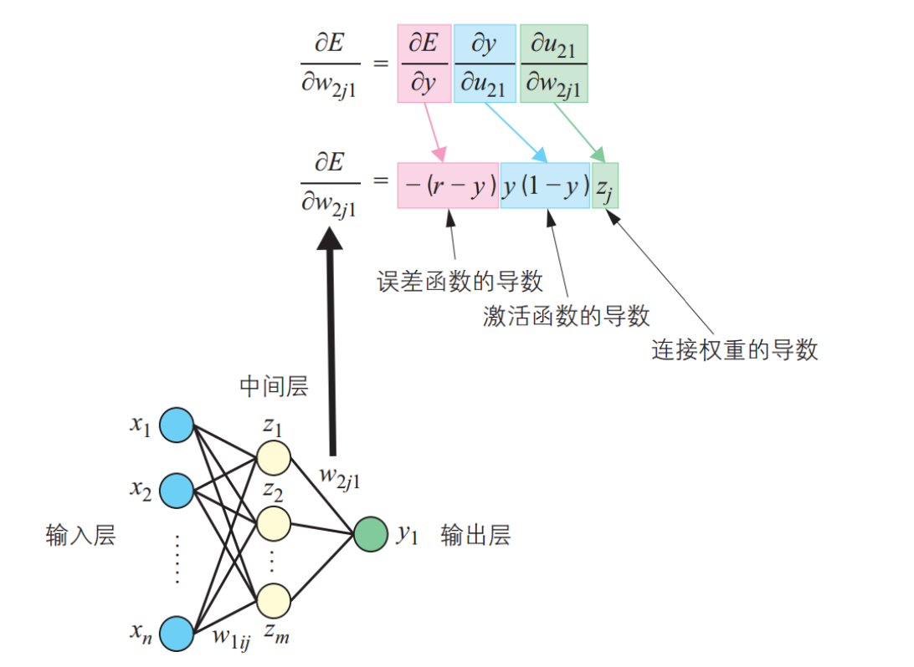

# 四 前馈神经网络

## 1 神经元模型

- **神经元M-P模型**：接收n个神经元的输入信号，经过加权求和，结果与阈值$\theta$比较，经过激活函数得到输出
- **模型**：
  $$
  y=f \left( \sum_{i=1}^{n} \omega_{ij} x_{i} - \theta \right)
  $$
- **表达性**：可表示多种逻辑运算（取反运算、逻辑与、逻辑或）

## 2 感知器

### 2.1 单层感知器

- **概念**：感知器能够通过有监督学习训练，自动确定模型参数，通过设定训练样本和期望输出，调整实际输出和期望输出之差，进行误差修正学习
- **模型**：

$$
\begin{aligned} 
w_i & \leftarrow w_i + \alpha(r-y) x \\ 
\theta & \leftarrow \theta - \alpha(r-y) 
\end{aligned}
$$

- **训练步骤**：
  1. 准备$N$个训练样本$x_i$，初始化期望输出$r_i$
  2. 初始化训练参数$w_i$和$\theta$
  3. 迭代调整参数，直到误差为0或者小于$\varepsilon$
  4. 逐个加入训练样本，计算实际输出：当实际输出和期望输出相等，参数不变；否则，进行误差修正，调整参数
  5. 回到步骤（3）

### 2.2 多层感知器

- **概念**：多层结构的感知器递进组成的向前传播的网络，称为前馈网络或正向传播网络
- **多层感知器**：输入层、中间层、输出层，之间通过权重相连。

## 3 BP算法

### 3.1 BP算法基本过程

- **基本思路**：通过计算实际输出与期望输出的误差，把误差进行反向传递，通过调整各层的连接权重减小误差，采用梯度下降法调整权重
- **主要步骤**：
  1. 前向传播计算：从输入层经过隐含层向输出层，计算网络输出
  2. 误差反向逐层传递：计算实际输出与期望输出之差，并反向传递
  3. 反复上述两步，对网络进行训练

### 3.2 激活函数

- **阶跃函数**：只输出0或1，函数不连续，不可导

$$
f(x) = \begin{cases}
0, \quad x < 0 \\ 
1, \quad x > 0
\end{cases}
$$

- **sigmoid函数**：

$$
f(x) = \frac{1}{1 + e^{-x}}
$$

- **ReLu函数**（修正线性单元）：

$$
\text{ReLu}(x) = 
\begin{cases} 
x, \quad x > 0 \\
0, \quad \text{otherwise}
\end{cases}
$$

- **tanh函数**：

$$
\tanh(x) = \frac{e^x - e^{-x}}{e^x + e^{-x}}
$$

### 3.3 BP算法示例

1. **假设某个多层感知器**：包含一个中间层和一个输出单元$y$，其中$w_{1ij}$ 表示输入层与中间层之间的连接权重，$w_{2j1}$ 表示中间层与输出层之间的连接权重， $i$ 表示输入层单元，$j$ 表示中间层单元，误差函数 E。
2. **调整中间层与输出层之间的连接权重**：

$$
\begin{aligned}
\frac{\partial E}{\partial w_{2 j 1}} 
&= \frac{\partial E}{\partial y} \frac{\partial y}{\partial u_{21}} \frac{\partial u_{21}}{\partial w_{2 j 1}} \\ 
&= -(r-y) y(1-y) z_{j}
\end{aligned}
$$

3. **调整输入层与中间层之间的连接权重**：

$$
\Delta w_{2 j 1}=\alpha(r-y) y(1-y) z_{j} \\
\begin{aligned} 
\frac{\partial E}{\partial w_{1 i j}} 
&= \frac{\partial E}{\partial y} \frac{\partial y}{\partial u_{21}} \frac{\partial u_{21}}{\partial w_{1 i j}} \\ 
&= -(r-y) y(1-y) \frac{\partial u_{21}}{\partial w_{1 i j}} 
\end{aligned}
$$

## 4 优化问题

- **难点**：

  - 参数过多，影响训练
  - 非凸优化问题：即存在局部最优而非全局最优解，影响迭代
  - 梯度消失问题，下层参数比较难调
  - 参数解释起来比较困难
- **需求**：

  - 计算资源要大
  - 数据要多
  - 算法效率要好：即收敛快
