# 五 卷积神经网络CNN

## 1 卷积

- **卷积**：(*f***g*)(*n*)成为 $f$ 和 $g$ 的卷积
- **连续卷积**：
$$
(f * g)(n)=\int_{-\infty}^{\infty} f(\tau) g(n-\tau) d \tau
$$
- **离散卷积**：
$$
(f * g)(n) = \sum_{\tau = -\infty}^{\infty} f(\tau) g(n-\tau)
$$
- **卷积的输出**：  
在给定一个输入`信号序列$x$`和`滤波器$w$`(卷积核)，卷积的输出为
$$
y_t = \sum_{k = 1}^K w_k x_{t-k+1}
$$
不同的滤波器来提取信号序列中的不同`特征`
- **卷积结果按输出长度的分类**
    1. 窄卷积：步长$T = 1$，两端不补零$P=0$，卷积后输出长度为$M-K+1$
    2. 宽卷积：步长$T = 1$，两端补零$P=K-1$，卷积后输出长度$M+K-1$ 
    3. 等宽卷积：步长$T = 1$，两端补零$P=(K-1)/2$，卷积后输出长度$M$
    
  其中，$K$为卷积核大小，$M$为原始数据长度。
  
- **其他卷积**：
  - 转置卷积/微步卷积：低维特征映射到高维特征
  - 空洞卷积：为了增加输出单元的感受野，通过给卷积核插入“空洞”来变相地增加其大小

## 2 卷积神经网络基本原理

卷积神经网络的基本结构大致包括：`卷积层`、`激活函数`、`池化层`、`全连接层`、`输出层`等

### 2.1 卷积层

- **二维卷积运算**：二维图像为$I$，二维卷积核为$K$，卷积运算可表示为
$$
S(i, j)=(I * K)(i, j)=\sum_{m} \sum_{n} I(i-m, j-n) K(m, n)
$$
$$
\left.S(i, j)=\operatorname{sum}\left(\begin{array}{ccc}I(i-2, j-2) & I(i-2, j-1) & I(i-2, j) \\ I(i-1, j-2) & I(i-1, j-1) & I(i-1, j) \\ I(i, j-2) & I(i, j-1) & I(i, j)\end{array}\right] . *\left[\begin{array}{rll}K(2,2) & K(2,1) & K(2,0) \\ K(1,2) & K(1,1) & K(1,0) \\ K(0,2) & K(0,1) & K(0,0)\end{array}\right]\right)
$$
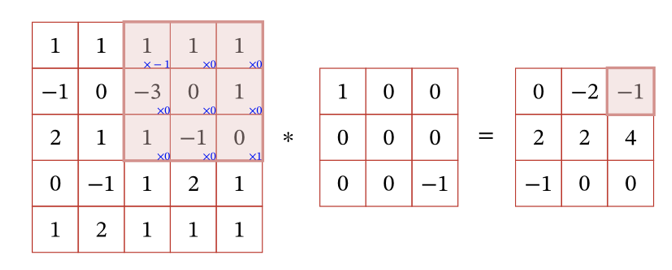

- **卷积的步长**（stride）：卷积核移动的步长

- **卷积的模式**：Full、Same和Valid
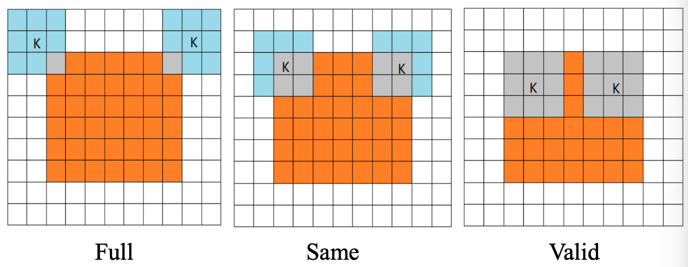

- **数据填充**：  
  假设图像为$n \times n$维，卷积核为$f \times f$维，在进行卷积操作之前填充$p$层数据
  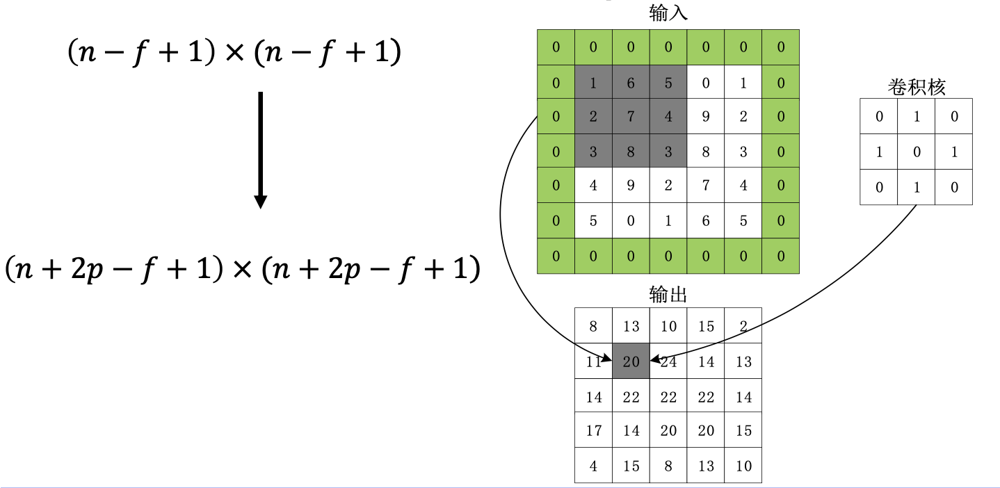

- **感受野**：卷积神经网络每一层输出的特征图上的像素点在输入图片上映射的区域大小，即特征图上的一个点对应输入图上的区域
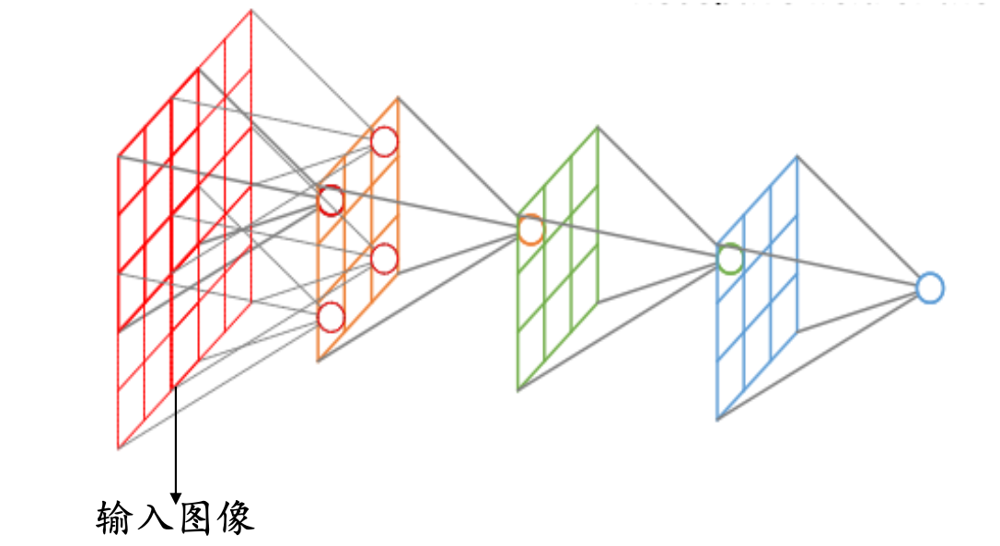

- **卷积层的深度(卷积核个数)**：一个卷积层通常包含多个尺寸一致的卷积核

### 2.2 激活函数
激活函数是用来加入非线性因素，提高网络表达能力，卷积神经网络中最常用的是ReLU，Sigmoid使用较少

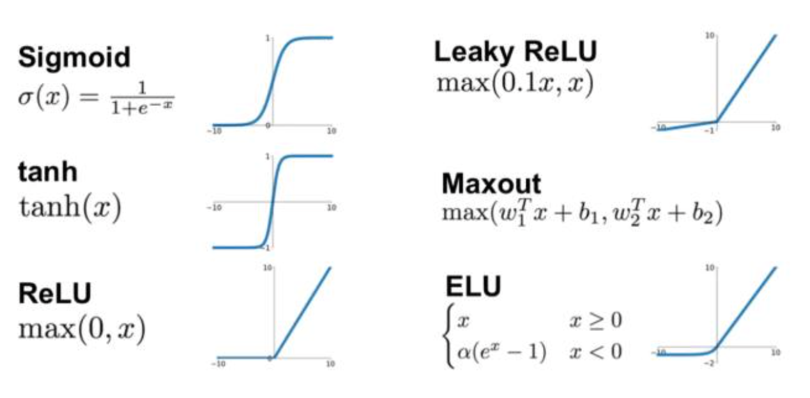
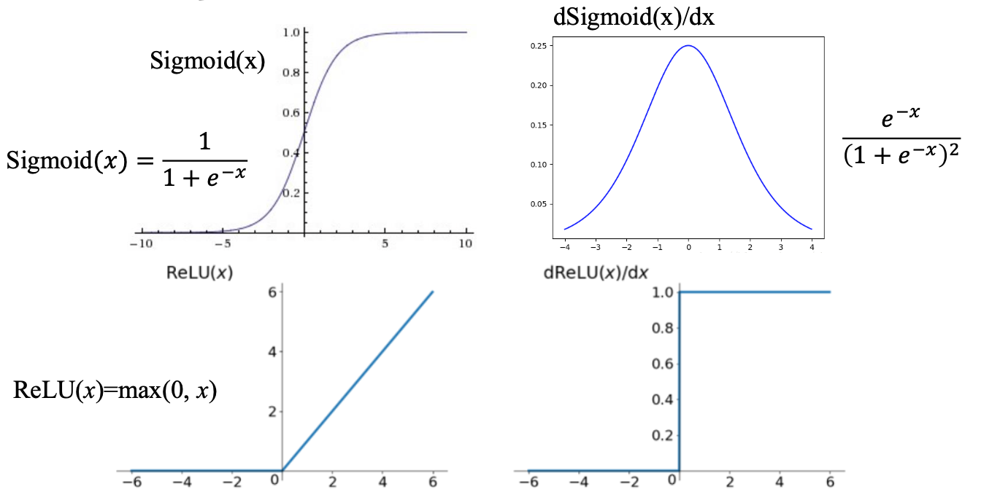

- **ReLU函数**：
  
  $$
   f(x)=\left\{
   \begin{array}{l} 
   0 \quad x < 0 \\ 
   x \quad x \geqslant 0
   \end{array}\right.
  $$
  - 优点：计算速度快，只有线性关系；输入为正数时，不存在梯度消失
  - 缺点：强制性把负值置为0，可能丢掉一些特征，当输入为负数时，无法更新权重

- **Parametric ReLU**
$$
f(x)=\left\{
\begin{array}{rc}
\alpha x \quad x<0 \\ 
 x \quad x \geqslant 0
 \end{array}\right.
$$
  - 当$\alpha = 0.01$时，称为`Leaky ReLU`
  - 当$\alpha$满足高斯分布，称为`Randomized ReLU`
  - 优点：比sigmoid函数收敛快，解决ReLU的神经元死亡问题
  - 缺点：需要多学习一个参数

- **ELU函数**：
$$
f(x)=\left\{\begin{array}{l}\alpha (e^x-1), x<0 \\ x, x \geq 0\end{array}\right.
$$
  - 优点：能够处理函数噪声的数据，更容易收敛
  - 缺点：计算量较大，收敛速度慢

- **注意事项**：
  1. CNN在卷积层尽量不要使用Sigmoid和Tanh，将导致梯度消失；
  2. 首先选用`ReLU`，使用较小的学习率，以免造成神经元死亡的情况；
  3. 如果ReLU失效，考虑使用Leaky ReLU、PReLU、ELU或者Maxout，此时一般情况都可以解决。

- **特征图**
  - 浅层卷积层：提取的是图像基本特征，如边缘、方向和纹理等特征
  - 深层卷积层：提取的是图像高阶特征，出现了高层语义模式，如“车轮”、“人脸”等特征

### 2.3 池化层

池化操作使用某位置相邻输出的总体统计特征作为该位置的输出。池化层不包含需要训练学习的参数，仅需指定池化操作的核大小、操作步幅以及池化类型。

- **常用池化方法**：
  - `最大池化`
  - `均值池化`
- **作用**：
  - 减少网络中参数计算量，防止过拟合
  - 增强网络对输入图像中的小变形、扭曲、平移的鲁棒性
  - 帮助获得不因尺寸大小而改变的等效图片表征

### 2.4 全连接层

- **作用**：
  - 对卷积层和池化层输出的特征图(二维)进行降维
  - 将学到的特征表示映射到样本标记空间的作用

### 2.5 输出层

- 对于**分类**问题，使用`Softmax`函数
$$
y_i = \frac{e^{z_i}}{\displaystyle \sum_{i = 1}^{n}e^{z_i}}
$$
- 对于**回归**问题，使用`线性函数`
$$
y_i = \sum_{m = 1}^{M}w_{im}x_m
$$

### 2.6 卷积神经网络的训练

- **Step 1**：用随机数初始化所有的卷积核和参数/权重

- **Step 2**：将训练图片作为输入，执行前向步骤(卷积， ReLU，池化以及全连接层的前向传播)并计算每个类别的对应输出概率。

- **Step 3**：计算输出层的总误差

- **Step 4**：反向传播算法计算误差相对于所有权重的梯度，并用梯度下降法更新所有的卷积核和参数/权重的值，以使输出误差最小化

注：卷积核个数、卷积核尺寸、网络架构这些参数，是在 Step 1 之前就已经固定的，且不会在训练过程中改变——只有卷 积核矩阵和神经元权重会更新。

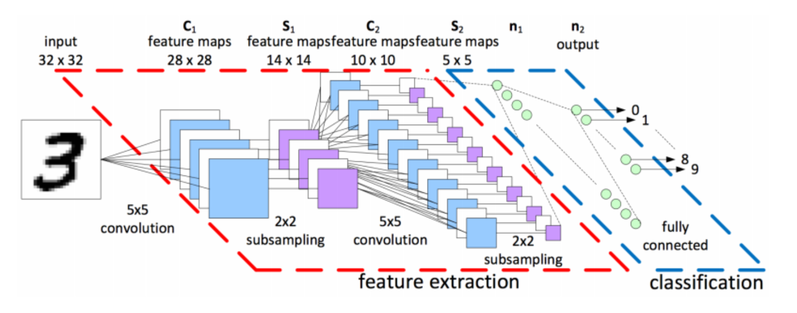

## 3 经典卷积神经网络

### 3.1 LeNet-5

应用场景：手写数字识别、英文字母识别

- **网络结构**（以手写数字识别为例）：

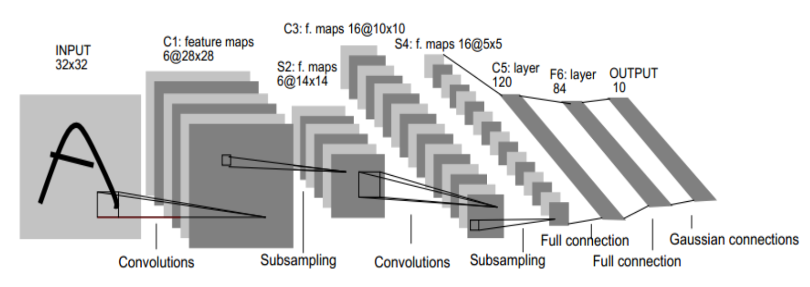

  - **输入层**：$32*32$ 的图片，也就是相当于1024个神经元
  - **C1层（卷积层）**：选择6个 $5*5$ 的卷积核，得到6个大小为32-5+1=28的特征图，也就是神经元的个数为 $6*28*28=4704$
  - **S2层（下采样层）**：每个下抽样节点的4个输入节点求和后取平均(平均池化)，均值乘上一个权重参数加上一个偏置参数作为激活函数的输入，激活函数的输出即是下一层节点的值。池化核大小选择 $2*2$ ，得到6个 $14*14$ 大小特征图

  - **C3层（卷积层）**：用 $5*5$ 的卷积核对S2层输出的特征图进行卷积后，得到6张 $10*10$ 新图片，然后将这6张图片相加在一起，然后加一个偏置项b，然后用激活函数进行映射，就可以得到1张 $10*10$ 的特征图。我们希望得到16张 $10*10$ 的特征图，因此我们就需要参数个数为 $16*(6*(5*5))=16*6*(5*5)$ 个参数

  - **S4层（下采样层）**：对C3的16张 $10*10$ 特征图进行最大池化，池化核大小为 $2*2$ ，得到16张大小为 $5*5$ 的特征图。神经元个数已经减少为: $16*5*5=400$ 

  - **C5层（卷积层）**：用 $5*5$ 的卷积核进行卷积，然后我们希望得到120个特征图，特征图大小为5-5+1=1。神经元个数为120（这里实际上是全连接，但是原文还是称之为了卷积层）

  - **F6层（全连接层）**：有84个节点，该层的训练参数和连接数都 $(120+1)* 84=10164$ 

  - **Output层**：共有10个节点，分别代表数字0到9，如果节点*i*的输出值为0，则网络识别的结果是数字*i*。采用的是径向基函数(RBF)的网络连接方式：

$$
y_i = \sum_j(x-j - w_{ij})^2
$$

**总结**：卷积核大小、卷积核个数(特征图需要多少个)、池化核大小(采样率多少)这些参数都是变化的，这就是所谓的CNN调参，需要学会根据需要进行不同的选择。

### 3.2 AlexNet

- **特点**
  - 成功应用ReLU作为激活函数
  - 使用Dropout，防止过拟合
  - 使用重叠MaxPooling，提升特征丰富性
  - 使用CUDA加速训练
  - 进行数据增强，减轻过拟合

- **网络结构**（以图像识别为例）：

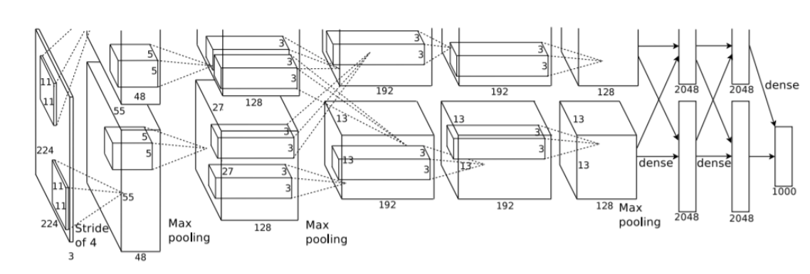

AlexNet可分为8层(池化层未单独算作一层)，包括5个卷 积层以及3个全连接层
  - **输入层**：AlexNet首先使用大小为224×224×3图像作为输入(后改为227×227×3)

  - **第一层（卷积层）**：包含96个大小为11×11的卷积核，卷积步长为4，因此第一层输出大小为55×55×96；然后构建一个核大小为3×3、步长为2的最大池化层进行数据降采样，进而输出大小为27×27×96
  - **第二层（卷积层）**：包含256个大小为5×5卷积核，卷积步长为1，同时利用padding保证输出尺寸不变，因此该层输出大小为27×27×256；然后再次通过核大小为3×3、步长为2的最大池化层进行数据降采样，进而输出大小为13×13×256

  - **第三层与第四层（卷积层）**：均为卷积核大小为3×3、步长为1的same卷积，共包含384个卷积核，因此两层的输出大小为13×13×384

  - **第五层（卷积层）**：同样为卷积核大小为3×3、步长为1的same卷积，但包含256个卷积核，进而输出大小为13×13×256;在数据进入全连接层之前再次 通过一个核大小为3×3、步长为2的最大池化层进行数据降采样， 数据大小降为6×6×256，并将数据扁平化处理展开为9216个单元

  - **第六层、第七层和第八层（全连接层）**：全连接加上Softmax分类器输出1000类的分类结果，有将近6千万个参数

### 3.3 VGGNet

- 比较常用的是`VGG-16`，结构规整，具有很强的拓展性
- 相较于AlexNet，VGG-16网络模型中的卷积层均使用 $3*3$ 的卷积核，且均为步长为1的same卷积，池化层均使用 $2*2$ 的池化核，步长为2

- **网络结构**

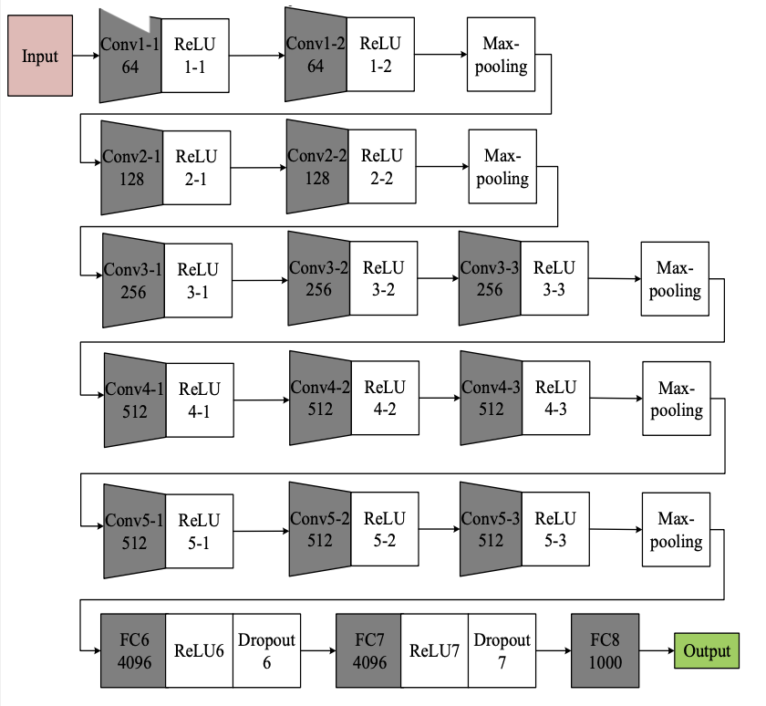

  - 两个卷积核大小为 $3*3$ 的卷积层串联后的感受野尺寸为 $5*5$， 相当于单个卷积核大小为 $5*5$ 的卷积层
  - 两者参数数量比值为$(2*3*3)/(5*5)=72\%$ ，前者参数量更少
  - 此外，两个的卷积层串联可使用两次ReLU激活函数，而一个卷积层只使用一次

### 3.4 Inception Net

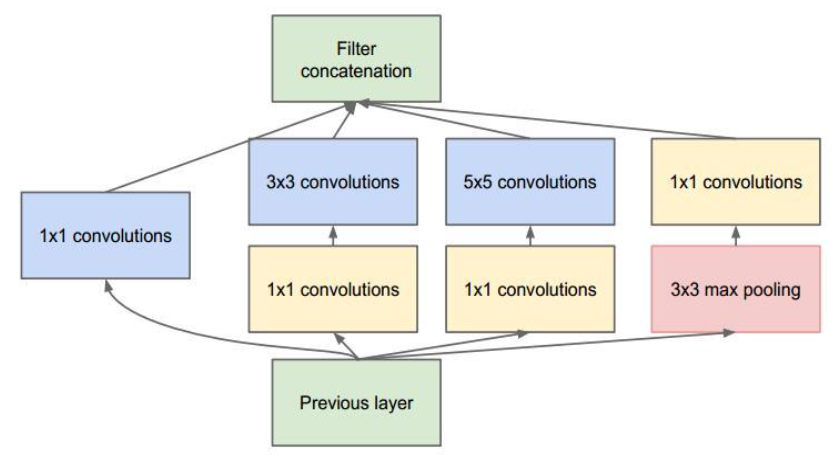

- **深度**：层数更深，采用了22层，在不同深度处增加了两个 loss来避免上述提到的梯度消失问题
- **宽度**：Inception Module包含4个分支，在卷积核3x3、5x5 之前、max pooling之后分别加上了1x1的卷积核，起到了降低特征图厚度的作用
  - 1×1的卷积的作用：可以跨通道组织信息，来提高网络的表达能力；可以对输出通道进行升维和降维。

### 3.5 ResNet

- **优点**：解决训练误差像降低再升高的问题，解决梯度消失核梯度爆炸的问题
- **残差块**：ResNet核心，在标准神经网络基础上添加跳跃连接
$$
a_{l+1} = \sigma(W_{l+1}a_l+b_{l+1})
\\
a_{l+2} = \sigma(W_{l+2}a_{l+1}+b_{l+2}+a_l)
$$

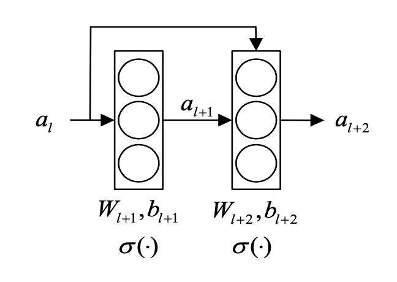

### 3.6 DenseNet

- **特点**：DenseNet中，两个层之间都有直接的连接，因此该网络的直接连接个数为L(L+1)/2。对于每一层，使用前面所有层的特征映射作为输入，并且使用其自身的特征映射作为所有后续层的输入
- **优点**：缓解梯度消失现象，加强特征传播，减少参数的数量

## 4 主要应用

- **图像处理领域**：图像分类，物体检测，图像分割，图像回归
- **语音识别领域**：CLDNN、Google Deep CNN、IBM Deep CNN
- **自然语言处理领域**：情感分析
