# 六 循环神经网络RNN

## 1 计算图

- **概念**：描述计算机构的一种图，元素包括`节点`和`边`，节点表示变量、标量、矢量或张量等，边表示某个操作，用函数表示

- 计算图的**求导**：可使用链式求导法则
  1. 情况1
  ```mermaid
  graph LR
  A((x)) --"g"--> B((y)) --"h"--> C((z))
  ```
  $$
  \frac{dz}{dx} = \frac{dz}{dy} \frac{dy}{dx}
  $$
  2. 情况2
  ```mermaid
  graph LR
  A((s)) --"g"--> B((x)) --"k"--> C((z))
  A((s)) --"g"--> D((y)) --"k"--> C((z))
  ```
  $$
  \frac{dz}{ds} = \frac{\partial z}{\partial y} \frac{dy}{ds} + \frac{\partial z}{\partial x} \frac{dx}{ds}
  $$

## 2 循环神经网络（RNN）

### 2.1 基本介绍

- **概念**：循环神经网络是一种人工神经网络，它的节点间的连接形成一个遵循时间序列的有向图
- **核心思想**：样本间存在顺序关系，每个样本和它之前的样本存在关联。通过神经网络在时序上的展开，找到样本之间的序列相关性

- **RNN的一般结构**


  - 其中各个符号的表示：$x_t,s_t,o_t$分别表示的是$t$时刻的输入、记忆和输出，$U,V,W$是RNN的连接权重，$b_s,b_o$是RNN的偏置，$\sigma,\varphi$是激活函数，$\sigma$通常选tanh或sigmoid，$\varphi$通常选用softmax。

  - 其中 softmax 函数，用于分类问题的概率计算。本质上是将一个K维的任意实数向量压缩 (映射)成另一个K维的实数向量，其中向量中的每个元素取值都介于(0，1)之间。

$$
\sigma(\vec{z})_{i}=\frac{e^{z_{i}}}{\sum_{j=1}^{K} e^{z_{j}}}
$$

### 2.2 RNN的一般结构

- **Elman Network**
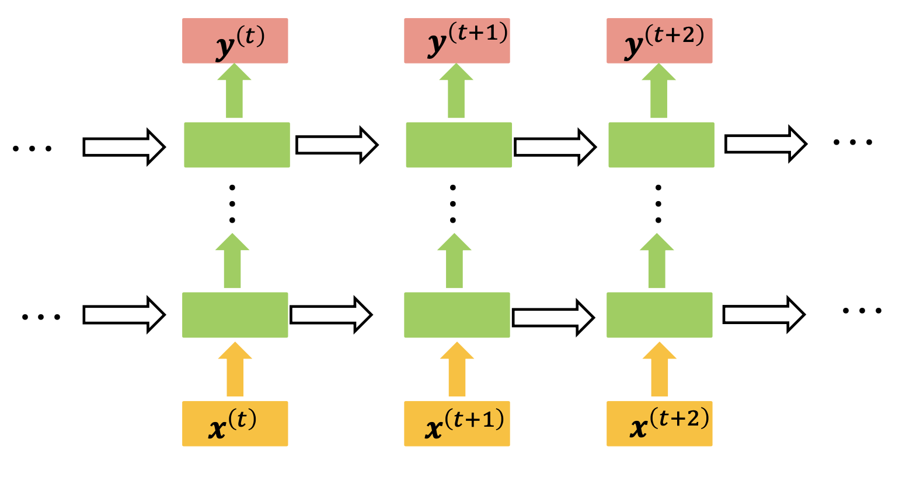

- **Jordan Network**
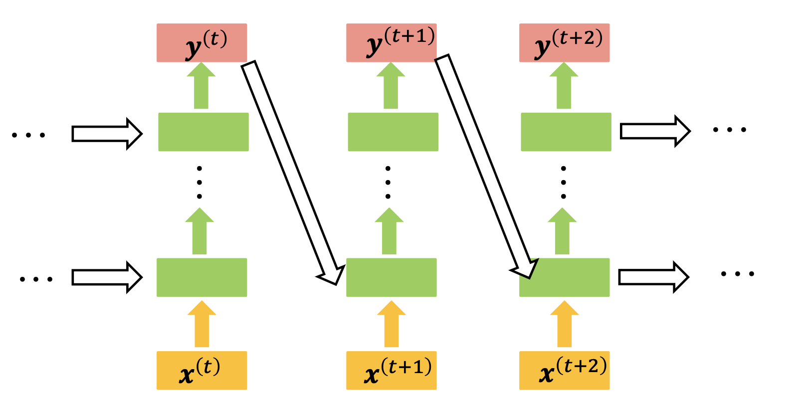

- **各种不同的RNN结构**
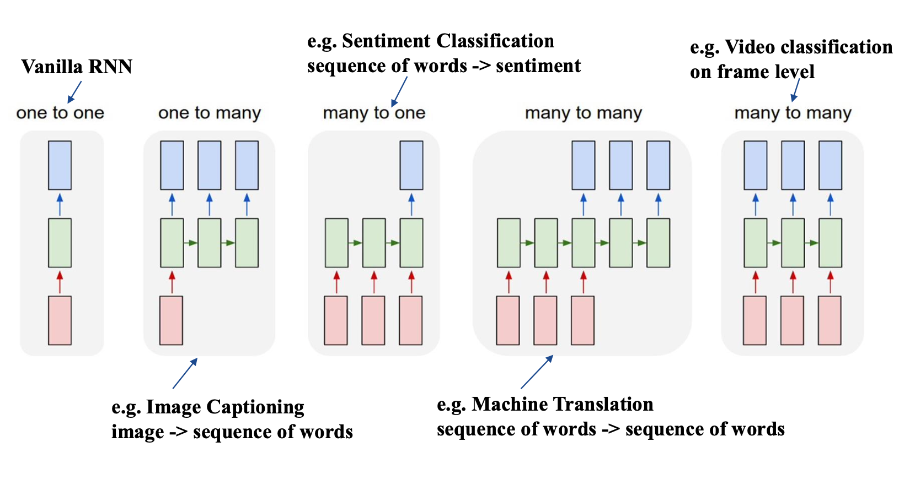

### 2.3 RNN训练算法-BPTT

- **BPTT算法**：在`BP算法`的基础之上，添加了`时序`演化过程
- **算法步骤**：
  1. 定义输出函数：
   $$
   \begin{array}{l}
   s_t = \tanh (U x_t + W s_{t-1}) \\
   \hat{y}_t = \text{softmax} (V s_t)
   \end{array}
   $$
  2. 定义损失函数：
   $$
   E_t (y_t, \hat{y}_t) = -y_t \log \hat{y}_t \\
   \begin{aligned} 
   E(y, \hat{y}) 
   &= \sum_t E_t (y_t, \hat{y}_t) \\ 
   &= -\sum_t y_t \log \hat{y}_t
   \end{aligned}
   $$
  3. 根据链式求导法，求损失函数$E$对U、V、W的梯度
   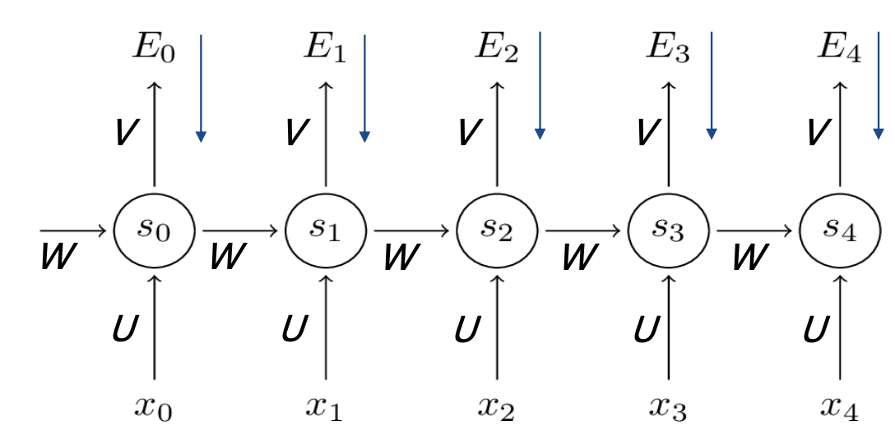
   $$
   \begin{aligned} 
   \frac{\partial E_t}{\partial V} 
   &= \frac{\partial E_t}{\partial \hat{y}_t} \frac{\partial \hat{y}_t}{\partial V} \\
   &= \frac{\partial E_t}{\partial \hat{y}_t} \frac{\partial \hat{y}_t}{\partial z_t} \frac{\partial z_t}{\partial V} \\
   \frac{\partial E_t}{\partial W} 
   &= \frac{\partial E_t}{\partial \hat{y}_t} \frac{\partial \hat{y}_t}{\partial s_t} \frac{\partial s_t}{\partial W} \\
   &= \sum_{k=0}^t \frac{\partial E_t}{\partial \hat{y}_t} \frac{\partial \hat{y}_t}{\partial s_t} \frac{\partial s_t}{\partial s_k} \frac{\partial s_k}{\partial W} \\
   &= \sum_{k=0}^t \frac{\partial E_t}{\partial \hat{y}_t} \frac{\partial \hat{y}_t}{\partial s_t} \left( \prod_{j=k+1}^t \frac{\partial s_j}{\partial s_{j-1}} \right) \frac{\partial s_k}{\partial W} \\
   \frac{\partial E_t}{\partial U} 
   &= \frac{\partial E_t}{\partial \hat{y}_t} \frac{\partial \hat{y}_t}{\partial s_t} \frac{\partial s_t}{\partial U} \\ 
   &= \sum_{k=0}^t \frac{\partial E_t}{\partial \hat{y}_t} \frac{\partial \hat{y}_t}{\partial s_t} \frac{\partial s_t}{\partial s_k} \frac{\partial s_k}{\partial U}
   \end{aligned}
   $$

## 3 长短时记忆网络（LSTM）

### 3.1 LSTM
一个LSTM单元由`输入门`、`输出门`和`遗忘门`组成，三个门控制信息进出单元


- **特点**：
  - LSTM依靠贯穿隐藏层的细胞状态实现隐藏单元之间的信息传递，其中只有少量的线性操作
  - LSTM引入了“门”机制对细胞状态信息进行添加或删除，由此实现长程记忆
  - “门”机制由一个Sigmoid激活函数层和一个向量点乘操作组成，Sigmoid层的输出控制了信息传递的比例

- **遗忘门**：LSTM通过遗忘门(forget gate)实现对细胞状态信息遗忘程度的控制，输出当前状态的遗忘权重，取决于 $h_{t−1}$ 和 $x_t$.

$$
f_{t}=\sigma\left(W_{f} \cdot\left[h_{t-1}, x_{t}\right]+b_{f}\right)
$$

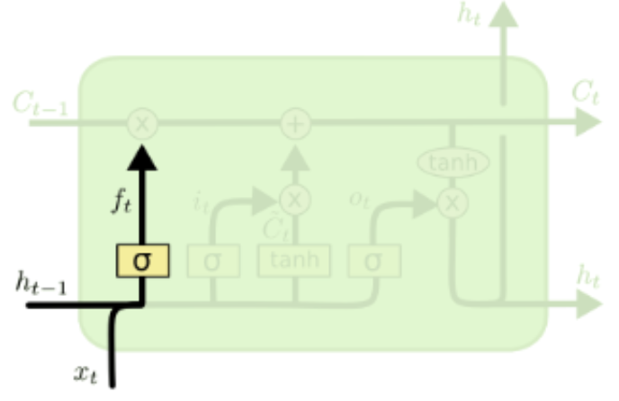

- **输入门**：LSTM通过输入门(input gate)实现对细胞状态输入接收程度的控制，输出当前输入信息的接受权重，取决于 $h_{t−1}$ 和 $x_t$.

$$
\begin{array}{c}i_{t}=\sigma\left(W_{i} \cdot\left[h_{t-1}, x_{t}\right]+b_{i}\right) \\ \tilde{C}_{t}=\tanh \left(W_{C} \cdot\left[h_{t-1}, x_{t}\right]+b_{C}\right)\end{array}
$$

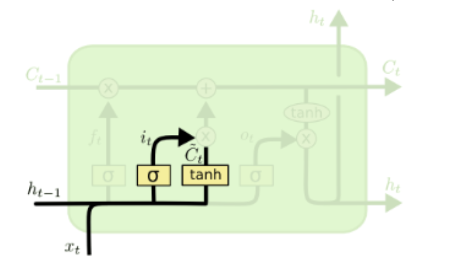

- **输出门**：LSTM通过输出门(output gate)实现对细胞状态输出认可程度的控制，输出当前输出信息的认可权重，取决于 $h_{t−1}$ 和 $x_t$.

$$
o_{t}=\sigma\left(W_{o} \cdot\left[h_{t-1}, x_{t}\right]+b_{o}\right)
$$

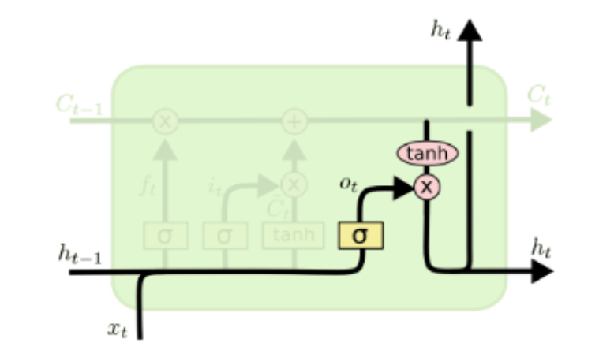

- **状态更新**：“门”机制对细胞状态信息进行添加或删除，由此实现长程记忆。

$$
\begin{array}{c}C_{t}=f_{t} * C_{t-1}+i_{t} * \tilde{C}_{t} \\ h_{t}=o_{t} * \tanh \left(C_{t}\right)\end{array}
$$

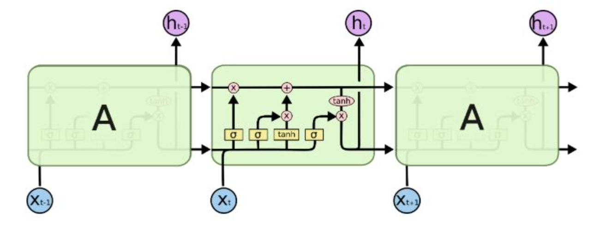

```py
# 标准化的RNN示例
# 构造RNN网络，x的维度5，隐层的维度10,网络的层数2
rnn_ seq = nn.RNN(5， 10,2)
# 构造一个输入序列，长为6，batch是3，特征是5
X =V(torch. randn(6， 3，5))
#out,ht = rnn_ seq(x， h0) # h0可以指定或者不指定
out,ht = rnn_ seq(x)
# q1:这里out、ht的size是多少呢? out:6*3*10， ht:2*3*10

# 输入维度50，隐层100维，两层
Lstm_ seq = nn.LSTM(50， 100，num layers=2 )
# 输入序列seq= 10，batch =3，输入维度=50
lstm input = torch. randn(10，3，50)
out, (h, c) = lstm_ seq(lstm_ _input) #使用默认的全0隐藏状态

```

## 4 其他经典的循环神经网络

### 4.1 Gated Recurrent Unit（GRU）

- 它的细胞状态与隐状态合并，在计算当前时刻新信息的方法和LSTM有所不同
- GRU只包含`重置门`和`更新门`
- 在音乐建模与语音信号建模领域与LSTM具有相似的性能，但是参数更少，只有两个门控。

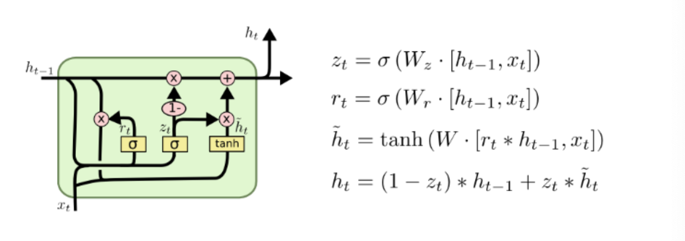

### 4.2 Peephole LSTM
让门层也接受细胞状态的输入，同时考虑隐层信息的输入

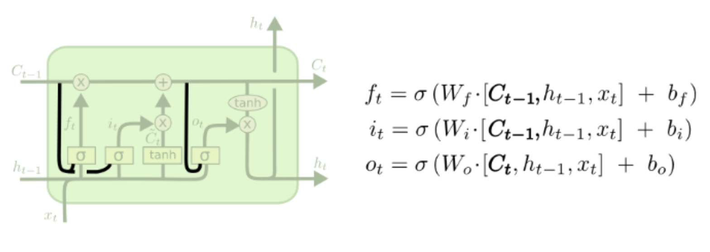

### 4.3 Bi-directional RNN（双向RNN）
假设当前$t$的输出不仅仅和之前的序列有关，并且还与之后的序列有关

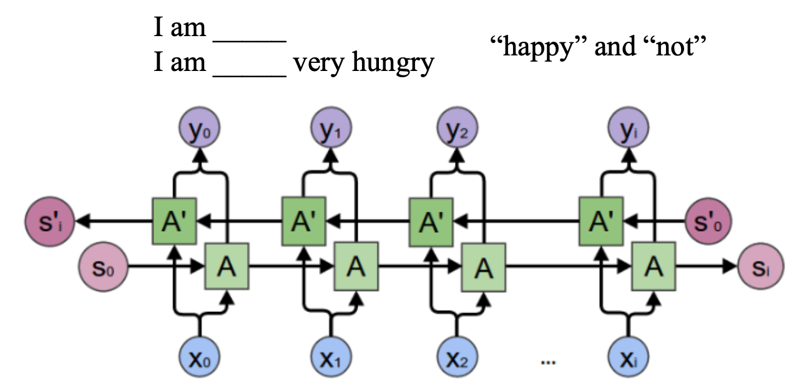

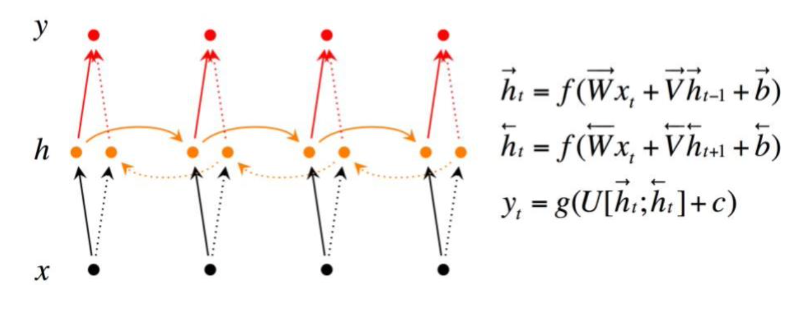

### 4.4 Continuous time RNN（CTRNN）
- 利用常微分方程系统对输入脉冲序列神经元的影响进行建模
- 应用于进化机器人中，用于解决视觉、协作和最小认知行为等问题

## 5 RNN的主要应用

- **语言模型**
  - **单词预测**：根据之前和当前词，预测下一个单词或字母
  - **问答系统**
- **自动作曲**
- **机器翻译**：将一种语言自动翻译成另一种语言
- **自动写作**：基于RNN和LSTM的文本生成技术，需要训练大量同类文本，结合模板技术
- **图像描述**：根据图像生成描述性语言
