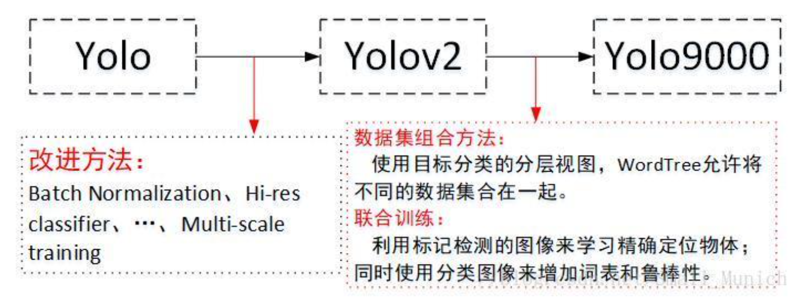

# 七 RCNN&YOLO

## 1. RCNN
Region-CNN的缩写，主要用于`目标检测`

### 1.1 实现过程
- **区域划分**:给定一张输入图片，从图片中提取2000个类别独立的候选区域，R-CNN 采用的是 Selective Search 算法
- **特征提取**：对于每个区域利用CNN抽取一个固定长度的特征向量， R-CNN 使用的是 Alexnet
- **目标分类**：再对每个区域利用SVM进行目标分类
- **边框回归**：BoundingboxRegression(Bbox回归)进行边框坐标偏移
- **优化调整**
  - Crop就是从一个大图扣出网络输入大小的patch，比如227×227
  - Warp把一个边界框bounding box的内容resize成227×227

### 1.2 Selective Search 算法

- **核心思想**：图像中物体可能存在的区域应该有某些相似性或者连续性的，选择搜索基于上面这一想法采用子区域合并的方法提取 bounding boxes候选边界框。
  1. 通过图像分割算法将输入图像分割成许多小的子区域
  2. 其次，根据这些子区域之间的相似性(主要考虑颜色、纹理、尺寸和空间交叠4个相似)进行区域迭代合并。每次迭代过程中对这些合并的子区域做bounding boxes(外切矩形)，这些子区域的外切矩形就是通常所说的候选框

- **算法步骤**：
  1. 生成区域集R，参见论文《Efficient Graph-Based Image Segmentation》
  2. 计算区域集R里每个相邻区域的相似度$S=\{s1,s2,...\}$
  3. 找出相似度最高的两个区域，将其合并为新集，添加进R
  4. 从S中移除所有与step2中有关的子集
  5. 计算新集与所有子集的相似度
  6. 跳至step2，直至S为空

### 1.3 Bbox回归

- **核心思想**：通过平移和缩放方法对物体边框进行调整和修正
  - bounding box的表示为$(x,y,w,h)$，即窗口的中心点坐标和宽高
  - Bbox回归就是找到函数 $f$，将$(P_x,P_y, P_w,P_h)$映射为更接近 $(G_x,G_y, G_w,G_h)$ 的 $(\hat{G}_x,\hat{G}_y, \hat{G}_w,\hat{G}_h)$

- **mAP**：mean Average Precision，是多标签图像分类任务中的评价指标。衡量的是学出的模型在所有类别上的好坏

### 1.4 SPPnet
SPPnet (Spatial Pyramid Pooling)：空间金字塔网络，R-CNN主要问题：每个Proposal独立提取CNN features，分步训练

### 1.5 Fast-RCNN

- **联合学习(jointtraining)**：把SVM、Bbox回归和CNN阶段一起训 练，最后一层的Softmax换成两个：一个是对区域的分类Softmax， 另一个是对Bounding box的微调。训练时所有的特征不再存到硬盘上，提升了速度。
- **ROI Pooling层**：实现了单尺度的区域特征图的Pooling。将每个候选区域均匀分成M×N块，对每块进行max pooling，将特征图上大小不一的候选区域转变为大小统一的数据，送入下一层
- **RPN(Region Proposal Network)**：使用全卷积神经网络来生成区域建议(Region proposal)，替代之前的Selective search
- **Faster R-CNN训练方式**
  - Alternating training
  - Approximate joint training

## 2 YOLO系列

- **特点**
  - 与R-CNN系列最大的区别是用一个卷积神经网络结构就可以从输入图像直接预测bounding box和类别概率，实现了`End2End`训练
  - 速度非常`快`，实时性好
  - 可以学到物体的全局信息，背景误检率比R-CNN降低一半，`泛化`能力强
  - 准确率还不如R-CNN高，小物体检测效果较差

- **目标检测网络结构**：24个卷积层和2个全连接层

- **YOLO2和YOLO9000**

