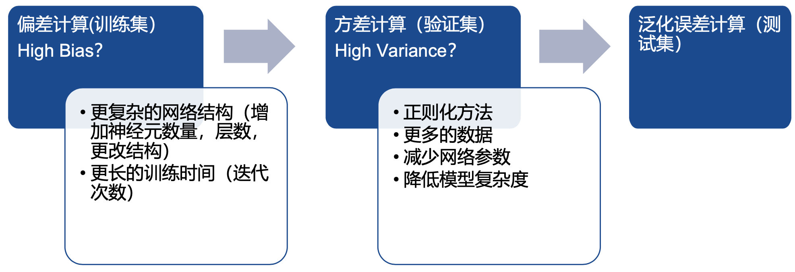

# 九 正则化方法

## 1 正则化方法概述

### 1.1 数据集

- **训练集**(Training set)：用于模型拟合的数据样本

- **验证集**(Validation set)：是模型训练过程中单独留出的样本集，可以用于调整模型的超参数和用于对模型的能力进行初步评估

- **测试集**(Test set)：用来评估模最终模型的泛化能力

### 1.2 过拟合
模型能很好地拟合训练样本，而无法很好地拟合测试样本的现象，从而导致泛化性能下降。可以减少参数、降低模型复杂度、正则化等

### 1.3 欠拟合
模型还没有很好地训练出数据的一般规律，模型拟合程度不高。可以调整参数、增加迭代深度、换用更加复杂的模型等

### 1.4 误差分析
- **偏差(bias)**：反映了模型在样本上的期望输出与真实标记之间的差距，即模型本身的精准度，反映的是模型本身的拟合能力
- **方差(variance)**：反映了模型在不同训练数据集下学得的函数的输出与期望输出之间的误差，即模型的稳定性，反应的是模型的波动情况
- **泛化误差(Generalization Error)**：度量训练所得模型在总体数据上得到的预估值和标签值偏离程度的期望
- **深度学习一般步骤**

## 2 参数范数正则化

### 2.1 范数基本知识
- `范数`是将向量映射到非负值的函数，它满足三条性质：
  - 非负性   $f(x) \geq 0(f(x)=0 \Leftrightarrow x=0)$
  - 齐次性   $\forall \alpha \in R, f(\alpha x)=|\alpha| f(x)$
  - 三角不等式   $f(x+y) \leq f(x)+f(y)$

- `$L_p$ 范数`是使用最为广泛的一种范数，定义为 $\|\boldsymbol{x}\|_{\boldsymbol{p}}=(\sum_i |x_i|^p)^{1/p}$，当 $p = 2$ 时该范数等价于向量和原点的欧几里得距离。

- 在深度学习中，最常见的做法便是使用`Frobenius范数`(F范数)，即 $\|\boldsymbol{x}\|_{\boldsymbol{F}} = \sqrt{\sum_{i, j} A_{i j}^{2}}$

### 2.2 参数范数正则化

- 正则化后的损失函数可表示为 $\tilde{J}$：

$$
\tilde{J}(\boldsymbol{\theta} ; \mathbf{X}, \mathbf{y})=\mathrm{J}(\boldsymbol{\theta} ; \mathbf{X}, \mathbf{y})+\alpha \Omega(\boldsymbol{\theta})
$$
- **$L_0$ 范数**：$\|\boldsymbol{W}\|_{\boldsymbol{0}}$，指向量中非0的元素的个数，越小说明0元素越多
- **$L_1$ 范数**：$\|\boldsymbol{W}\|_{\boldsymbol{1}}$，指向量中各个元素绝对值之和
- **$L_2$ 范数**：$\|\boldsymbol{W}\|_{\boldsymbol{2}}$，即各元素的平方和再开方

### 2.3 $L_2$ 正则化

主要用于线性回归，又称为岭回归(Ridge Regression) 或权重衰减(Weight decay)

- **正则化项**
$$
\Omega(\mathbf{w})=\frac{1}{2}\|\mathbf{w}\|_{2}^{2}
$$

- **损失函数**
$$
\tilde{J}(\boldsymbol{\theta} ; \mathbf{X}, \mathbf{y})=\mathrm{J}(\boldsymbol{\theta} ; \mathbf{X}, \mathbf{y})+ \frac{\alpha}{2}\|\mathbf{w}\|_{2}^{2}
$$

### 2.4 $L_1$ 正则化

又称为Lasso回归(Lasso Regression)，在损失函数中添加待正则化参数w的L1-范数(即w所有参数绝对 值之和)作为正则化项

- **正则化项**

$$
\Omega(w) = \|w\|_1
$$

- **损失函数**：

$$
\tilde{J}(\boldsymbol{\theta} ; \mathbf{X}, \mathbf{y})=\mathrm{J}(\boldsymbol{\theta} ; \mathbf{X}, \mathbf{y})+ \alpha \|w\|_1
$$

- **计算梯度**：

$$
\nabla_{\mathbf{w}} \tilde{J}(\boldsymbol{w} ; \boldsymbol{X}, \boldsymbol{y})=\nabla_{\mathbf{w}} J(\boldsymbol{w} ; \boldsymbol{X}, \boldsymbol{y})+\alpha \cdot \operatorname{sign}(\boldsymbol{w})
$$

### 2.5 $L_1$和$L_2$的对比

- L2范数更有助于计算病态的问题
- L1相对于L2能够产生更加稀疏的模型
- 从概率角度进行分析，很多范数约束相当于对参数添加先验分布，其中L2范数相当于参数服从高斯先验分布；L1范数相当于拉普拉斯分布

## 3 稀疏表示学习

如果矩阵𝑆是普通的非稀疏矩阵，稀疏表示目的是为这个普通稠密表达的样本𝑆找到一个合适的字典，将样本转换为`稀疏表示`(Sparse Representation)形式，从而在学习训练的任务上得到简化，**降低模型的复杂度**。亦被称作`字典学习`(Dictionary Learning)

稀疏表示的**本质**是使用尽可能少的数据表示尽可能多的特征，并且同时也能带来计算效率的提升

给定数据集为 $\{x_1,x_2,\cdots,x_𝑛\} $字典学习可表示为

$$
\min _{B, \alpha_{i}} \sum_{i=1}^{m}\left\|x_{i}-B \alpha_{i}\right\|_{2}^{2}+\lambda \sum_{i=1}^{m}\left\|\alpha_{i}\right\|_{1}
$$

其中$B \in R^{d \times k},\alpha_i \in R^k$ ，k 为字典的词汇量，$\alpha_i$ 是样本的稀疏表示
