# 十 注意力机制

## 1 注意力机制

### 1.1 机器翻译Encoder-Decoder

- 神经机器翻译主要以`Encoder-Decoder`模型为基础结构
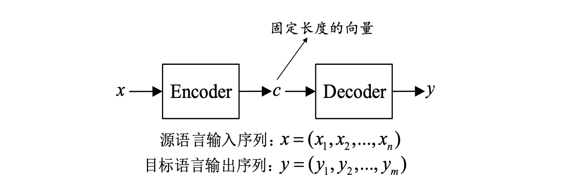

- 在神经机器翻译中，**Encoder**一般采用`RNN`或者`LSTM`实现
  - 从统计角度，翻译相当于寻找译句 $y$，使得给定原句 $x$ 时条件概率最大：$\arg\max_{y} p(\boldsymbol{y} | \boldsymbol{x})$
  - 得到上下文向量 **$c$** 的方法有很多，可以直接将最后一个隐状态作为上下文变量，也可对最后的隐状态进行一个非线性变换 $\sigma(\cdot)$，或对所有的隐状态进行非线性变换 $\sigma(\cdot)$.

$$
c =h_{T} \\  \,\,\,\  c =\sigma\left(h_{T}\right) \\ c =\sigma\left(h_{1}, h_{2}, \cdots, h_{T}\right)
$$

### 1.2 解码器
- 用给定的上下文向量 $c$ 和之前已经预测的词 $\{y_1,\cdots,y_{t-1}\}$预测$y_t$

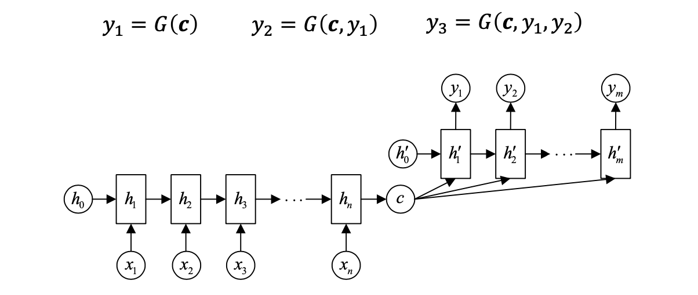

### 1.3 现存问题

- 输入序列不论长短都会被编码成一个固定长度的向量表示，而解码则受限于该固定长度的向量表示
- 这个问题限制了模型的性能，尤其是当输入序列比较长时，模型的性能会变得很差

### 1.4 神经网络模型注意力机制

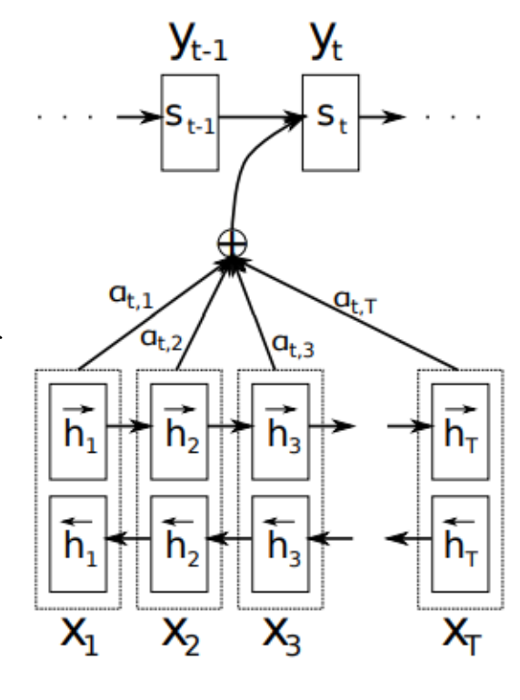

- 在这个新结构中，定义每个输出的条件概率为:  $p\left(y_{i} \mid y_{1}, \cdots, y_{i-1}, \boldsymbol{x}\right)=g\left(y_{i-1}, x_{i}, c_{i}\right)$.
- 其中 $s_i$ 为解码器RNN中的隐层状态: $s_{i}=f \left(s_{i-1}, y_{i-1}, c_{i}\right)$.
- 这里的上下文向量 $c_i$ 取决于注释向量序列 (encoder转化得到)，通过使用注意力系数 $\alpha_{ij}$ 对 $h_j$  加权求得：

$$
c_{i}=\sum_{j=1}^{T} \alpha_{i j} h_{j}
$$

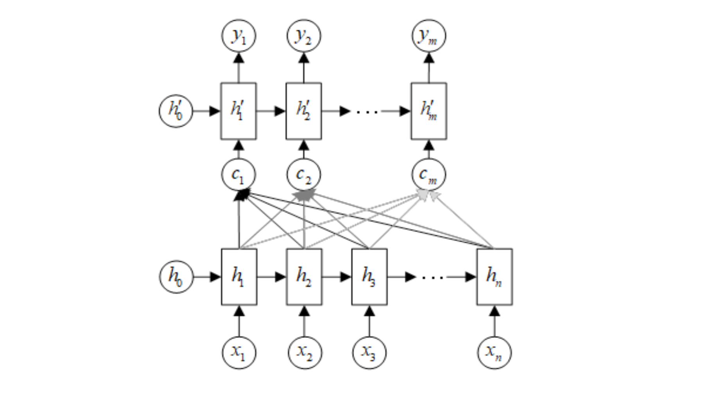

### 1.5 注意力机制的计算

- **注意力系数计算**

$$
\alpha_{i j}=\frac{\exp \left(e_{i j}\right)}{\sum_{k=1}^{T_{x}} \exp \left(e_{i k}\right)} \quad e_{i j}=a\left(s_{i-1}, h_{j}\right)
$$

后一个公式中的 $a(\cdot)$ 表示alignment mode，反映 $i$ 位置的输入和 $j$ 位置输出的匹配程度。

- 计算注意力系数的**相似函数**(alignment model)有以下几种：

$$
a\left(s_{i-1}, h_{j}\right) = 
h_{j}^{T} \cdot s_{i-1} \\
a\left(s_{i-1}, h_{j}\right) = 
\frac{h_{j}^{T} \cdot W_{\alpha} \cdot s_{i-1}}{W_{\alpha} \cdot\left[h_{j}^{T}, s_{i-1}^{T}\right]^{T}} \\
a\left(s_{i-1}, h_{j}\right) = 
v_{\alpha} \tanh \left(U_{\alpha} h_{j}+W_{\alpha} s_{i-1}\right)
$$

### 1.6 几种主流的注意力机制

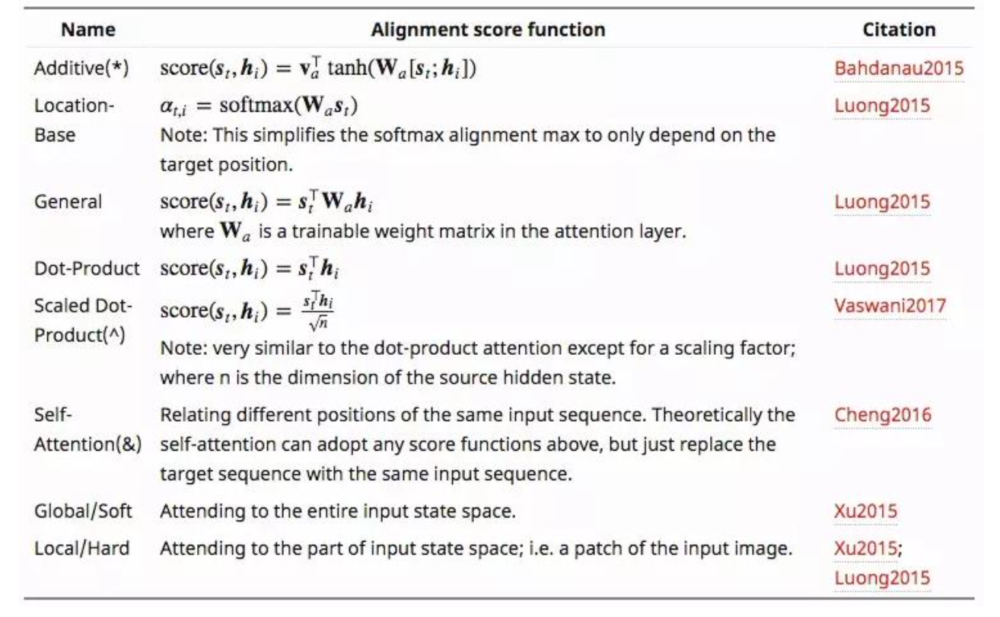

### 1.7 注意力机制的理解

- `Attention函数`的**本质**：可以被描述为一个查询(query)到一系列(键key-值value)对的映射

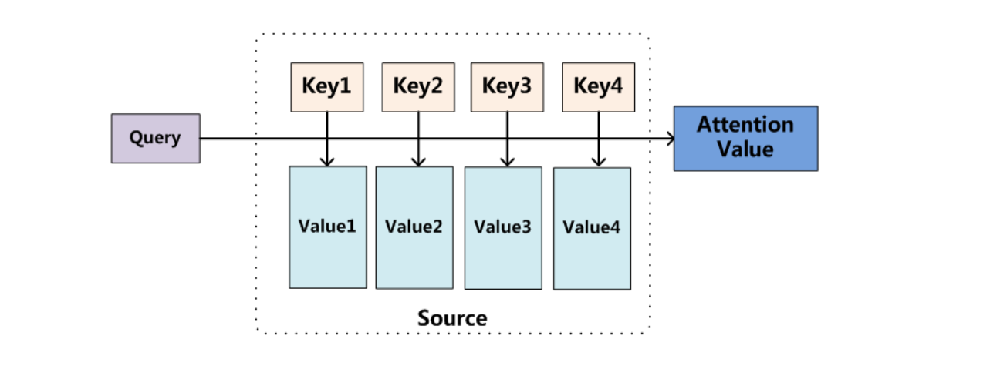

$$
\text { Attention(Query, Source })=\sum_{i=1}^{L_{x}} \text { similarity }\left(\text { Query }, \mathrm{Key}_{i}\right){\times} \text { Value }_{i}
$$

- **注意力系数计算**
  - 阶段1：根据Query和Key计算两者的相似性或者相关性
  - 阶段2：对第一阶段的原始分值进 行归一化处理
  - 阶段3：根据权重系数对Value进行加权求和，得到Attention Value

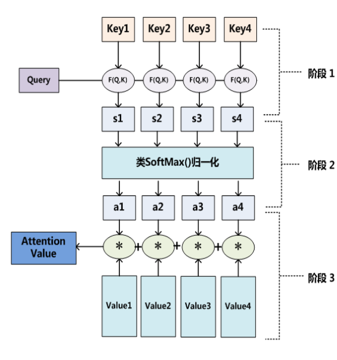

- **Self-attention layer** in “Attention is all you need”>

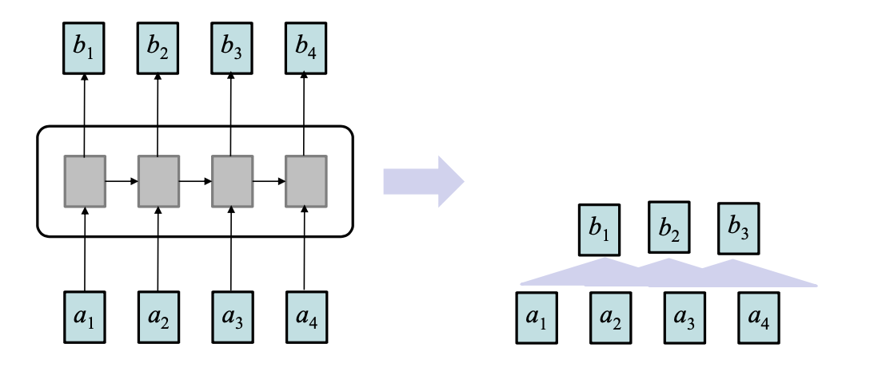

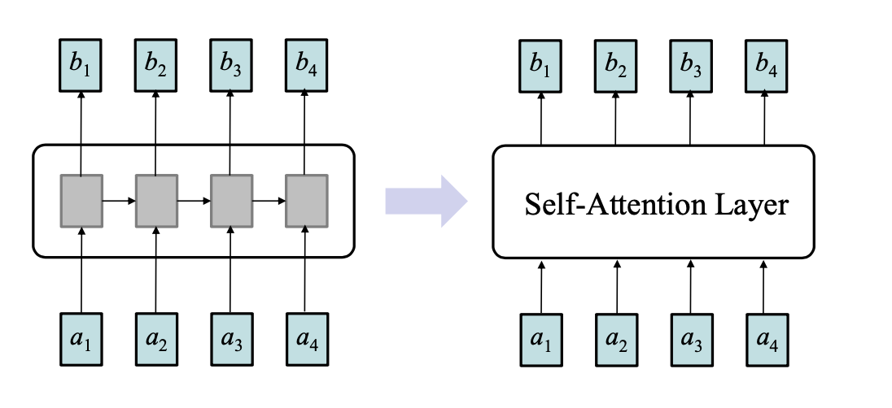

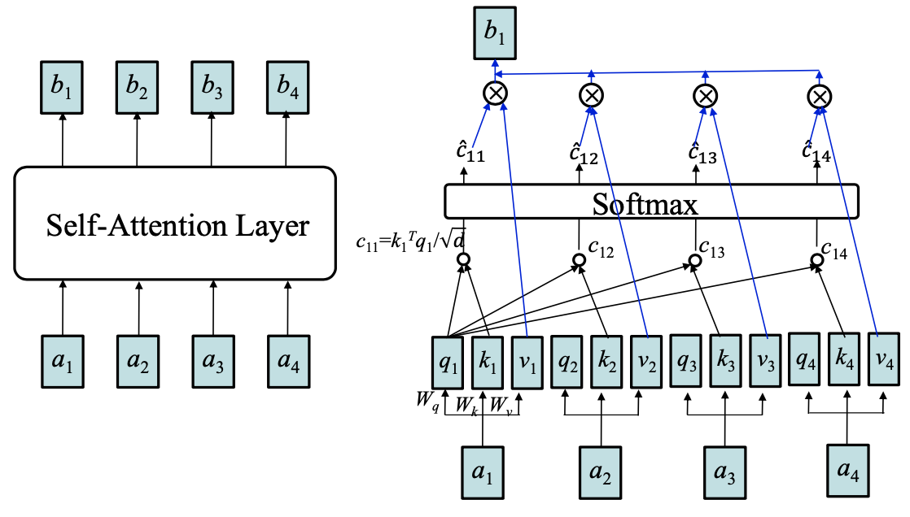

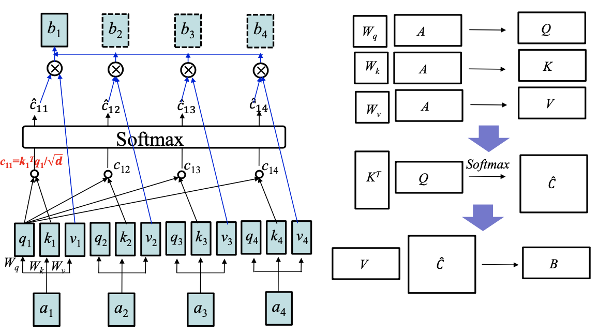

### 1.8 注意力机制的应用

- **GPT/GPT-2**
- **BERT**

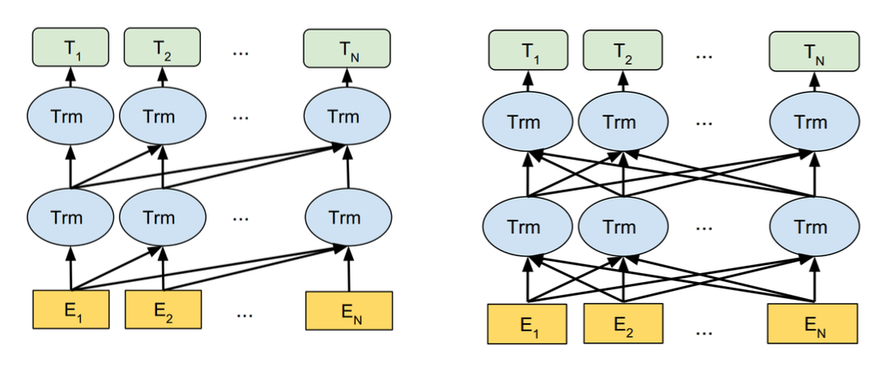

## 2 记忆网络

### 2.1 代表工作

- **Memory Networks**. ICLR 2015
- **End-To-End Memory Networks**. NIPS 2015: 2440-2448
- **Key-Value Memory Networks for Directly Reading Documents**. EMNLP 2016: 1400-1409
- **Tracking the World State with Recurrent Entity Networks**. ICLR 2017
