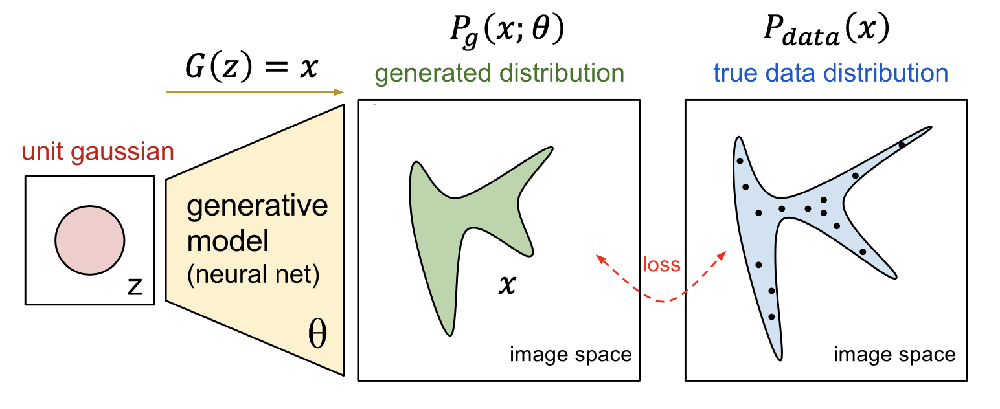
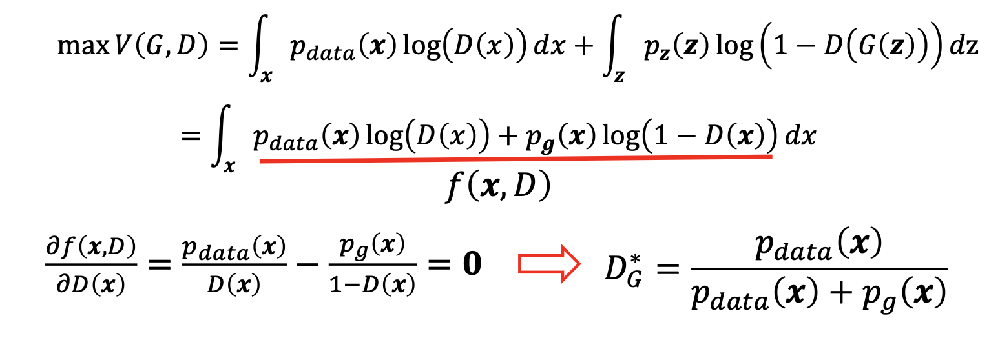

# 十四 GAN

## 1 GAN背景

机器学习方法有两种，**生成方法**和**判别方法**。

- 生成方法，所学到到模型称为**生成式模型**
  - 生成方法通过观测数据学习样本与标签的联合概率分布P(X,Y)，训练好的模型，即生成模型，能够生成符合样本分布的新数据；
  - 生成式模型在无监督深度学习方面占据主要位置，可以用于在没有目标类标签信息的情况下捕捉观测到或可见数据的高阶相关性 

- 判别方法，所学到的模型称为**判别式模型**
  - 判别方法，由数据直接学习决策函数f(X)或者条件概率分布P(Y|X)作为预测的模型，即判别模型
  - 判别模型经常用在有监督学习方面；
  - 判别方法关心的是对给定的输入X，应该预测什么样的输出Y。

## 2 GAN概况

### 2.1 GAN简介
**生成对抗网络**（Generative Adversarial Networks，GAN）*[Goodfellow et al.,2014*] 是通过对抗训练的方式来使得生成网络产生的样本服从真实数据分布。在生成对抗网络中，有两个网络进行对抗训练。
1. 一个是**判别网络**，目标是尽量准确地判断一个样本是来自于真实数据还是由生成网络产生；
2. 另一个是**生成网络**，目标是尽量生成判别网络无法区分来源的样本。

这两个目标相反的网络不断地进行交替训练。 当最后收敛时，如果判别网络再也无法判断出一个样本的来源，那么也就等价于生成网络可以生成符合真实数据分布的样本。

GAN起源于博弈论中的二人零和博弈(获胜1，失败-1)
- 由两个互为敌手的模型组成
  - 生成模型(假币制造者团队)
  - 判别模型(警察团队)
- 竞争使得两个团队不断改进他们的方法直到无法区分假币与真币

### 2.2 GAN模型
**生成模型**
- 捕捉样本数据的分布，用服从某一分布(均匀分布，高斯分布)的噪声z生成一个类似真实训练数据的样本，越像真实越好
- $p_{data} (x)$ 表示真实数据的x分布
- $p_z (z)$ 表示输入噪声变量z的分布
- $p_g$ 表示在数据x上学习得到的生成样本的分布
- $𝐺(z;\theta_g)$ 表示生成模型(多层感知器)

**判别模型**
- 一个二分类器，估计一个样本来自训练数据(而非生成数据)的概率，如果样本来自真实的训练数据，输出大概率，否则，输出小概率。
- $D(x;\theta_d)$ 表示判别模型(多层感知器)
- $D(x)$ 表示x来自真实数据而非生成数据的概率

用网络代替概率模型$P(x;\theta),P_{data}(x)$

### 2.3 GAN目标函数和损失函数

- **目标函数**

$$
\min _{G} \max _{D} V(G, D)=E_{x \sim p_{\text {data }}(x)}[\log D(x)]+E_{z \sim p_{z}(z)}[\log (1-D(G(z)))]
$$
G表示生成器，D表示判别器，V(D, G)表示判别器与生成器之间的博弈价值函数，D(x)表示判别器对真实样本的判别结果，D(G(z))表示判别器对生成样本的判别结果

  1. 训练GAN的时候，判别模型希望目标函数最大化，也就是使判别模型判断真实样本为“真”，判断生成样本为“假”的概率最大化，要尽量最大化自己的判别准确率
  2. 与之相反，生成模型希望该目标函数最小化，也就是降低判别模型对数据来源判断正确的概率，要最小化判别模型的判别准确率

- **判别器损失函数**
$$
L(D)=-E_{x \sim p_{\text {data }}(x)}[\log D(x)]-E_{z \sim p_{z}(z)}[\log (1-D(G(z)))]
$$

- **生成器损失函数**
$$
L(G)=-E_{z \sim p_{z}(z)}[\log (D(G(z)))]
$$

### 2.4 GAN模型训练

- **训练步骤**
  1. GAN在训练的过程中固定一方，更新另一方的网络权重
  2. 交替迭代，在这个过程中，双方都极力优化自己的网络，从而形成竞争对抗，直到双方达到一个动态的平衡(纳什均衡)
  3. 此时生成模型的数据分布无限接近训练数据的分布(造出了和真实数据一模一样的样本)，判别模型再也判别不出来真实数据和生成数据，准确率为50%。

固定**G**，训练**D**时，最优的判别器为：

$$
D_{G}^{*}=\frac{p_{\text {data }}(\boldsymbol{x})}{p_{\text {data }}(\boldsymbol{x})+p_{g}(\boldsymbol{x})}
$$

- **证明**

### 2.5 优势和不足

**优势**

- 任何一个可微分函数都可以参数化D和G(如深度神经网络)
- 支持无监督方法实现数据生成，减少了数据标注工作
- 生成模型G的参数更新不是来自于数据样本本身(不是对数据的似然性进行优化)，而是来自于判别模型D的一个反传梯度

**不足**

- 无需预先建模，数据生成的自由度太大
- 得到的是概率分布，但是没有表达式，可解释性差
- D与G训练无法同步，训练难度大，会产生梯度消失问题

## 3 GAN的优化和改进

### 3.1 限定条件优化

- **CGAN**:Conditional Generative Adversarial Nets. Generative Adversarial Text to Image Synthesis
- **InfoGAN**: Interpretable Representation Learning by Information Maximizing Generative Adversarial Nets. Improved Techniques for Training GANs
- **GP-GAN**: Towards Realistic High-Resolution Image Blending

### 3.2 迭代式生成优化

- **LAPGAN**:Deep Generative Image Models using a Laplacian Pyramid of Adversarial Networks
- **StackGAN**: Text to Photo-realistic Image Synthesis with Stacked Generative Adversarial Networks
- **PPGN**: “Plug & Play Generative Networks: Conditional Iterative Generation of Images in Latent Space

### 3.3 结构优化

- **DCGAN**:Unsupervised Representation Learning with Deep
  Convolutional Generative Adversarial Networks
- **Pix2Pix**: Image-to-Image Translation with Conditional Adversarial Networks

## 4 GAN的主要应用

- **图像转换**:[https://affinelayer.com/pixsrv/](https://affinelayer.com/pixsrv/)
- **图像迁移**:[https://junyanz.github.io/CycleGAN/](https://junyanz.github.io/CycleGAN/)
- **图像生成**:[https://arxiv.org/abs/1606.03498](https://arxiv.org/abs/1606.03498)
- **图像合成**:[https://arxiv.org/abs/1704.04086](https://arxiv.org/abs/1704.04086)
- **图像预测**:[https://arxiv.org/abs/1702.01983](https://arxiv.org/abs/1702.01983)
